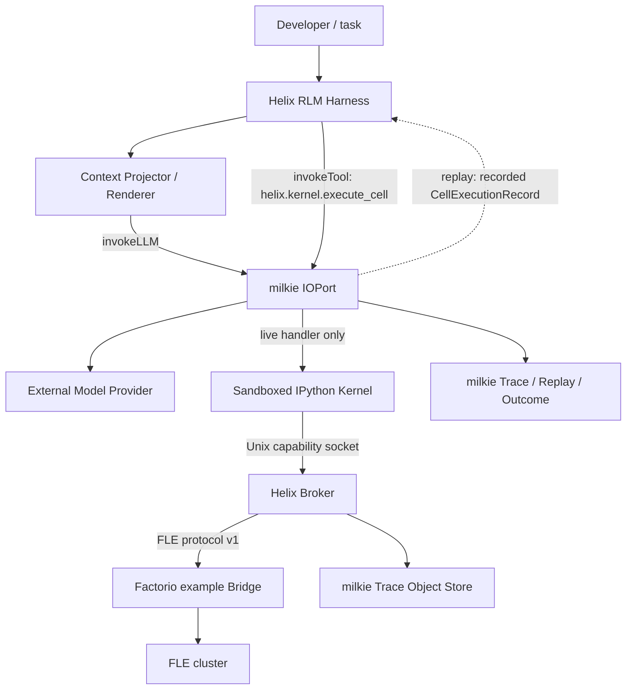
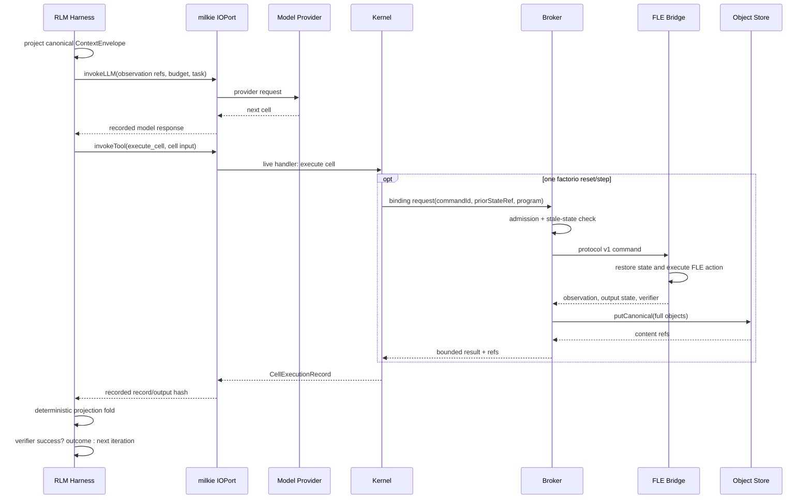

# 【agent-runtime】RLM Harness 与 Factorio 验收纵切

- Issue: [#1](https://github.com/xforce-io/helix/issues/1)
- 状态: Implemented
- 最后更新: 2026-08-08

## 1. 背景

Issue #1 要求 Helix 在真实 Factorio Learning Environment（FLE）中完成一个由环境 verifier 判定的生产任务。该纵切用于验证 Helix 的核心主张：模型拥有持久的程序化执行环境，并能根据对象化观察持续编写和运行行动程序；运行时则持有权限、预算、隔离和副作用边界。Factorio/FLE 适合首个验收环境，因为它同时包含长时程状态、可执行 Python 行动和独立于模型判断的成功证据。Helix 不复制 milkie 已有的 Run lifecycle、Trace、Replay、Lineage 和 Task Outcome，而是通过 milkie IOPort 把模型调用与一次 Kernel cell 执行纳入这些机制。本设计只覆盖完成 FLE 0.4.3 注册任务 `iron_ore_throughput`（60 游戏秒自动生产 16 个铁矿石）所需的最小纵切，不把首个 example 提前抽象成通用游戏框架。

## 2. 名词解释

- **RLM Harness**：Helix 中驱动模型与持久 IPython Kernel 交替运行的协调层；模型决定下一段程序，Harness 执行硬边界。
- **Kernel**：隔离运行的持久 IPython 进程。模型提交 cell，但不能直接访问宿主网络、凭证或进程控制。
- **Binding**：预加载到 Kernel 的窄能力对象。本设计中的 `factorio` binding 只暴露受控的 reset、step 和只读状态。
- **Broker**：Helix 宿主进程内的能力代理，校验 Kernel 请求，并把一次 cell 产生的环境事实归入该 cell 的执行记录。
- **Bridge**：运行在 Kernel 沙箱之外、持有 FLE Python 依赖并连接 FLE cluster 的 example 进程。
- **Observation Ref / State Ref**：分别指向完整 FLE Observation 和可恢复 GameState 的内容寻址引用；模型默认只接收引用与有界预览。
- **确认状态**：Bridge 已返回、完整对象已持久化且 cell 记录已由 milkie IOPort 接受的最近状态。
- **不确定状态**：请求可能已在 FLE 生效，但调用方未取得可验证响应，因而不能安全重试的状态。

## 3. 设计目标与非目标

- **目标**：模型通过持久 IPython 与受控 `factorio` binding，在真实 FLE 中完成 `iron_ore_throughput`。
- **目标**：一次运行固定 model、Harness、Kernel protocol、binding set、FLE adapter 与任务版本，结果可以归因。
- **目标**：action、Observation、GameState 和 verifier 证据可由 milkie Trace 定位；Replay 不启动 Kernel 或 FLE，也能重建模型所见结果和 Helix 投影状态。
- **目标**：Kernel、Broker、Bridge 的权限边界和超时后恢复规则明确且可测试。
- **目标**：FLE/Python 只作为 example 可选依赖，未配置时不影响 Helix TypeScript 核心构建。
- **非目标**：不训练或修改模型权重，不以 production score 或 reward 代替 verifier 成功。
- **非目标**：不支持任意游戏、通用 Environment API、多人 FLE、视觉输入、Global Evolution 或跨无关 Session 通信。
- **非目标**：不在本纵切提供递归模型调用、子 Agent、跨 Run 的 Factorio episode，或对不可信租户提供生产级多租户隔离。
- **非目标**：不把确定性 lifecycle、Trace、Replay、Lineage、Task Outcome 再实现在 Helix 中。

## 4. 能力与功能设计

开发者从 `examples/factorio` 启动一次独立运行。example 先检查 Docker/FLE cluster、模型配置、版本和对象存储，然后准备固定任务、单 Agent（`agent_idx=0`）、无视觉输出的 episode 配置。RLM Harness 在首次模型调用前生成包含任务、能力、版本和预算的 `ContextEnvelope`；**Harness 不包含可提交给 FLE 的固定解法或 action program**。模型必须先自行生成包含 `factorio.reset()` 的 cell 取得初始 Observation，此后每次 cell 完成后，Harness 先折叠 `CellExecutionRecord`，再把当前投影和上一 cell 结果送入下一次模型调用。模型每轮自主返回下一段 IPython cell，并根据真实反馈继续或修正，直到 verifier 成功或预算耗尽。

模型通过两条一致但用途不同的通道理解环境：每次 `invokeLLM` 都收到面向决策的 `ContextEnvelope`；执行 cell 时则可通过 Kernel 中宿主注入的 `helix` Bootstrap 查询同一状态。宿主侧隐藏策略和凭证不进入任一模型可见通道。

`factorio.step` 的 `program` 是 FLE public namespace 上执行的 Python action program。它必须通过长度、语法和能力策略校验，最大 10,000 字符。Bridge 在显式上一 State Ref 对应的 GameState 上执行该 action，最长 120 秒，并返回 Observation、output GameState、reward、终止状态和 `task_verification`。完整对象先进入内容寻址存储，模型收到稳定引用、结构化摘要和有界文本预览；其后模型可继续检查或行动。

运行在以下任一条件成立时结束：

1. `task_verification.success=true`：进入成功收尾；只有最终 Observation、对象 hash、step 连续性和固定版本证据校验通过后，才记录 milkie Task Outcome `success`；
2. 达到任务 `trajectory_length`、FLE 明确失败或模型在 verifier 成功前主动结束：记录 `failure`；
3. 用户中断或基础设施故障且没有任务结论：记录 `unknown`；
4. 发生安全策略拒绝：本次运行记录 `failure`，同时保留拒绝证据。

reward、production score、automated production score、steps 和 ticks 只进入 Outcome scores/Trace 指标，不参与成功判定。

### 4.1 UI / UX

首版没有图形页面，交付面是 example CLI 与 milkie Trace。CLI 展示以下稳定状态：

- `preflight`：显示所选 task、固定版本和依赖检查；不自动下载 Factorio、不自动启动 Docker 服务；
- `connecting`：连接已存在的 FLE cluster；失败时给出可执行的准备命令与原始错误分类；
- `running`：显示 `episodeId`、当前 step/上限、最近 verifier 状态、Observation/State ref 和有界模型输出；
- `succeeded` / `failed` / `interrupted`：显示 milkie `runId`、Outcome、最终 verifier 证据和 Trace 定位信息；
- `uncertain`：明确说明环境动作可能已生效、未盲重试，并给出最后确认 State Ref 与中止原因。

日志默认不展开完整 GameState、base64 图像、凭证或模型 Provider 原始认证信息。`enable_vision=false` 是本任务的固定配置，避免无用地图数据进入上下文和 Trace。

## 5. 设计思路与折衷

### 5.1 Model 在 Harness 外部

选择把 Model Provider 作为可替换依赖，经 milkie IOPort 调用。Harness 拥有控制循环和执行约束，model 拥有语义决策，但 model 不是进程隔离、Trace 或状态持久化的承载体。这样同一 Harness 可固定或替换模型，也能直接复用 milkie 对非确定 I/O 的记录与回放。

放弃把 model 放入 Kernel 或 Continual Harness。前者会把 Provider 凭证和网络暴露给模型生成代码；后者会混淆“当前任务执行”和“根据历史证据演化未来 Harness”两种生命周期。

### 5.2 一次 cell 是首版唯一副作用记录边界

选择用 milkie tool `helix.kernel.execute_cell` 包住一次 live cell。cell 内发生的 Factorio 调用作为结构化 `CellExecutionRecord.factorioEffect` 返回，而不再嵌套调用第二个 milkie tool。每个 cell 至多执行一个 `reset` 或 `step`；一个 FLE step 本身可携带包含循环和多个游戏操作的大段 Python program，因此不会把游戏行动退化为单指令工具调用。

这是 Replay 正确性的必要约束：milkie Replay 命中已录制的外层 tool 后不会重新运行 handler；若 live handler 内再记录一个嵌套 tool，Replay 将跳过内层消费并产生队列欠消费。单一边界让 Replay 直接返回完整 cell 记录，Helix 再以纯函数折叠 Kernel/episode 投影，无需启动 Kernel 或 FLE。

放弃首版支持一个 cell 内多个环境副作用或递归模型调用。它们需要 milkie 定义嵌套 effect 的记录/消费顺序，不能由 Helix 私自实现另一套 Replay。

### 5.3 窄 FLE adapter，而非通用环境框架

选择在 example 内定义 FLE Bridge protocol，并固定一个内置任务。第二个真实环境出现前，共性尚不足以形成稳定公共契约。

放弃直接在 Kernel 中 import FLE。直接导入会让模型生成程序绕过 Broker、Trace 和恢复规则，并扩大到宿主网络与 RCON 的权限。

### 5.4 显式状态与 verifier 优先

每个 step 显式携带最后确认 State Ref，Bridge 以其恢复 GameState 后再执行 action。该做法增加状态序列化和重载成本，但使输入状态可归因，并为 Bridge 崩溃后的安全恢复提供边界。`task_verification.success` 是唯一成功依据；分数只用于诊断，避免 reward hacking 被误认作验收通过。

### 5.5 隔离策略

首个本地 example 使用独立、长生命周期的 IPython worker 进程和独立 FLE Bridge 进程。Kernel 进程不安装或 import FLE，不接收 Provider 凭证，环境变量使用 allowlist；它只能通过版本化 stdio capability protocol 请求 Broker。Broker 对外层 cell 与内层 FLE action 分别执行 AST allowlist，拒绝 import、文件、进程、网络、反射、私有属性、动态执行与 raw RCON。Bridge 才持有 FLE 连接。

这是适合本地验收的 capability sandbox，不冒充生产级 OS/多租户隔离。容器级无网络、只读根文件系统、seccomp 与资源 cgroup 属于后续托管部署加固；本 Issue 的证据必须如实标注 `isolationProfile=local-process-ast/v1`，不得写成已验证的生产沙箱。

### 5.6 内部事实与模型渲染分离

选择以 canonical JSON 作为 `ContextEnvelope`、对象 metadata 和投影状态的内部事实格式；首版 `markdown-json/v1` renderer 用 Markdown 表达任务叙事，用独立 JSON block 表达结构化 metadata。这样 Trace/hash 不依赖 prompt 排版，同时保留模型对任务说明的可读性与 JSON 字段的无歧义性。

放弃首版把完整 prompt 或内部事实源改成 TOON。TOON 对大量同构行可能更省 token，但会引入额外 parser/version/escaping 契约，且本纵切的 envelope 以异构嵌套状态为主。未来可增加 `markdown-toon/v1` renderer，但只能在固定模型和真实任务上证明 token 更少且成功率、字段读取正确率不下降后启用；它不能改变 canonical JSON 事实或 Replay 语义。

## 6. 架构设计

### 6.1 逻辑分层



依赖方向如下：

- RLM Harness 依赖 Kernel Runtime 抽象与 milkie adapter，不依赖 FLE Python 包；
- Context Projector 从 Helix 投影生成 canonical envelope，Renderer 只决定发给模型的文本表示；
- Kernel 只依赖 protocol 与预加载 binding，不依赖 milkie 实现；
- Factorio Broker/Bridge 属于 example adapter，可从 Helix 核心移除；
- object store、Trace、Replay、Outcome 和 Run lifecycle 只由 milkie 提供；
- Model Provider 只经 IOPort 可达，不进入 Kernel 网络域。

一次 Run 固定以下版本事实：`modelRef`、`harnessVersion`、`kernelProtocolVersion=1`、`bindingSetVersion`、`factorioAdapterVersion`、FLE 包/源码版本、task ID 与 task definition digest。版本事实在首个模型调用和首个 cell 前写入 Run 上下文。

### 6.2 核心业务流程

#### Live 主路径



每次 Run 的 ID 规则为：

- `runId`：milkie 提供；
- `episodeId`：通过 IOPort 的可记录 UUID 能力生成；
- `cellId`：`{runId}:cell:{ordinal}`；
- `stepIndex`：reset 为 `0`，后续 step 单调递增；
- `commandId`：`{episodeId}:{stepIndex}`。

#### Replay 路径

Replay 读取已录制的 model response 与 `helix.kernel.execute_cell` 输出。execute handler 不运行，Kernel、Broker 和 Bridge 均不启动。Harness 对返回的 `CellExecutionRecord` 执行与 live 相同的纯投影折叠，并在结尾由 milkie 校验所有录制 I/O 已恰好消费。Replay 缺对象、输入 hash 不符、版本事实不符或存在剩余记录时必须失败，不能退回 live FLE。

#### 超时与崩溃路径

Bridge 对每个 `commandId` 保存进程内 command ledger，并且同一 episode 只允许一个在途命令：

1. 若同一 `commandId` 已完成，返回同一结果，不再次执行；
2. 若调用前校验失败，返回确定未执行的错误，可由模型修正后使用新 step；
3. 若 action 返回 FLE 业务错误且 output GameState 可确认，记录该 Observation/State，允许模型继续；
4. 若超过 120 秒、连接中断或 Bridge 崩溃且无法证明未执行，标记 `FLE_TIMEOUT_UNCERTAIN`，禁止对原环境盲重试；
5. Broker 可对仍存活的 Bridge 查询同一 `commandId`；若 ledger 已有完整结果则完成原 cell；
6. Bridge 不可达、ledger 无结论或最后确认 State Ref 不存在时，销毁不确定环境并结束 Run，Outcome 为 `unknown`。

首版不从不确定动作后自动恢复并继续，也不把新 command 伪装成原 step 的幂等重试。最后确认 State Ref 仅作为诊断和未来显式恢复设计的输入。

## 7. 模块设计

| 模块 | 责任 | 明确不负责 |
|---|---|---|
| RLM Harness | 模型/Kernel 交替循环、预算检查、停止判定、纯投影折叠 | Provider 网络、Trace 存储、FLE 实现 |
| Context Projector / Renderer | 生成 canonical envelope；渲染 Markdown + JSON 模型输入 | 决定权限、修改事实、保存另一份状态 |
| Kernel Runtime | 创建/销毁隔离 IPython、维护 namespace revision、执行一个 cell | 直接连接 FLE、持久化事实、决定任务成功 |
| Kernel Bindings | 向模型暴露窄能力与对象读取；把请求送到 Broker | 持有凭证、绕过 Broker、定义 Replay |
| milkie Adapter | 把模型调用和 `execute_cell` 映射到 IOPort；记录 Outcome | 重做 milkie lifecycle/Trace/Replay |
| Factorio Broker | 校验 action/state/次序、管理一次在途、对象化大结果 | 解释任务目标、提供 raw RCON |
| Factorio Bridge | 适配 FLE reset/step、GameState 导入导出、command ledger | 成为 Helix 通用环境接口 |
| Factorio Example | preflight、固定任务配置、CLI 呈现与清理说明 | 自动安装 Factorio、分发资产/凭证 |

核心包只包含前五类通用边界；Factorio Broker、Bridge 和启动入口位于 `examples/factorio`。Python/FLE 依赖不得进入核心 npm 安装路径。

### 7.1 Bootstrap 与能力发现

Kernel Runtime 在首个 cell 前安装保留名称 `helix`，example 另外注册 `factorio`。`helix` 是受保护的能力代理，不是权限事实源；其中 metadata 投影只读，显式方法仍可按 capability 产生受控 effect。它至少提供：

- `helix.task`：用户可见任务说明、验收条件和 task ref；
- `helix.runtime`：`runId`、固定版本、Kernel revision 和可见预算；
- `helix.capabilities.list()` / `describe(name)`：名称、签名、effect class、返回 schema 和硬限制；
- `helix.state`：当前 episode、最后确认 Observation/State refs 和 verifier 投影；
- `helix.objects.describe(ref)` / `read(ref, range)` / `put(value)`：受管对象的查看、分段读取和显式外置；
- `helix.help(name?)`：适合模型阅读的简明说明。

模型首次收到的 capability manifest 与 `helix.capabilities` 来自同一个 canonical 投影，禁止维护两份手写描述。模型可在 Python namespace 中执行 `helix = None`，但这只覆盖本地名称：Kernel Runtime 在每个 cell admission 前重新安装保留 binding，Broker 仍根据宿主 capability token 和 policy 判权。Provider 的 system/developer messages 不自动复制成 Python 变量；宿主执行策略内部信息、Provider 凭证、认证头、宿主路径和 Broker capability token 永不进入 `helix`。

从模型交互视角，首版只有一个顶层执行入口：提交下一段 cell；从 milkie I/O 视角，对应唯一 tool effect `helix.kernel.execute_cell`。`factorio.reset/step/status` 和对象读取是 Kernel binding，而不是向模型并列展示的一组外层 tools。

### 7.2 ContextEnvelope 与模型渲染

每次 `invokeLLM` 前，Context Projector 从已折叠状态构造 `helix.context/v1`。它至少包含：

- `runtime`：run ID、固定 model/Harness/Kernel/bindings/adapter 版本和 Kernel revision；
- `task`：用户可见 instructions、acceptance 与 task definition digest；
- `capabilities`：当前允许 binding 的紧凑 manifest；
- `kernel`：保留 binding 与普通变量的名称、类型、shape/length 和估算大小，不包含任意变量全值；
- `episode`：episode ID、step/trajectory limit、最后确认 refs、terminated/truncated/verifier；
- `lastCell`：状态、输出预览/refs、可选 Factorio effect 与错误分类；
- `budget`：剩余模型 token、cell、环境 step 和 wall-clock 等可见硬预算。

首次调用发送完整 bootstrap；后续调用发送固定 metadata digest、当前投影和上一 cell 增量。为了防止模型因省略字段误判，renderer 必须标明哪些部分由 digest 固定、哪些部分已更新。milkie 记录实际发送给 Provider 的完整 request，因此 Replay 不重新渲染旧模型输入；canonical envelope digest、renderer name/version 同时进入 request metadata，供归因和差异比较。

首版 renderer 为 `markdown-json/v1`：Markdown 只承载任务说明、操作提示和章节边界，canonical JSON block 承载 metadata。任意 Observation、stdout、异常和用户内容必须先按 JSON 规则编码或作为独立引用，不得未经转义拼入 Markdown/XML 边界。TOON 只可作为未来 renderer，不能成为 object store、Trace 或协议事实格式。

LLM 看见的是有界决策投影，不是完整 Trace。完整 GameState、全部 Observation、隐藏策略、凭证和宿主内部信息仅保留在相应受控位置；模型按 ref 主动读取所需片段。

典型的下一轮模型 metadata block 如下；字段值来自 canonical envelope，示例中的省略仅用于文档展示，线上 renderer 不生成无 schema 语义的省略号：

```json
{
  "schema": "helix.context/v1",
  "runtime": {
    "runId": "run-123",
    "kernelRevision": 7,
    "renderer": "markdown-json/v1"
  },
  "task": {
    "id": "iron_ore_throughput",
    "acceptance": "task_verification.success=true"
  },
  "kernel": {
    "variables": [
      { "name": "plan", "type": "dict", "estimatedBytes": 420 },
      { "name": "observation_ref", "type": "ObjectRef", "bytes": 2810340 }
    ]
  },
  "episode": {
    "episodeId": "episode-456",
    "stepIndex": 3,
    "terminated": false
  },
  "lastCell": {
    "cellId": "run-123:cell:7",
    "status": "success",
    "observation": {
      "hash": "sha256:abc...",
      "kind": "fle.observation",
      "bytes": 182430,
      "truncated": true
    },
    "verification": { "success": false }
  },
  "budget": { "remainingSteps": 125, "remainingCells": 60 }
}
```

### 7.3 Cell 执行记录

`helix.kernel.execute_cell` 的输入至少包含：

- `cellId`、cell source 与 source digest；
- 期望的 Kernel namespace revision；
- 期望的 episode revision/最后确认 State Ref；
- 当前预算上限与固定版本摘要。

返回的 `CellExecutionRecord` 至少包含：

- `cellId`、输入 digest、开始/结束的 namespace revision；
- stdout、stderr、display result 的有界预览及完整 Content Ref；
- 可稳定序列化的 namespace 摘要与 revision；
- 本 cell 创建的受管对象引用列表及 producer metadata；
- 结构化错误或成功状态；
- 可选且至多一个 `factorioEffect`：`episodeId`、`stepIndex`、`commandId`、method、program ref、input State Ref、Observation Ref、output State Ref、reward、terminated、truncated、task verification 与 error classification。

Harness 只根据该记录折叠可回放投影。IPython namespace 由 live Kernel 在 Run 内持有；首版不承诺序列化任意 Python 对象或在 Kernel 崩溃后恢复 namespace。投影函数不得读取时钟、网络、随机数或宿主文件系统。

### 7.4 受管对象与内容引用

普通 Python 值默认只具有当前 live Kernel/Run 生命周期，不自动进入 Trace object store。它可在 namespace 中跨 cell 使用，但受 Kernel 硬内存预算约束，也不承诺在 Kernel 崩溃后恢复。Helix 不在 cell 后扫描或自动 pickle 任意 namespace：对象可能不可序列化、序列化可能执行代码，也可能瞬时复制大内存。

所有 Helix binding 的大结果必须先外置，再向 Kernel 返回轻量、带类型的 Result object。例如 `FactorioStepResult` 持有 Observation/State `ObjectRef`、verifier、指标和 step metadata，而不是完整 GameState。模型创建的受支持普通值可显式调用 `helix.objects.put(value)` 外置；不支持类型返回可判定错误，不退回不受控 pickle。

内容引用使用 milkie `ITraceObjectStore.putCanonical` 产生的 sha256 标识，至少携带 `hash`、`kind`、`schema`、`mediaType`、字节数、producer run/cell/effect、可选 preview 和 `truncated`。该 metadata 同时出现在 Python Result object、`CellExecutionRecord` 和下一轮 envelope 的有界投影中；完整 provenance 只认 milkie Trace。完整 Observation 使用 canonical JSON；GameState 使用 FLE `GameState.to_raw()` 的 JSON 表示；action program 使用 UTF-8 文本。

preview 最大 8 KiB。IPython display hook 对支持类型生成有界摘要；超过阈值的可序列化 display artifact 写入 object store 并返回 ref，但不静默替换原 Python 变量。stdout/stderr 必须流式计数：模型最多看到 8 KiB preview，完整流仅在输出预算内进入 object store；达到预算立即停止捕获并返回 `OUTPUT_LIMIT_EXCEEDED`，禁止先聚合完整输出再截断。无法安全摘要的对象只返回类型、shape/length 和截断标记。

### 7.5 Kernel 与 Bridge 协议

Kernel worker 使用版本化消息协议接收 execute-cell 请求，stdout 只传协议帧，诊断写 stderr。Kernel 内 `factorio` binding 通过唯一挂载的 Unix capability socket 请求 Broker；Kernel 容器没有网络接口、宿主凭证、Docker socket或任意宿主目录挂载。

Bridge protocol v1 是 example 内部、单请求单响应的版本化协议。请求包含 `protocolVersion`、`commandId`、`method` 和 params；响应为成功 result，或含 `code`、`retryable`、`stateCertainty` 的结构化错误。允许的方法只有 `reset`、`step`、`status`、`close`。Bridge 以无 shell 的参数数组启动，环境变量采用 allowlist，协议输出与日志分流。

### 7.6 Action program policy

Broker/Bridge 在进入 FLE 前解析 Python AST：允许控制流、局部变量、字面量、容器和显式登记的 FLE public functions；拒绝 `import`、动态代码执行、文件/进程/网络 API、反射式全局访问、私有属性、raw RCON 与未登记 callable。长度超过 10,000 字符、AST 无法解析或使用禁止能力时，不执行 FLE。

该策略是能力边界，不依赖关键词过滤；但它仍与容器/网络隔离共同生效，不能单独作为生产级安全沙箱证明。

## 8. API / CLI 设计

本 Issue 不新增 Helix 对外稳定 API。以下均为 `examples/factorio` 的实验性入口或内部版本化契约；在 L2 Approved 前不得作为公共导出发布。

建议的 example 入口为：

```text
npm run example:factorio -- --model <model-ref>
```

机器验收使用独立入口，避免把人工演示输出误当成通过：

```text
npm run verify:factorio:live -- --model <model-ref> --evidence <path>
npm run verify:factorio:replay -- --run <run-id> --evidence <path>
```

必须参数/配置：

- `--model <model-ref>`：交给 milkie/Provider adapter 解析，不接受明文密钥；
- task 固定为 `iron_ore_throughput`，首版不允许 CLI 替换；
- FLE endpoint、对象存储和 Provider 凭证只从既有安全配置来源读取；
- 可选 `--trace-output <path>` 只决定人类可读摘要位置，不改变 milkie 事实源。

成功退出码为 `0`，且必须同时满足 verifier success 与 milkie Outcome success。任务失败退出码为 `1`；配置/依赖错误为 `2`；用户中断为 `130`；不确定基础设施故障为非零并明确打印 `runId` 和最后确认 State Ref。CLI 退出码不能替代 Trace 中的 Outcome。

模型可见的 Factorio binding 语义为：

- `factorio.reset()`：创建固定任务 episode，返回初始 Observation ref/preview；每个 Run 只能成功一次；
- `factorio.step(program)`：在最后确认状态执行一个 action program，返回 Observation ref/preview、verifier 与指标；
- `factorio.status()`：只读返回当前投影，不产生环境副作用，不占用 step。

`reset` 与 `step` 在同一个 cell 中不能同时调用；第二个 effectful 调用立即以 `MULTIPLE_EFFECTS_IN_CELL` 拒绝，且不接触 FLE。

模型可见的通用 Bootstrap 语义为：

- `helix.help(name?)`：返回当前版本下的简明用法；
- `helix.capabilities.list()` / `describe(name)`：发现能力及其 effect/limit/result schema；
- `helix.objects.describe(ref)`：只读返回对象 metadata；
- `helix.objects.read(ref, offset?, limit?)`：有界读取支持分段访问的对象；
- `helix.objects.put(value)`：仅对登记的安全 codec 外置普通 Python 值，返回 `ObjectRef`；
- `helix.state.current`：只读当前可回放投影。

这些名称是 L2 中待实现验证的首版内部契约，不作为 npm 顶层公共导出。所有返回 schema 都带版本；未知字段允许忽略，未知 schema major 必须拒绝。

## 9. 边界考虑

### 9.1 错误模型

稳定错误类包括：

- `INVALID_PROGRAM`：语法、长度或输入形态错误，确定未执行；
- `ACTION_CALL_NOT_ALLOWED`：调用名称不在公开 capability manifest 中，确定未执行；作为可恢复 API 错误返回模型修正；
- `POLICY_VIOLATION`：import、文件/进程/网络、动态执行、私有属性或 raw RCON 等越权能力，确定未执行并终止 Run；未知但非显式越权的调用不得归入此类，以免把能力探索错误误判为安全事件；
- `MULTIPLE_EFFECTS_IN_CELL`：一个 cell 发起第二个环境副作用，确定未执行第二次；
- `STALE_STATE`：episode revision 或 State Ref 不是最后确认值，确定未执行；
- `FLE_UNAVAILABLE`：preflight/连接失败，确定未执行；
- `FLE_EXECUTION_ERROR`：action 业务错误，状态是否可继续以响应中的 `stateCertainty` 为准；
- `FLE_TIMEOUT_UNCERTAIN`：无法确认 action 是否生效，禁止盲重试；
- `BRIDGE_PROTOCOL_ERROR`：帧、版本或响应不合法；按 state certainty 决定恢复或终止；
- `OBJECT_MISSING`：Trace 对象不可读取，Replay/恢复失败；
- `OBJECT_CODEC_UNSUPPORTED`：普通 Python 值没有登记的安全外置 codec，值仍留在 Kernel；
- `OUTPUT_LIMIT_EXCEEDED`：display/stdout/stderr 超过输出预算，停止继续捕获并保留已有 ref/preview；
- `KERNEL_RESOURCE_EXHAUSTED`：Kernel 内存、CPU 或进程资源硬预算耗尽，当前 Run 不承诺恢复 namespace；
- `BUDGET_EXHAUSTED`：模型、cell、trajectory 或 wall-clock 硬预算耗尽。

所有错误都必须区分“确定未执行”“已确认执行”“是否执行不确定”，不能只给 `retryable=true`。

### 9.2 并发、幂等与顺序

首版一个 Run 只有一个 episode、一个 Kernel 和一个在途环境命令。Broker 使用 `(episodeId, stepIndex)` 与期望 State Ref 做 compare-and-advance；未来 step 不能越过未确认 step。相同 `commandId` 和相同输入可返回 ledger 中的同一结果；相同 ID 不同输入为协议错误。不同 ID 不得被当成自动重试。

### 9.3 权限与安全

- Model Provider 凭证只由 milkie/provider adapter 持有；
- Kernel 无网络、无宿主进程控制、无凭证、无 Docker socket；
- Bridge 网络只达 FLE cluster，拒绝任意目标和 raw RCON 方法；
- Trace 与 CLI 对密钥、认证头和宿主路径做结构化脱敏；action/Observation/GameState 不是秘密，但按对象存储策略控制访问；
- example 不下载、打包或分发 Factorio 二进制、存档、许可证或用户凭证；
- 恶意 FLE/Provider 与宿主 Docker daemon 被视为信任边界之外，首版不对其失陷负责。

### 9.4 性能与预算

- action program 最大 10,000 字符；单次 FLE 执行硬上限 120 秒；
- 最大 step 数取任务声明的 `trajectory_length`，不得由模型提高；
- 预览单对象最大 8 KiB，完整内容以 ref 读取；
- ContextEnvelope 只携带 namespace inventory 与对象 metadata，不自动内联普通变量全值；
- stdout/stderr/display 采用流式预算，达到上限即停止捕获，不能先在内存聚合后截断；
- Kernel 内存/CPU 配额在 Run 开始时固定并进入版本化运行 metadata；超限为显式资源错误；
- 同一时刻至多一个 FLE action，避免状态竞争；
- GameState 每步持久化带来额外延迟和存储，是首版可恢复性优先的有意折衷；
- Run 仍受 milkie 已有模型 token、工具调用与 wall-clock 硬预算约束。

### 9.5 成功证据与 Outcome

只有完整 Observation 中的 `task_verification.success=true` 且 §11.1 阶段 A 的证据链断言全部通过，才可映射为 `recordTaskOutcome({ value: "success", source: "eval:fle" })`。Trace 至少可关联 Run 固定版本、reset、每个 cell/action、Observation/State refs、最终 task verification 和 Outcome。`failure`、`unknown` 的映射遵循 §4，不因高 reward 自动升级。阶段 B Replay 决定 Issue 验收是否完成，但不回写或改写已经记录的 live Task Outcome。

## 10. 迁移 / 兼容 / 回滚

当前 Helix 没有已发布公共运行时 API 或存量 Trace，因此不需要数据迁移。设计采用新增且可移除的 Factorio example：未安装 Python/FLE 时，核心 TypeScript build/test 保持通过；回滚可移除 example、binding registration 和启动脚本，不改变 milkie 数据模型。

首版复用 milkie 现有 model/tool IOPort、Trace object store 与 Task Outcome，不新增 EventKind，也不复制 Replay 日志。`CellExecutionRecord` 作为 `helix.kernel.execute_cell` 的版本化 tool output 被 milkie 记录；不兼容变化必须提升 Kernel protocol/binding set 版本，并拒绝用错误版本 live-resume 或 replay。旧 Trace 继续按其固定版本读取，不做静默升级。

FLE adapter 必须固定到通过验收的不可变 tag/commit 与 task definition digest。升级 FLE 时使用新的 adapter version 运行完整 E2E；失败可回退旧版本和旧镜像，不改写已有对象或 Outcome。

## 11. 测试计划

L2 `Approved` 只表示设计边界通过评审，不表示实现或 Issue 验收已经通过。实现完成的唯一验收结果来自本节定义的确定性验证器与 evidence bundle。

### 11.1 可执行验收规约

实现完成后必须依次通过 live 和 replay 两阶段；只有二者针对同一 `runId` 均通过，Issue #1 的 S1 才能勾选。

#### 阶段 A：真实 FLE

```text
npm run verify:factorio:live -- \
  --model <model-ref>
```

命令先执行 preflight，再启动 Helix Run。preflight 必须确认 adapter 为 `fle` 且 mode 为 `live`、FLE cluster 握手成功、model/Harness/Kernel/bindings/FLE/task digest 均已固定；检测到 fake/in-memory adapter 时直接拒绝验收。运行必须至少产生一次 `factorio.step`，并在任务声明的 `trajectory_length` 内结束。

live 阶段的机器判定必须同时满足：

1. 进程退出码为 `0`；
2. 最终完整 Observation 的 `task_verification.success` 严格等于 `true`；
3. 同一 `runId` 的 milkie Task Outcome 为 `success`，source 为 `eval:fle`；
4. Trace 中恰有一次成功 reset，stepIndex 连续，至少一个 step 且不超过 `trajectory_length`；
5. 每个 action program ≤10,000 字符，每个 FLE step ≤120 秒，无 `POLICY_VIOLATION`、raw RCON 或 uncertain action；
6. 每个 action、Observation 和 output State ref 均存在，重新计算内容 hash 与 ref 一致；
7. 最终 verifier 所在 Observation Ref 与 Outcome 引用的证据相同；
8. 固定版本与 task definition digest 在首个模型调用前已经记录，运行中未变化。
9. action program 只能来自本 Run 的 `llm.responded` tool call；Harness、测试夹具和 Bridge 不得回退或注入 gold/fixed action；
10. 至少有两次模型决策：一次模型生成的 reset cell，以及看到该 reset Observation 后生成的后续 cell；后续模型 request 必须实际包含上一 `CellExecutionRecord` 的有界反馈。

执行顺序为：先验证第 2、4–8 项，通过后记录 success Outcome，再验证第 3 项并以退出码 `0` 完成。任一断言失败时退出非零，Outcome 不得为 success，报告必须列出失败 check 和相关 Trace/Object refs。

#### 阶段 B：零 live effect Replay

```text
npm run verify:factorio:replay -- \
  --run <run-id>
```

Replay 进程必须在 Kernel 和 FLE 均不可启动/不可连接的环境执行。机器判定必须同时满足：

1. Kernel 启动计数、Bridge 启动计数和 FLE 调用计数均为 `0`；
2. milkie 已录制的 model/tool I/O 全部恰好消费，无缺失、剩余或 live fallback；
3. 每轮 `CellExecutionRecord` digest、episode 投影 digest、最终 verifier 和 Outcome 与 live Run 一致；
4. 所有读取的 Object Ref 重新校验 hash 成功；
5. Replay 报告引用阶段 A 的 `runId` 与 live evidence digest。

### 11.2 验收证据包

两个命令各输出一份 canonical JSON，并把相同内容存入 milkie object store。最终汇总对象 `helix.factorio.verification/v1` 至少包含：

```json
{
  "schema": "helix.factorio.verification/v1",
  "verdict": "pass",
  "runId": "run-123",
  "pins": {
    "model": "model-ref",
    "harness": "harness-version",
    "kernelProtocol": "1",
    "bindings": "binding-version",
    "fle": "immutable-version",
    "taskDigest": "sha256:..."
  },
  "live": {
    "adapter": "fle",
    "mode": "live",
    "stepCount": 12,
    "verifierSuccess": true,
    "outcome": "success",
    "traceRunId": "run-123",
    "finalObservationRef": "sha256:..."
  },
  "replay": {
    "liveEffectCount": 0,
    "ioFullyConsumed": true,
    "projectionDigestMatch": true,
    "reportRef": "sha256:..."
  },
  "checks": [
    { "id": "S1.model-owned", "passed": true },
    { "id": "S1.feedback-loop", "passed": true },
    { "id": "S1.fle-verifier", "passed": true }
  ]
}
```

`verdict=pass` 由确定性 verifier 根据上述断言生成，不能由模型填写或根据自然语言总结推断。Issue #1 关联最终 evidence ref；截图、CLI 文本或 production score 只能作为辅助材料。

### 11.3 分层测试

- **E2E（对应 S1，真实环境）**：准备受支持的模型、Docker/FLE cluster 与固定 FLE 版本，运行 `examples/factorio`。Harness 不携带固定 action；模型必须先生成 reset cell，再在读取其真实 Observation 后生成至少一个后续 cell，并在任务 `trajectory_length` 内使完整 Observation 出现 `task_verification.success=true`。判定结果：进程退出 `0`、milkie Outcome 为 success，Trace 可按同一 `runId` 证明 cell/action 来源于模型 response、反馈进入下一轮 request，并定位 reset、全部 cell/action、Observation/State refs、固定版本与最终 verifier；单 action ≤10,000 字符、单步 ≤120 秒。缺少 Factorio/FLE/Provider 时测试必须明确 preflight failure，fake bridge 或 fixed/gold action 结果不得标记该 E2E 通过。
- **E2E（Replay）**：对上述成功 Run 执行 milkie Replay，同时禁止启动 Kernel/Bridge 并封锁 FLE。判定结果：模型输出、每个 `CellExecutionRecord`、最终投影与 Outcome 一致，所有录制 I/O 恰好消费，FLE 实际调用计数为零。
- **Integration**：用固定 Bridge 验证 reset→多 step→verifier 的对象化链；相同 command 返回同一结果且不重复执行；stale state 被拒绝；120 秒超时进入 uncertain、未盲重试且 Run 以 unknown 中止；verifier/reward 到 Outcome/scores 映射正确。
- **Integration**：录制含 Factorio effect 的 `execute_cell` 后 Replay，验证只有外层 tool 记录、handler 未执行、纯投影仍得到相同 episode revision，并且不存在欠消费记录。
- **Integration**：首次和后续模型调用分别生成完整 bootstrap 与增量 envelope；验证 capability manifest 与 Kernel `helix.capabilities` 同源，实际 Provider request、envelope digest 和 `markdown-json/v1` renderer version 被记录；Replay 不重新渲染旧请求。
- **Integration**：binding 大结果自动返回受管 Result/ObjectRef；普通安全值显式 `put` 后可分段读取；未知 codec 明确拒绝；普通 namespace 不被自动扫描或 pickle。
- **Unit**：验证 action 10,000 字符边界、AST allowlist/deny cases、一个 cell 一个 effect、ID/step 单调性、State Ref compare-and-advance、8 KiB 预览截断、canonical content hash、对象 metadata/provenance、保留 binding 重装和隐藏字段不可见。
- **Unit**：验证 ContextEnvelope schema/digest、首次/增量投影、Markdown/JSON escaping、namespace inventory、stdout 流式上限、`OUTPUT_LIMIT_EXCEEDED`/`KERNEL_RESOURCE_EXHAUSTED`、错误 `stateCertainty`、退出码和 Outcome 真值表。

已完成同一 `runId=factorio-1786176474389-d489dcab` 的完整验收：Live 由模型在 7 次决策中提交 7 个 cell，真实 FLE verifier 达到 30/16 并记录 milkie Outcome `success/eval:fle`；Replay 的 projection digest 为 `sha256:eab1e30ce272f741ee8c2a6e497a4e80a7ef20bfb59f4e5a03471b12205c4216`，Kernel/FLE handler 与 live fallback 调用均为 0，全部 I/O 队列消费完毕。验收 evidence 位于本地忽略目录 `artifacts/factorio/runs/<runId>/`，摘要回链 Issue #1。

固定程序 smoke 只属于 Layer 0 环境自检：它证明 FLE adapter、任务和 verifier 可用，也可发现依赖/启动问题；它不得生成 Agent Outcome、不得满足 `S1.model-owned`，名称和文档必须明确带 `smoke`。

## 12. 开放问题 / 决策记录

### 开放问题

N/A — 本纵切依赖与验收边界均已落地；后续通用化需另立设计。

### 决策记录

| 日期 | 决策 | 原因 |
|---|---|---|
| 2026-08-08 | 采用 Factorio/FLE 内置任务作为首个真实验收 | 有程序化行动、长时程状态和独立 verifier |
| 2026-08-08 | 固定 FLE 0.4.3、Factorio 2.0.73 与 `iron_ore_throughput` task digest | 真实 smoke verifier 已验证 60 游戏秒自动产出 30/16，依赖图由 uv lock 固定 |
| 2026-08-08 | 固定 action 降级为 Layer 0 smoke；S1 强制 model-owned reset→feedback→next-cell | 对齐 Prime Agent：已知解只能验证环境，不能证明模型拥有并迭代程序化执行 |
| 2026-08-08 | Model 位于 Harness 外，经 milkie IOPort 调用 | 解耦语义决策与执行/凭证/确定性边界 |
| 2026-08-08 | 一次 cell 至多一个环境 effect，并作为唯一 milkie tool 边界 | 保证现有 Replay 跳过 handler 时不会漏消费嵌套 effect |
| 2026-08-08 | FLE Bridge 留在 example，不抽象通用 Environment API | 第二个真实环境出现前避免过早公共契约 |
| 2026-08-08 | verifier success 是唯一成功判据 | 防止 reward/production score 替代任务闭环 |
| 2026-08-08 | 以受保护的 `helix` Bootstrap 和每轮 ContextEnvelope 双通道暴露可见状态 | 模型在决策与执行阶段都能发现同源 metadata，权限仍留在宿主 |
| 2026-08-08 | 内部 canonical JSON，首版模型渲染为 `markdown-json/v1` | 分离可验证事实与提示排版；TOON 等压缩格式留给真实评测 |
| 2026-08-08 | 普通 Python 值留在受限 Kernel，大 binding 结果自动外置 | 避免扫描/pickle 任意 namespace，同时控制 context 与内存规模 |
| 2026-08-08 | L2 经用户评审批准，状态更新为 Approved | 模块、effect、上下文、对象和验收边界已达到可实现状态 |
| 2026-08-08 | 未注册公开调用作为可恢复 API 错误；仅真实越权终止 Run | 支持模型探索纠错，同时保持 import/eval/文件/网络/私有属性等安全边界 |
| 2026-08-08 | Live + Replay 同 run 验收通过，状态更新为 Implemented | FLE verifier、milkie Outcome、Trace、对象引用和零 live effect Replay 全部机器判定通过 |

## 13. 关联

- Issue：[xforce-io/helix#1](https://github.com/xforce-io/helix/issues/1)
- L1 概要：[Issue #1 comment](https://github.com/xforce-io/helix/issues/1#issuecomment-5224797737)
- Prime Agent 案例：[Prime Agent: The first AI capable of building its own environment](https://www.primeintellect.ai/blog/prime-agent)
- 外部环境：[Factorio Learning Environment](https://github.com/JackHopkins/factorio-learning-environment)
- PR：N/A — 首次实现尚未创建 PR
