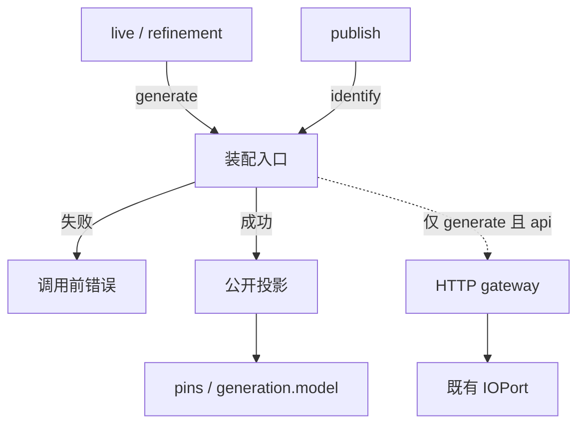

# 【factorio】将模型装配切到 milkie 连接契约

- Issue: #27
- 状态: Approved
- 最后更新: 2026-08-16（分层改为门面：调用方不接触 milkie 符号）

## 1. 背景

Factorio live / refinement 仍直接构造 milkie `AnthropicAdapter`，或走 `--model-config` + `createGateway`，并读取 `ANTHROPIC_*`。milkie [#251](https://github.com/xforce-io/milkie/issues/251) / [PR #252](https://github.com/xforce-io/milkie/pull/252) 已发布 `transport` + `protocol`/`runtime` 契约；Node 入口是 `resolveAndParseConnection` / `assembleApiGateway`。

[#26](https://github.com/xforce-io/helix/issues/26) 仍是 provider 中立配置的产品目标。本 issue 只做装配切流与旧装配面清除。

已批准 L1：[comment 5307361361](https://github.com/xforce-io/helix/issues/27#issuecomment-5307361361)（取代 [5307248012](https://github.com/xforce-io/helix/issues/27#issuecomment-5307248012)）。人工取舍：不兼容旧格式，不建互斥门禁。

## 2. 名词解释

- **装配入口**：Helix 唯一模型连接门面。调用方只交配置，并声明 `generate` 或 `identify`。成功返回公开投影；仅 `generate` 且 `transport=api` 时额外返回 HTTP gateway。milkie parse / 装配留在入口内部。
- **入口 A / 入口 B**：两种收数方式，不是两套产品配置。A = 操作员路径：`HELIX_LLM_*` 环境快照（入口只取闭集后缀）。B = 测试/注入：已收集规范对象。一次调用 XOR，不可合并。
- **规范配置**：`transport=api` 时 `protocol`/`model`/`apiKey` 必填；`baseUrl`/`provider` 可选。`transport=agent-cli` 时 `runtime` 必填。字段表以 milkie 为准，Helix 不另造一份。
- **公开投影**：可序列化成功产物。无 API key、无完整 base URL。调用方只用投影当身份与记录，不碰执行材料。
- **旧装配面**：`AnthropicAdapter` 直接构造、`createGateway`、`--model-config` 旧装配、`legacyModelConfig`、一切 `ANTHROPIC_*` 读取。必须删除，不是兼容层。

## 3. 设计目标与非目标

- **目标**：
  - live 与 refinement 只经同一装配入口连接模型；`protocol` 唯一决定 adapter，`provider` 不选路。
  - 只认规范配置；A/B XOR。
  - 删除旧装配面；残留 `ANTHROPIC_*` 不是配置面。
  - 公开记录不含原始凭证或完整 base URL。
- **非目标**：
  - 不兼容、不映射、不互斥扫描旧变量。
  - 不迁移 Kairo / Researcher；不新增协议；不实现 `agent-cli` 生命周期。
  - 不把真实 LLM E2E 纳入默认 CI；不改 Kernel / FLE；不完成 #26 真实 FLE 验收与全量文档迁移。
  - 不在 Helix 重写 milkie schema / helper / adapter / trace；不扩展 publish 协议。

## 4. 能力与功能设计

开发者用 `HELIX_LLM_*`（A）启动 live / refinement；测试可用 B 注入。都只调装配入口：

- `generate`：要打模型。`api` 成功则带 gateway；`agent-cli` 只给投影，HTTP=0、spawn=0。
- `identify`：只要模型名。publish 用投影 `model` 核验 `generation.model`，不建 gateway。

仅旧变量、缺规范配置、入口 XOR 失败、字段交叉：在模型调用、Docker/FLE、refinement 持久化之前失败。Helix 本 issue 不启动任何 CLI，不扩展 publish 协议。

### 4.1 UI / UX

N/A：无页面。错态为调用前安全错误（字段名，无密钥/完整 URL）。

## 5. 设计思路与折衷

- **选择**：Helix 只做宿主门面。pin milkie 到含 #252 的已发布提交（merge `fec0ebfb99f57e04a0812fc74fd01f85e9b81b57`）。入口内部固定 `contractVersion=2`。放弃调用方直接 `createGateway` / `new AnthropicAdapter` / 直调 milkie parse。
- **选择**：旧变量删除读取点，仅旧变量因缺规范字段失败。放弃 `hostEnv` 互斥表。
- **选择**：门面按用途分 `generate` / `identify`，内部仍一次 parse。publish 走 `identify`，避免第二事实源。放弃让调用方看见 resolve/assemble 两步。
- **放弃**：milkie 窗口内仅旧配置映射。不要旧成功路径。
- **放弃**：保留 `--model` 作为模型身份。第三来源。

## 6. 架构设计

### 6.1 逻辑分层

调用方只依赖门面：配置 + `generate`|`identify` → 投影，或再加 gateway。  
入口内聚：XOR、过滤 A、parse、按需建网关、脱敏后的对外结果。  
耦合：Helix 依赖 milkie，不反向改 milkie；live / refinement / publish 不引用 milkie 连接符号。

### 6.2 核心业务流程

**generate（live / refinement）**

1. 交 A 或 B。
2. 入口解析；失败则停。
3. `api`：返回投影 + gateway，交给既有 IOPort。
4. `agent-cli`：只返回投影，不建网关，不发 HTTP，不 spawn。
5. 投影 `model` 写入该次 pins / 与 `generation.model` 比较。

**identify（publish）**

1. 同一入口、同一配置面。
2. 只返回投影，比较 `generation.model`。不建网关。

**失败**：XOR、缺字段、交叉、未知值，均在副作用前。仅旧 `ANTHROPIC_*` 对入口不可见，表现为缺规范字段。

入口内部消费 milkie（`contractVersion=2`，不传 `legacyModelConfig`）。该细节不是调用方契约。

## 7. 模块设计

| 模块 | 拥有 | 不拥有 |
|---|---|---|
| 装配入口 | XOR、过滤 A、`generate`/`identify`、对外投影与可选 gateway | 字段表、adapter 选路、脱敏算法、IOPort/Trace |
| live / refinement | 调 `generate`；用返回的 gateway | milkie 连接 API、私有 adapter |
| publish | 调 `identify`；比较 `generation.model` | 建网关、读 `ANTHROPIC_MODEL`、新发布协议 |
| milkie | parse、protocol→adapter、错误码、投影脱敏 | Helix 前缀、旧变量互斥、用途分流 |

权威：字段与错误码以 milkie #251 L2 为准。Helix 只规定门面与删除面。

## 8. API / CLI 设计

不新增 Helix 公共 npm API。example 内部门面：

| 输入 | 规则 |
|---|---|
| 配置 | 恰好 A 或 B。A 为 `HELIX_LLM_*` 快照（只取闭集后缀）。B 为规范对象，供测试。A+B 或皆无 → 调用前错误，`fields` 含 `entry`。 |
| 用途 | `generate` 或 `identify`。调用方不可改契约版本，不可传 `legacyModelConfig`。 |

| 输出 | 规则 |
|---|---|
| `generate` + `api` | 投影 + gateway。`provider` 不改变 adapter。 |
| `generate` + `agent-cli` | 仅投影。gateway / HTTP / spawn = 0。 |
| `identify` | 仅投影。不建网关。 |
| 失败 | 不可重试。公开体只有安全文案与字段名。 |

CLI：live / refinement / publish 不再接受 `ANTHROPIC_*` 或 `--model` 作为模型身份。操作员只用 `HELIX_LLM_*`。不新增第三套 CLI 模型旗标。

## 9. 边界考虑

- **假设**：实现前 milkie 依赖已含 #251 参考实现（pin 见 §10）。凭证只在执行环境或入口 B 对象里。
- **错误**：副作用前 fail-closed。仅旧变量 = 缺规范字段，不是「检测到旧变量」。
- **并发**：无全局注册表。同一输入重复调用结果相同。
- **权限**：不读文件系统密钥；不回读未交给入口的 `process.env`。
- **安全 / 脱敏 sink**：stdout、公开投影、trace、evidence、pins、policy/suite 记录、错误文本。禁止 API key 与完整 base URL。允许 `model` / `protocol` / `provider` / `hasApiKey` / `hasBaseUrl`。测试用明显假值（如 `sk-test`、`https://example.invalid/v1`）。
- **兼容**：不改已录制 run 的 pins。新 runner 只用新装配身份。
- **删除清单**（不得再作装配面）：`AnthropicAdapter` 直接构造、`createGateway`、`--model-config` 旧装配、`legacyModelConfig`、`ANTHROPIC_MODEL` / `ANTHROPIC_AUTH_TOKEN` / `ANTHROPIC_BASE_URL` / `ANTHROPIC_API_KEY` 读取。

## 10. 迁移 / 兼容 / 回滚

- milkie 依赖从当前 pin 抬到 PR #252 merge：`fec0ebfb99f57e04a0812fc74fd01f85e9b81b57`。
- 无旧配置迁移窗口。无互斥扫描。无双写。
- 操作员改用 `HELIX_LLM_TRANSPORT=api`、`HELIX_LLM_PROTOCOL`、`HELIX_LLM_MODEL`、`HELIX_LLM_API_KEY`，可选 `HELIX_LLM_BASE_URL` / `HELIX_LLM_PROVIDER`。
- 回滚 = 回退本 issue 提交与 milkie pin。不保留旧读取分支作开关。
- 已录制 artifacts 不改写。

## 11. 测试计划

- **E2E（S1）**：live 与 refinement 共用入口，均不得绕过。对 `anthropic-messages` 与 `openai-chat-completions` 各装配成功（可控/注入 gateway，真实 LLM 不进默认 CI）。live 与 refinement 各至少一次成功。同一 `provider` 换 protocol 即换 adapter。向 `apiKey` 与完整 `baseUrl` 注入不同 sentinel，§9 每个 sink 均不含 sentinel。
- **E2E（S2）**：仅旧 `ANTHROPIC_*` → 调用前失败，模型调用数 = 0，无新 refinement 持久化。仅规范配置且环境残留旧变量 → 结果与无残留相同。源码与入口不读取这些键。
- **E2E（S3）**：`agent-cli`+`runtime`：gateway / HTTP / spawn = 0。`agent-cli` 混入 `protocol`/`apiKey`/`baseUrl`，或 `api` 混入 `runtime`：调用前拒绝，模型调用数 = 0。
- **Integration**：A/B 对同一规范字段同投影或同 milkie 拒绝码；A+B 与皆无入口级拒绝；过滤后 A 快照不含旧变量键。publish / refinement：`generation.model` ≠ 投影 `model` 时拒绝，且不 assemble、不改历史 pins。
- **Unit**：`contractVersion` 恒为 `2`；未提供 ≠ 空字符串；`provider` 不选路。仓库无 `AnthropicAdapter` / `createGateway` / `legacyModelConfig` / `ANTHROPIC_*` 装配引用。

环境不够跑真实 LLM 时，用注入 gateway / 本地 stub；不得伪称真实通过。

## 12. 开放问题 / 决策记录

- 2026-08-16：人工批准 L1 comment 5307361361。不兼容旧格式，清除旧装配，不建互斥门禁。
- 2026-08-16：Helix 固定 `contractVersion=2`。
- 2026-08-16：分层改为门面。调用方只见 `generate`/`identify` + 投影/可选 gateway；milkie 符号留在入口内。
- 开放问题：N/A。

## 13. 关联

- Issue #27 · L1 [comment 5307361361](https://github.com/xforce-io/helix/issues/27#issuecomment-5307361361)
- Issue #26 · milkie #251 · milkie PR #252
- milkie L2：`docs/design/251-model-connection-contract.md`
- 分支：`feat/27-model-connection-contract`
