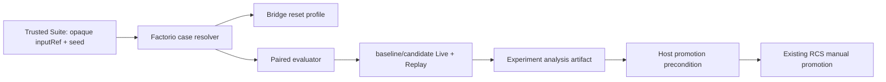

# 【factorio】Harness 自进化胜率实验

- Issue: #29
- 状态: Approved
- 最后更新: 2026-08-17

## 1. 背景

Factorio P3 已能将 recorded run 生成的 overlay 送入 baseline/candidate 双臂评估，并在人工批准后使其可被后续 live 显式选择。但现有真实评估 arm 未把 Suite case 的 `inputRef`、`seed` 传入 FLE；同时，早期 policy 可以在两臂均失败时仍通过。因此它证明了 control-plane 闭环，不证明候选 harness 提高真实任务完成率。

2026-08-17 的真实 bridge 探测确认，FLE 的 `run_idx` 是 Docker 容器槽位而不是随机 seed：单容器集群对 `run_idx=17` 明确拒绝。修订方案将 `inputRef` 映射为白名单 FLE task，`seed` 严格限制为已启动的 0–3 容器槽位；它们分别提供真实 task variation 与独立 instance slot。

本设计只为 Factorio example 建立锁定 holdout 的成对实验。RCS 继续拥有 Policy、Suite、Candidate、Report、Decision 和 overlay 可见性；milkie 继续拥有 run、Trace、Replay、lineage 与 outcome。本设计不改变它们的权威边界。

## 2. 名词解释

| 词 | 定义 |
|---|---|
| 实验 case | 一个 immutable `inputRef`、FLE `seed`、权重和类别构成的 holdout 实例。|
| pair | 同一 case、相同共享执行 pins 下的一个 baseline run 和一个 candidate run。|
| 实验计划 | 绑定 policy、suite、candidate、门禁阈值和实验 id 的 Factorio-only manifest。|
| 成功率差 | 所有有效 pair 上 `candidate.success - baseline.success` 的加权均值。|

## 3. 设计目标与非目标

- **目标**：让 `inputRef`、`seed` 真正决定 bridge reset 使用的 FLE instance；记录两臂证据和可复算统计结论。
- **目标**：只在 replay、成功率、统计显著性、成本、时延和分层回归均满足时允许人工 promotion。
- **目标**：将代码和实验模板限制在 `examples/factorio/`，不向通用 refinement 层添加契约。
- **非目标**：公共 SDK、自动 promotion、在线 A/B 流量分配、任意 FLE task，或将真实 holdout 正文/凭证提交到仓库。

## 4. 能力与功能设计

### 4.1 UI / UX

N/A。本设计通过现有 refinement CLI 和机器可读 artifacts 交付；操作员按 `examples/factorio/experiments/success-rate-v1/README.md` 执行。

### 4.2 锁定的成对评估

Suite 的 `inputRef` 选择真实、白名单 FLE task profile；`seed` 只能在已配置的四槽容器池中使用并传为 FLE `run_idx`。不得把任意 seed 解释为 `run_idx`。未登记 input、未配置槽位、重复的实验 pair、或候选生成阶段读取 suite 输入均 fail closed。

baseline/candidate 对同一 profile 分别运行，除 harness selection/pins 外共享 model、FLE、Factorio server、task digest、资源预算、超时和 profile digest。调度顺序由 `pairIndex` 决定 AB/BA，证据中记录该顺序。任何 arm 的 live、Replay、profile digest 或 shared-pin 不一致会使整个实验 `indeterminate`。

### 4.3 统计与 promotion 门禁

主指标是最终 FLE verifier 的二元结果，`quality=1|0`。分析 artifact 对有效 pair 计算加权成功率差、discordant pair 数、精确单侧 McNemar p 值、paired bootstrap 95% CI、成本/延迟比及按类别的成功率差。

正式 policy 采用：成功率差至少 10pp、CI 下界大于 0、p 小于 0.05、失败率不升、成本不超过 1.2 倍、延迟不超过 1.5 倍、每个关键类别回归不超过 5pp。统计结论只作为 Factorio Host 的人工 promotion 前置条件；现有 RCS 权限/签名/visibility gate 仍必须通过。

## 5. 设计思路与折衷

- 选择在 example 内实现 resolver、statistics 与 evidence index，而不是修改 `src/refinement/`。当前没有第二个场景可证明通用统计契约。
- 选择 opaque input ref 加 Host registry，而不是在 Suite 内内嵌任务正文。前者保留可审计 identity，又不使 holdout 流入 generation prompt。
- 选择配对检验和 CI，而不是仅采用 aggregate delta。前者控制同一 task/seed 的难度差及模型随机性；代价是需记录更完整的 pair 证据。
- 不把单次运行标为提升；正式实验需要 40 个任务变体乘 4 个独立重复。首次实现的 fixture 使用小样本，只验证计算与 fail-closed 行为，不能作为质量证明。

## 6. 架构设计

### 6.1 逻辑分层



`src/refinement/` 调用的 `FactorioRunArm` 仍只接收普通 case 和 frozen pins；Factorio Host 将普通 case 转为 profile、执行并返回既有 `EvaluationArmResult`。analysis 不改写 RCS report，它以 refs/hash 只读引用 report 和 canonical live/replay evidence。

### 6.2 核心业务流程

1. HRCA 发布 immutable policy/suite；candidate generation 仅读取 source run projection。
2. evaluator 为每个 case resolve profile，依次运行两臂并冻结证据 refs。
3. 重放两臂，统计器仅接受一致且 replay-reproduced 的 pairs；任务失败只要可确定性重放，仍是有效负例，不能因 `S2.live-success` 为假而从统计中消失。
4. 写入 experiment manifest、pair index、analysis；任何缺证据/门禁失败的结果不可 promotion。
5. 人工审批同时验证既有 RCS report 与 experiment analysis，才使 exact overlay 对 external live 可见。

## 7. 模块设计

| 模块 | 职责 | 非职责 |
|---|---|---|
| `examples/factorio/src/experiment/cases.ts` | 受限 inputRef/seed registry、profile digest | 读取 holdout 正文、修改 Suite |
| `examples/factorio/src/experiment/statistics.ts` | pair 聚合、McNemar、bootstrap CI、分层结果、门禁 | 运行模型/FLE、promotion |
| `examples/factorio/src/experiment/evidence.ts` | manifest/index、hash/路径验证 | 复制或重写 raw evidence |
| `refinement-host.ts` | case profile 传递、真实 arm 接线、analysis 前置 | 通用 refinement schema |
| bridge/kernel/executor | 将首次 reset profile 原样传至 FLE，记录 profile digest | 解释 policy 或统计结论 |

## 8. API / CLI 设计

没有公共 npm API。Factorio-only CLI 为：

```text
npm run factorio:experiment -- analyze --experiment <id> --report <evaluation-report-ref>
```

成功输出 `{experimentId, analysisPath, verdict, successRateDelta, confidenceInterval, mcnemarPValue}`。只接受已完成的 RCS evaluation report；读/写路径固定在 `artifacts/factorio/experiments/<id>/`。

## 9. 边界考虑

- resolver、bridge、evidence parser 均使用 closed schema；unknown inputRef、非法 seed、路径逃逸与 hash drift 拒绝。
- 每个 run 是独立 FLE episode；pair 不共享 state，AB/BA 顺序记录而不改变 profile。
- provider 若不能 pin sampling seed，重复编号仍进入 profile/证据，统计把它视为独立重复；model identity/连接投影必须在两臂相同。
- bootstrap CI 使用固定、由 experiment manifest 导出的随机序列；没有足够有效 pair 时 verdict 为 `indeterminate`。
- credentials、holdout 正文、完整 endpoint 绝不写入 plan、evidence index 或分析 artifact。

## 10. 迁移 / 兼容 / 回滚

现有 P1/P2/P3 默认路径保持不变；实验为 opt-in。旧 report 没有 experiment analysis 时不能用于新实验 promotion，但仍可按原记录 replay。回滚可删除 `examples/factorio/src/experiment/` 和 opt-in CLI，不改写 RCS、overlay 或旧 evidence。

## 11. 测试计划

- **E2E**：在真实 FLE + 已配置模型环境中，对冻结 suite 运行成对 baseline/candidate，输出 canonical evidence 与 analysis；满足门禁时人工 promote，任一门禁失败时 external route 仍拒绝。环境不可用时明确报告，不能用 fixture 代替。
- **Integration**：验证 `inputRef/seed → reset profile → bridge run_idx`，两臂 shared pins/profile digest 对称，raw live/replay evidence 通过 index 校验。
- **Unit**：closed case schema、统计计算、边界 p/CI、类别回归、缺失/篡改 evidence、path/hash fail-closed。

## 12. 开放问题 / 决策记录

- FLE 当前 P1 默认仍固定为 `iron_ore_throughput`；实验路径通过 Host-private profile 覆盖 bridge task 与模型可见 task 叙事，默认 P1 pins 保持不变。
- 当前 refinement policy schema 不承载统计字段；首版将其放在 Factorio experiment plan 和人工 promotion precondition，避免提前改变通用契约。

## 13. 关联

- Issue: #29
- L1: Issue #29 comment
- P3: `docs/design/13-harness-refinement-toolchain.md`
- 实现: `examples/factorio/src/experiment/`
