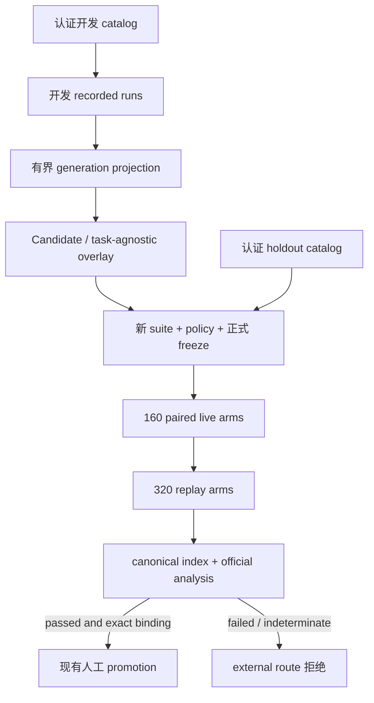

# 【factorio】Harness 自进化胜率实验

- Issue: #29
- 状态: Approved
- 最后更新: 2026-08-22

## 1. 背景

Factorio P3 已能由 recorded run 生成 overlay、运行 baseline/candidate 两臂、经人工审批后供下一轮 live 显式选择。#39 又将正式实验收敛为有不可变身份的 10 个认证任务、4 个 FLE 槽位和每变体 4 个模型重复，共 160 对。

首个正式候选未达到成功率与统计门槛；后续 r4 筛选也已读取该矩阵的一部分。把这些正式 case 的失败轨迹作为下一候选的生成输入，再用相同任务身份复验，会使 holdout 泄漏，不能支持“候选提升”的结论。

本修订在 Factorio example 内引入开发任务闭集与正式 holdout 闭集的隔离生命周期。RCS 仍拥有 policy、suite、candidate、decision 与 overlay 可见性；milkie 仍拥有 run、trace、replay、lineage 与 outcome。本设计不修改这些权威边界，也不改 `src/refinement/` 通用契约。

## 2. 名词解释

| 词 | 定义 |
|---|---|
| 开发任务 | 只用于收集 source run、诊断与生成候选的认证 `inputRef` 闭集。|
| 正式 holdout | 候选生成前尚不可被 generation projection、candidate 或其 source run 读取的认证任务闭集。|
| 污染 | 某 candidate 的生成输入直接或间接含有其正式 holdout 的 `inputRef`、`taskId`、`taskDigest`、instruction、feedback 或该矩阵 evidence。|
| 实验 case | 一条 `{caseId, inputRef, taskId, taskDigest, slot, seed, repetitionIndex, category, weight}` 冻结行。|
| pair | 同一 case、相同共享 execution pins 下的 baseline 和 candidate 两个 arm。|
| 正式 freeze | 签名绑定 suite/policy digest、认证 catalog snapshot、160 行 canonical matrix 与统计门槛的不可变记录。|

## 3. 设计目标与非目标

- **目标**：候选只从开发任务的有界、可追溯 source run 投影学习；开发与正式 holdout 的身份闭集严格互斥。
- **目标**：候选生成完成后才发布新的正式 freeze，并只以该 freeze 的完整 160 对 live/replay evidence 得出 terminal 分析结论。
- **目标**：使任务叙事模板根据当前 reset 的任务和 action capabilities 选择资源、recipe、机器与规模，而不是复用某个历史任务的产品、坐标或产线。
- **非目标**：降低 160-pair、成功率、CI、McNemar、成本、延迟、失败率、类别回归或人工 promotion 门槛。
- **非目标**：把筛选或正式失败 case 回灌给同一 candidate；自动 promotion；开放任意 FLE task；向通用 refinement 层添加协议。

## 4. 能力与功能设计

### 4.1 UI / UX

N/A。操作员通过现有 refinement CLI、Factorio-only artifacts 与 `success-rate-v2` 实验脚本执行。空态为无认证开发/holdout catalog；错态为身份交集、未发布 freeze、签名/digest 漂移或 generation projection 泄漏，均拒绝且不调用模型。

### 4.2 开发与 holdout 生命周期

1. 认证开发任务与正式 holdout 任务。两者的 `inputRef`、`taskId`、`taskDigest` 必须双向不相交；下一次正式 freeze 标识为 `success-rate-v2`。
2. 在开发任务运行可重放的 baseline/诊断 run；只将这些 run 的有界 feedback 投影给 generation 模型。
3. 先发布不含正式 catalog/matrix 的不可变 generation policy，再生成并 admission 一个 candidate。模板不得命名固定目标、recipe、吞吐量、坐标或历史工厂布局；实际 run 必须以当前 reset 信息和 allowlist 决策。
4. **在 candidate terminal 后**发布新的 suite 和正式 freeze；freeze 必须绑定该 candidate 的 generation policy 的精确 digest。生成路径无法读取其 catalog snapshot 或 matrix。
5. 对 freeze 的全部 160 pair 跑 baseline/candidate live，随后对全部 320 arm replay；canonical index 与 freeze 全等后才可分析。
6. 仅 `passed` 的正式 analysis 且 candidate/overlay/freeze 精确匹配时，才成为既有人工 promotion 的必要前置。

### 4.3 统计与 promotion 门禁

主指标为 FLE verifier 的二元结果。正式分析锁定：160 有效 pair、成功率差 ≥10pp、paired bootstrap 95% CI 下界 > 0、单侧 McNemar `p < 0.05`、失败率不升、成本 ≤1.2×、延迟 ≤1.5×，且每个冻结关键类别回归 ≤5pp。任何 replay、pins、freeze 引用或矩阵身份缺失时 fail closed；小样本仅是 smoke，必须 `indeterminate`，不可 promotion。

## 5. 设计思路与折衷

- **选择独立认证任务闭集，而不是同一 profile 仅换 repetition。** 后者实施简单，但候选已从同一任务身份的筛选反馈中学习，不能作为无污染的提升证明。
- **选择 candidate 生成后冻结 holdout，而不是先冻结后再把其失败反馈加入下一轮。** 前者保留评估独立性；后者会把调参结果伪装成验证。
- **选择 recipe-driven 的任务无关叙事，而不是把一个成功 factory layout 固化为模板。** 固定坐标/采矿-熔炼链对单任务有效，但不覆盖电路、装配、科学或油链任务。
- **放弃在通用 policy schema 加入实验字段。** Factorio-only freeze 已能绑定统计与身份；没有第二个 domain 证明通用化价值。

## 6. 架构设计

### 6.1 逻辑分层


```mermaid
flowchart TD
  D[认证开发 catalog] --> DR[开发 recorded runs]
  DR --> GP[有界 generation projection]
  GP --> C[Candidate / task-agnostic overlay]
  C --> F[新 suite + policy + 正式 freeze]
  H[认证 holdout catalog] --> F
  F --> E[160 paired live arms]
  E --> R[320 replay arms]
  R --> A[canonical index + official analysis]
  A -->|passed and exact binding| M[现有人工 promotion]
  A -->|failed / indeterminate| X[external route 拒绝]
```

### 6.2 核心业务流程

开发 catalog 的 resolver 与正式 catalog 的 resolver 分别构造 profile；二者仅共享 FLE adapter 和 closed-schema 验证。generation host 在读取 source run 前检查该 run 的 profile 属于开发 catalog，并检查投影不含正式身份。freeze 发布时检查两 catalog 双向不交并把正式 catalog snapshot 写入 freeze。

评估 host 只接受正式 matrix 中的 case，按其 slot 调度两臂，记录同一 model/FLE/预算 pins。分析器先校验每行 evidence/replay 与 freeze，再运行统计。promotion host 读取 official analysis，拒绝分析非 official、非 passed 或 candidate/overlay/freeze 不匹配的请求。

## 7. 模块设计

| 模块 | 职责 | 非职责 |
|---|---|---|
| `experiment/cases.ts` | 开发/正式 catalog、profile identity、双向不交校验 | 扫描 Gym 或读取 holdout 正文 |
| `experiment/freeze.ts` | 正式 catalog snapshot、matrix、suite/policy digest 与隔离校验 | 保存开发 feedback |
| `refinement-host.ts` | 只投影开发 source run；生成任务无关 overlay；正式 promotion 前置 | 改通用 RCS schema |
| `experiment/evidence.ts` | canonical pair/replay 校验和 official analysis binding | 生成或修补 raw evidence |
| `experiments/*` 脚本 | 开发 run、smoke、正式 160 对与 replay 的可复现编排 | 在证据不足时宣布通过 |

## 8. API / CLI 设计

没有公共 npm API。正式分析入口保持：

```text
npm run factorio:experiment -- analyze --index <experiment-index.json>
```

正式评测调用必须显式设置隔离的 `HELIX_FACTORIO_HARNESS_STATE_ROOT`。candidate generation 只接受带认证开发 profile 的 source run；正式 freeze 只接受新的 `success-rate-v2` catalog 和完整 matrix，且不复用已被候选读取的旧 freeze。未提供 index、index 非 freeze 的完整 matrix、或 catalog 分区校验失败时非 0 退出且不写 promotion 相关 verdict。

## 9. 边界考虑

- 开发与正式 identity 的任一交集、别名映射到同一 `taskId`/`taskDigest`、或 source run 缺失可验证 profile 时，candidate generation 失败。
- 任务模板只能提供方法性策略；运行时的 target、recipe、资源 patch、位置与规模来自当前 reset/allowlist。不得将 player inventory 视为自动吞吐。
- 单个 slot 内不得并发；每个 pair 是独立 FLE episode。live/replay 可确定失败是有效负例，不能删除以改善统计。
- 凭证、完整 endpoint、holdout instruction、正式 catalog snapshot 与正式 evidence 不得进入 candidate prompt 或开发 artifacts。
- 若无足够独立认证任务，停止实验，不以旧正式矩阵或已读取 case 替代。

## 10. 迁移 / 兼容 / 回滚

既有 `success-rate-v1` freeze、r4 筛选证据和失败 analysis 保留为只读历史，不能绑定下一候选 promotion。默认 P1/P2/P3 路径保持不变。回滚时停止发布新的正式 freeze 和 candidate；保留 catalog snapshot、evidence 与 analysis 以支持历史 replay，不删除或重写旧结论。

## 11. 测试计划

- **E2E**：开发 run 只来自开发 catalog；candidate terminal 后发布正式 freeze；完整 160 对的两臂 live/replay 都可读，official analysis 给出可判定 `passed` 或 `failed`。身份泄漏或任一 arm replay 失败时 external route 不可选择 overlay。
- **Integration**：开发/正式 catalog 的 `inputRef`、`taskId`、`taskDigest` 交集拒绝；开发 source run 伪称正式/未知 profile 拒绝；generation projection 不含正式 identity；新 candidate 不可使用旧 freeze 的 analysis promotion。
- **Unit**：task-agnostic 生成指令包含 recipe discovery、动态 resource/placement/scale 规则并禁止固定拓扑；freeze/catalog 双向不交；官方 analysis 的 exact candidate/overlay/freeze binding。

## 12. 开放问题 / 决策记录

- 2026-08-22：#29 comment `5380908886` 的 L1 已获用户 **Approved**。本文件为该批准后的 L2 事实源。
- 需要先认证足量且与正式集不相交的 FLE task profiles；认证失败不能以未认证名称或已读取 holdout 替代。
- r4 是失败筛选，不能作为下一候选 source run，也不能进入正式统计或 promotion。

## 13. 关联

- Issue: https://github.com/xforce-io/helix/issues/29
- L1: https://github.com/xforce-io/helix/issues/29#issuecomment-5380908886
- 历史正式矩阵: `docs/design/39-official-success-rate-matrix.md`（仅 `success-rate-v1` 历史证据）
- v2 操作模板: `examples/factorio/experiments/success-rate-v2/README.md`
- 实现: `examples/factorio/src/experiment/`
