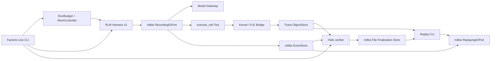

# 【factorio】接入 milkie 运行截止时间与不可变任务结果

- Issue: #3
- 状态: Implemented
- 最后更新: 2026-08-09

## 1. 背景

Issue #1 的 Factorio v2 已验证模型自主持久 Kernel、真实 FLE action、对象化 Observation、milkie Trace 与零 live effect Replay。后续试跑发现，Helix 虽然限制模型次数、cell 数和单次 FLE step，却没有把一次 run 的绝对墙钟截止时间传入 milkie；在途模型调用仍可能依赖 Provider 默认等待。正式验收结果也仍由 `recordTaskOutcome` 表达，读取语义是 last-write-wins，不适合作为不可覆盖的最终裁决。milkie #227、#228、#229 已分别提供 immutable Task Outcome finalization、端到端 I/O control 与失败终态 Replay。本设计只消费这些已批准契约，不在 Helix 重做 lifecycle、Trace、Replay 或 Outcome。

## 2. 名词解释

- **Live budget**：Live run 开始前固定的原始绝对截止时间及其模型可见剩余量，是录制事实的一部分。
- **Execution control**：当前进程实际传给 IOPort 的 `signal/deadlineAt`。Live 与 Live budget 对齐；Replay 使用新的本地 safety deadline。
- **Observation Outcome**：`recordTaskOutcome/getTaskOutcome` 的可追加、last-write-wins 评价，不作为本设计的正式验收结果。
- **Finalization**：`finalizeTaskOutcome/getFinalTaskOutcome` 的一次性、证据绑定、不可覆盖结果，是 Factorio v3 的唯一正式 Outcome。
- **Terminal event**：与一个 I/O request 因果配对的唯一成功或失败终态。

## 3. 设计目标与非目标

- **目标**：一次 Live 固定绝对 run deadline，并传播到所有 LLM 与 Tool 调用；deadline/cancel 可在固定容差内结束并形成稳定终止语义。
- **目标**：模型通过 ContextEnvelope 看到可 Replay 的剩余墙钟预算。
- **目标**：正式 Outcome 只由 crash-safe finalization store 保存，并绑定最终验证事件和唯一 run completion。
- **目标**：成功、失败、取消和不确定终止均保留可诊断证据；新版本 Live 可在无 live fallback 下 Replay。
- **非目标**：改变 FLE 任务、动作 allowlist 或注入 gold/fixed action；提高模型解题成功率。
- **非目标**：修改 milkie 已批准契约，或把本纵切提前抽象成所有 Helix harness 的公共 API。
- **非目标**：用新代码静默解释旧 v2 artifacts，或让 Replay 重新写入/覆盖 Live finalization。

## 4. 能力与功能设计

Factorio v3 仍以 `verify:factorio:live` 和 `verify:factorio:replay` 为入口。Live 在首个 Trace 事件和首个模型调用前固定 `RunBudget.deadlineAt`，并安装 caller cancellation signal；每轮先通过 milkie clock 获取可录制的当前时间，再构造含 `remainingWallMs` 的 ContextEnvelope。所有 `invokeLLM`、`invokeTool` 与 Tool handler 共享同一 execution control，不能逐轮续期。

Harness 不再把 control error 作为无结构异常直接丢出，而是连同最后确认 projection 返回结构化 termination。LLM 阶段 deadline 表示预算耗尽；caller cancellation 表示外部中断。Tool 阶段若 control 已结算但环境动作是否完成未知，则保守进入 uncertain，不允许自动重试。

Live 完成 Trace、对象、State 链和 verifier 检查后，只调用 `finalizeTaskOutcome`。正式结果绑定至少两个 Event Ref：承载最终 verifier/最后确认状态的 terminal event，以及唯一 `agent.run.completed`。Replay 读取 `getFinalTaskOutcome`，不扫描 `task.outcome.recorded`，也不产生新的 finalization。

### 4.1 UI / UX

CLI 继续输出 canonical JSON，并新增：

- Live：`termination`、`budget.deadlineAt`、`budget.remainingWallMsAtEnd`、`finalization.status/value/recordHash/intentHash`；
- Replay：`finalizationMatch` 与原 Live finalization 的稳定 hash；
- deadline：退出码 `1`，termination=`wall_budget_exhausted`，正式 Outcome=`failure`；
- caller cancellation：退出码 `130`，termination=`cancelled`，正式 Outcome=`unknown`；
- uncertain Tool control：非零退出，termination=`uncertain_effect`，正式 Outcome=`unknown`；
- finalization conflict/corruption/evidence failure：退出码 `2`，不得输出 pass。

没有 GUI 变化。Factorio GUI、截图和地图渲染仍属于 example 观察面，不参与 Outcome 真值。

## 5. 设计思路与折衷

### 5.1 Live budget 与 execution control 分离

选择保存原始 `deadlineAt`，同时允许 Replay 使用新的本地 execution control。Replay 若直接复用已过期的 Live deadline，会在消费 FIFO 前被 milkie preflight 拒绝；若完全丢弃原 deadline，又无法重建模型当时看到的剩余预算。因此：

- ContextEnvelope 的 `remainingWallMs` 使用原始 Live deadline 和 `port.now()`；Recording/Replay 分别记录和消费同一 clock 值；
- IOPort options 使用当前进程的 execution control；Live 对齐原 deadline，Replay 使用新的 5 分钟 safety deadline；
- control 不进入 request 业务 hash，模型可见 budget 进入 request，因此 Replay 仍严格验证实际请求。

放弃每轮 `Date.now()+timeout`，因为它会隐式续期；放弃把旧 deadline 直接传给 Replay，因为它必然过期。

### 5.2 结构化 termination

选择将终止原因固定为闭集：

```ts
type TerminationReason =
  | 'verifier_succeeded'
  | 'model_budget_exhausted'
  | 'cell_budget_exhausted'
  | 'wall_budget_exhausted'
  | 'cancelled'
  | 'uncertain_effect'
  | 'policy_violation'
  | 'kernel_resource_exhausted'
  | 'environment_failed'
```

映射规则：verifier success→success；模型/cell/wall budget 与 policy violation→failure；caller cancel 与 uncertain effect→unknown；明确环境业务失败→failure。Kernel/基础设施错误若没有领域结论则 unknown。结构化结果保留最后确认 projection，使非成功 run 也能完成 Trace 与 finalization。

### 5.3 独立 finalization 事实源

选择 `FileTaskOutcomeFinalizationStore`，根目录为 `artifacts/factorio/final-outcomes`。`finalizationId` 固定为 `${runId}:eval:fle:v2`，verifier claim 固定为 `{type:'eval', id:'helix.factorio.fle/v2'}`。同 ID 同 intent 是幂等恢复；其他已有结果是冲突并 fail closed。

放弃同时写 observation Outcome。两个表面同时存在会让消费者继续误读 last-write-wins 值；Factorio v3 没有兼容该读取面的公共消费者，正式结果只认 `getFinalTaskOutcome`。

## 6. 架构设计

### 6.1 逻辑分层



Helix 只负责 Factorio termination 映射与领域证据选择；deadline 结算、失败终态、Replay FIFO、finalization 原子性和证据完整性由 milkie 提供。

### 6.2 核心业务流程

Live 主路径：

1. preflight 固定 pins、`deadlineAt`、runId 和 cancellation signal；
2. `agent.run.started` 后，Harness 用 `port.now()` 计算剩余预算并发起带 control 的 LLM/Tool；
3. 每个结果折叠 projection；control/error 转换为 termination，不丢失最后确认状态；
4. detach 恰好一次，产生唯一 `agent.run.completed`；
5. 检查 request-terminal 配对、对象 hash、State 链、verifier 和证据 Event Ref；
6. 调用 `finalizeTaskOutcome`；只接受 `finalized` 或同 intent 的 `idempotent`；
7. 写 Live evidence，退出码由 termination、final value 和检查共同决定。

Replay 主路径：

1. 读取 Live evidence，要求 harness/evidence/milkie pins 为新版本；
2. 使用录制 clock 与原 `deadlineAt` 重建相同 ContextEnvelope，使用新的本地 safety control；
3. 禁止 Model、Kernel、Bridge/FLE fallback，消费全部 Replay I/O；
4. 读取并校验原 finalization，不重新写入；
5. projection、对象、termination、finalization hash 与 Live 一致后输出 verdict。

关键失败路径：request preflight 失败不消费 FIFO；合法 deadline/cancel 形成 v2 failure terminal；terminal/Trace 损坏由 milkie integrity error fail closed；finalization conflict/corruption/evidence 缺失为配置/证据错误，不降级为 observation Outcome。

## 7. 模块设计

- `cli-common.ts`：固定版本、artifact roots、默认 Live/Replay wall budget；读取旧 artifacts 时执行 pin gate。
- `harness.ts`：`RunBudget`、execution control、录制 clock、模型可见剩余预算、结构化 termination 与所有 IOPort control 传播。
- `live-executor.ts` / `line-process.ts`：Tool handler 接收相同 AbortSignal；取消时终止子进程等待，并以 effect 是否开始决定 state certainty。
- `verification.ts`：termination→Outcome 真值表、唯一 terminal 配对、finalization evidence event 选择。
- `live.ts`：signal lifecycle、detach once、File finalization store、Live evidence v2。
- `replay.ts`：fresh safety control、读取 finalization、Live/Replay hash 比较。
- `types.ts`：harness v3、Context budget、termination 与 evidence/finalization 摘要。

## 8. API / CLI 设计

本需求不新增 Helix 公共 npm API。example 内部契约为：

```ts
interface RunBudget {
  deadlineAt: number
}

interface HarnessOptions {
  budget: RunBudget
  control: IOInvocationControl
  execute(input: ExecuteCellInput, signal?: AbortSignal): Promise<CellExecutionRecord>
}

interface HarnessResult {
  projection: EpisodeProjection
  termination: TerminationReason
  uncertain: boolean
}
```

CLI 维持现有命令；Live 固定默认墙钟上限 30 分钟，Replay safety deadline 固定 5 分钟。首版不新增用户可调 timeout CLI/config，避免将实验参数提前变成公共契约；测试通过依赖注入使用短 deadline。

## 9. 边界考虑

- deadline 必须是有限、非负 Unix epoch ms；非法值在调用 Provider/Tool 前拒绝。
- 同一 run 所有 Live I/O 共享一次解析后的 control；不得逐轮延长。
- caller cancel 优先于尚未到达的 deadline；错误 code 以 milkie resolver 为准。
- Tool 已发出 effect 后 control 结算不能证明远端未执行，必须映射 uncertain；command ledger 仍是恢复事实源。
- 每次 Bridge 尝试使用独立递增的 command ID；失败且状态未变时，后续模型输入是新命令，不能复用已被幂等账本占用的 ID。成功 effect 的 `stepIndex` 仍只按确认状态迁移递增。
- signal handler 只触发 AbortController，不直接 `process.exit()`；必须先 detach/finalize/close。
- finalization 只允许唯一 completed run；evidence Event Ref 必须来自同一 run，且最终 verifier evidence 与最后确认 projection 一致。
- File store 使用 crash-safe durability；不可用时不得回退 Memory store。
- Replay safety deadline 只约束 Replay 进程，不改变原始模型可见预算或 finalization intent。
- secrets、stack、SDK body 和 abort reason 不进入 Trace/evidence；稳定失败 envelope 由 milkie sanitizer 负责。

## 10. 迁移 / 兼容 / 回滚

- 版本提升：`harness=factorio-rlm/v3`、ContextEnvelope `helix.context/v2`、Live/Replay evidence `v2`、verifier claim `helix.factorio.fle/v2`。
- milkie pin 提升为 `d74128cf3ac976ebd68eb1b87f340574811c6366`。
- 旧 v2 run、Trace 和 observation Outcome 不改写；只能用其记录的旧 pin/旧代码 Replay。新 runner 在 pin/schema gate 处明确拒绝。
- finalization store 是新增目录，无数据迁移；回滚新代码不会删除其中记录。
- 回滚可将默认运行入口切回旧 commit，但不得用旧 observation Outcome 覆盖已有 v3 finalization。

## 11. 测试计划

- **E2E（S1）**：使用永不 settle 的 LLM 和 Tool，设置短 deadline；断言在 deadline+100ms 内结束，LLM request 恰有一个 error terminal，LLM deadline→failure；caller cancel→unknown；Tool 已开始后 control→unknown/uncertain 且不盲重试。
- **E2E（S2）**：完成 deterministic run，绑定最终 tool terminal 与 run completion；首次返回 finalized，相同 ID/intent 返回 idempotent，不同 intent 返回 conflict，`getFinalTaskOutcome` 始终等于首次结果。
- **E2E（S3）**：真实 Factorio Live 必须 verifier success，再对同 run Replay；要求 live effect=0、四类 I/O remaining=0、projection/termination/finalization hash 一致。模型未在预算内成功只能证明失败路径，不能替代 S3 成功验收。
- **Integration**：Recording/Replaying `port.now()` 使 `remainingWallMs` 与 request hash 一致；signal 传播到 child wait；detach once；evidence event 选择与同 run 校验；File finalization root 可跨进程读取。
- **Unit**：termination 真值表、deadline clamp、非法 deadline、caller cancel 优先级、Tool state certainty、finalization conflict、v2 pin/schema 拒绝、Live/Replay evidence decoder。

验收结果（2026-08-09）：

- 自动化：16 个 TypeScript 测试、12 个 Python worker 测试、TypeScript build 与 `git diff --check` 全部通过。
- S1/S2：短 deadline/cancel、Tool uncertain、首次/idempotent/conflict/跨实例 finalization 均通过；成功 Trace 中 7 组 LLM、7 组 Tool request-terminal 严格配对，唯一 `agent.run.completed`，且没有 `task.outcome.recorded`。
- S3：真实 run `factorio-1786282197773-efc05060` 由模型自主执行 7 个 cell、6 次 FLE step，verifier 产能为 30/16，Live finalization=`success`；同 run Replay 的 live effect=0、四类 remaining I/O=0，projection/termination/finalization record hash 一致。

## 12. 开放问题 / 决策记录

- 2026-08-09：用户批准端到端推进；选择新 Issue #3，不修改已 Implemented 的 Issue #1 历史事实。
- 2026-08-09：Live 默认 30 分钟、Replay safety 5 分钟；首版不暴露可调 CLI。
- 2026-08-09：正式结果只用 finalization，不双写 observation Outcome。
- 2026-08-09：真实首轮验收发现失败命令复用 step 派生 command ID 会与幂等账本冲突；改为每次 Bridge 尝试独立递增，状态链仍按成功 effect 递增。随后真实 Live 与同 run Replay 通过。
- 开放问题：N/A。

## 13. 关联

- Issue #3 · L1 comment · Issue #1 · PR #2
- milkie #227 · #228 · #229
- `docs/design/1-rlm-factorio-harness.md` · `src/factorio/`
