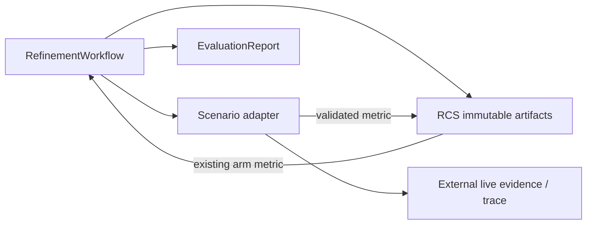

# 【refinement】评估任务的可恢复性与证据完整性

- Issue: #33
- 状态: Approved
- 最后更新: 2026-08-17

## 1. 背景

Refinement evaluation 为同一 candidate 与 suite 分配确定的 job/run 标识。一次真实 arm 已完成但 evaluation job 尚未形成 report 时，进程异常或 adapter 抛错会使 job 保持未完成。旧实现再次执行 job 时会再次调用该 arm，并让外部 runtime 向同一 trace 追加事件；trace 的唯一 completion 约束随后拒绝该记录。该问题在 Factorio holdout 中出现，但恢复机制必须保持 core 的场景无关性。

## 2. 名词解释

- **evaluation arm**：suite 中一个 case 的 baseline 或 candidate 的一次冻结执行。
- **arm terminal metric**：由 adapter 返回并通过 pin/提取器校验后的不可变 EvaluationMetric。
- **恢复**：对尚未生成 EvaluationReport 的同一 evaluation job 继续执行缺失 arm，而不重新执行已持久化 arm。

## 3. 设计目标与非目标

- **目标**：每个已校验 arm 的 terminal metric 在 RCS 中写入一次；重试只读取它或运行缺失 arm；所有 case 都进入最终 report。
- **目标**：candidate FLE 失败能以质量 0 的 metric 参与报告和 gate，而非截断 suite。
- **非目标**：重新抽样模型、改变 suite/candidate identity、修复外部 runtime 的 trace 格式，或自动允许 promotion。

## 4. 能力与功能设计

### 4.1 UI / UX

N/A。命令 API 仍返回原有 EvaluationAck 和 EvaluationReport；恢复对调用方透明。

## 5. 设计思路与折衷

- **选择：RCS 持久化每个已验证 arm metric。** 其 identity 由 jobRef、arm、caseId 构成。恢复前读取 metric；存在则跳过 adapter，不存在才使用已预留 runRef 执行。
- **放弃：为每次重试随机生成 attempt/run 后缀。** 这会令相同 candidate/suite 的重试引入新的模型采样，既无法保证幂等，也破坏 paired 对照。
- **放弃：只依赖外部 live.json 判断是否完成。** core 无权了解场景文件布局，且未验证的文件不能替代经过 extractor/pins 校验的 metric。

## 6. 架构设计

### 6.1 逻辑分层

RCS 是恢复决定的唯一事实源；scenario adapter 仍负责生成真实 metric 与 trace，core 不读取场景产物。

### 6.2 核心业务流程

1. workflow 为 baseline/candidate 取得确定的 reserved runRef。
2. 查询对应 arm terminal metric；若存在，验证后复用。
3. 若未开始，先原子写入 started marker，再调用 adapter，校验 metric/pins 后写入 arm terminal metric。
4. 所有 case 完成后聚合并一次性写入 report/result。
5. 已有 terminal metric 的 arm 直接复用；仅有 started marker 而无 terminal metric 时明确 fail-closed，不会猜测外部 trace 是否已经产生副作用。

## 7. 模块设计

- `src/refinement/workflow.ts`：定义 arm metric artifact identity、读取/写入和恢复流程。
- `src/refinement/control-store.ts`：复用 write-once artifact 事务，无新的外部存储。
- scenario Host：无恢复状态分支；它仅收到未完成 arm 的 reserved runRef。

## 8. API / CLI 设计

N/A。现有 `evaluate` / `show-evaluation-job` 的输入输出保持兼容；同一 job 的重复调用获得同一 report 或继续缺失 arm。

## 9. 边界考虑

- metric 只在 extractor digest、runRef、shared pins 与 harness pins 校验后持久化。
- 同一 arm identity 的不同 metric 写入必须 fail-closed；started marker 之后的进程中断也必须 fail-closed，而非重跑同一 run ID。
- 已有 report 优先返回，绝不重新执行 arm。
- candidate quality=0 由 adapter metric 表达；gate 的质量增量和失败率规则继续拒绝不合格候选。
- 并发同进程调用由 worker map 合并；跨进程由 RCS write-once 提交避免覆盖，冲突报错而不替换证据。

## 10. 迁移 / 兼容 / 回滚

无需数据迁移。旧未完成 job 没有 arm terminal artifact，会在首次恢复时执行缺失 arm；已完成 report 不受影响。回滚代码不会删除已写 artifact，但旧代码会忽略它，故仅应在无运行中 job 时回滚。

## 11. 测试计划

- **E2E**：三 case suite 令一个 candidate arm 返回 quality=0；第一次中断后恢复，同一已完成 arm 不再调用 adapter，最终 report 含三 case 且 verdict 非 passed。
- **Integration**：分别在 baseline、candidate、report 前中断，验证恢复仅执行缺失 arm，所有 runRef 保持唯一。
- **Unit**：terminal metric artifact 写一次、冲突拒绝、跨 RCS 实例读取、未校验 metric 不可持久化。

## 12. 开放问题 / 决策记录

N/A。

## 13. 关联

- Issue: #33
- L1: https://github.com/xforce-io/helix/issues/33#issuecomment-5316959593
- PR: 待创建
- 相关：#31、PR #32
