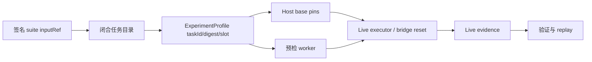

# 【factorio】受验证多任务保持集

- Issue: #35
- 状态: Implemented
- 最后更新: 2026-08-18

## 1. 背景

Factorio 实验目录和 FLE Gym 都能发现多个吞吐任务，但现有运行引脚、预检与验证器把任务身份固定为 `iron_ore_throughput`。因此目录中的其它条目无法形成由 Helix 验证的真实证据。铁矿新保持集的基线与候选连续两轮均为 4/4 成功，胜率饱和，不能继续检验自进化质量提升。

本设计先认证 `iron_plate_throughput`，以获得一个闭合、可重放、尚未被铁矿结果污染的真实任务族。

## 2. 名词解释

- **受支持任务**：静态目录中明确列出，并有确定 `taskId`、`taskDigest`、类别和自然语言目标的 FLE 任务。
- **任务身份**：运行 pins、实验 profile、预检事实和 live evidence 中一致的 `{taskId, taskDigest}`。
- **保持集**：在候选生成前签名发布的 suite；其中的任务与槽位均不可由候选生成阶段选择。

## 3. 设计目标与非目标

- **目标**：使 iron ore 与 iron plate 均通过同一任务身份链参与真实配对评估。
- **目标**：身份未注册、digest 不匹配或 FLE 未注册时，在模型或 FLE 动作前失败。
- **目标**：保持旧 iron-ore 记录和 replay 的兼容性。
- **非目标**：扫描并开放任意 Gym 任务；更改通用 refinement 协议；变更模型动作安全策略；迁移历史 evidence。

## 4. 能力与功能设计

### 4.1 UI / UX

N/A。该能力由 Factorio 示例的 suite、CLI 与证据文件驱动，无交互页面。

研究者只能在静态任务目录中选择 `inputRef`。suite 解析后生成任务 profile；运行前预检返回同一任务的事实，完成后 live evidence 固化相同身份。

## 5. 设计思路与折衷

- **选择闭合、带 digest 的任务目录**：每项保存 `inputRef`、`taskId`、`taskDigest`、类别和 instruction。这样 suite 的语义、FLE 注册事实和 replay pins 可逐项比对。
- **不只删除 iron ore 硬编码**：仅放宽字符串检查会允许环境漂移或未认证任务进入结果，无法证明预注册的评估对象。
- **不在运行时扫描 Gym 并自动开放**：可见任务集合随 FLE 版本与环境变化，不能作为实验契约。
- **只启用 iron plate**：它已由当前 FLE 版本注册，且难度足以避免铁矿保持集的饱和；其它既有目录条目暂不作为已支持输入，避免“列出即支持”。

## 6. 架构设计

### 6.1 逻辑分层

目录是唯一的任务身份源。TypeScript Host 由 profile 生成 base pins，并把同一身份传给预检 worker；bridge 只接受与目录一致的 profile。验证器检查 pins 的完整性，不再把具体任务名写死。Milkie 仍独占 trace、finalization、replay 和 lineage。

### 6.2 核心业务流程

1. 研究者预注册 suite，解析 `inputRef` 得到闭合 profile。
2. Host 用 profile 生成 `{taskId, taskDigest}` pins，并向预检 worker 指定任务。
3. worker 从 FLE registry 读取任务定义、计算 digest，并只在与目录吻合时确认环境可用。
4. bridge 以 profile 的任务与槽位创建环境；执行结束后 live evidence 固化 profile 与 pins。
5. 验证/回放使用记录的 pins，旧铁矿 evidence 仍按原字段通过。

失败路径：目录不存在、profile 不一致、FLE 未注册、预检返回其它 digest，均在 `factorio.reset()` 前抛错且不写成功 evidence。

## 7. 模块设计

- `experiment/cases.ts`：只保留经认证的任务目录与 profile 解析。
- `cli-common.ts`：从任务身份产生 pins，并将目标传给预检 worker。
- `preflight_worker.py`：按显式 `--task-id` 返回 registry 事实与 digest。
- `types.ts` / `verification.ts`：允许受支持的任务身份，而不是固定铁矿字符串。
- `refinement-host.ts`：在每个 evaluator arm 解析 profile 后，以该 profile 预检和装配。

## 8. API / CLI 设计

- 内部 `pins(model, task?)` 与 `pinsSessionAsync(model, task?)` 接受已解析的受支持任务；缺省保持 iron ore 兼容。
- 内部 `preflightLive(task?)` 接受同一任务身份；缺省保持 iron ore 兼容。
- `preflight_worker.py --task-id <id>` 是 worker 私有参数，不作为公共用户 API。
- suite 继续只接收 `inputRef` 和 slot seed；不暴露原始 Gym taskId 输入。

## 9. 边界考虑

- 输入未在目录：suite/profile 解析失败。
- worker 的 taskId/digest 与目录不符：预检失败，尚未产生 FLE 动作。
- 旧 evidence：其 `taskId=iron_ore_throughput` 和历史 digest 仍有效。
- 并发：每个 suite case 继续映射独立 pre-provisioned slot；任务身份不改变槽位隔离。
- 安全：不增加任何 Factorio action allowlist、文件、网络或模型能力。

## 10. 迁移 / 兼容 / 回滚

无需数据迁移。缺省 pins/preflight 仍是 iron ore；回滚只需停止发布 iron-plate suite，历史铁矿证据和 replay 不受影响。

## 11. 测试计划

- **E2E**：预注册含两个 iron-plate 槽位的 holdout；基线/候选以真实 FLE 完成，evidence profile、pins 和 verifier 身份一致。若环境不具备，则记录为预检失败而非伪造成功。
- **Integration**：iron plate profile → pins → preflight worker；错误 task/digest 在桥接 reset 前拒绝。
- **Unit**：目录只接受认证任务；动态 pins gate 接受 iron ore/plate，保留旧铁矿回归。

## 12. 开放问题 / 决策记录

- 2026-08-18：iron plate 的 4-slot 真实 holdout 已完成；candidate 4/4，baseline 2/4，RCS promotion gate 通过。该结果是小样本的观察性提升，不能替代预设大样本的显著性结论。
- 2026-08-18：其中一个 baseline 以记录的 I/O deadline 终态结束；当前严格 replay 未能将该记录重建为控制错误，已由 [#36](https://github.com/xforce-io/helix/issues/36) 跟踪。不得删除该 slot 或把未回放 arm 计为可重放。
- 后续任务须先新增其 FLE metadata/digest 和相同级别的测试，不能只加入名称。

## 13. 关联

- Issue: #35
- L1 概要: https://github.com/xforce-io/helix/issues/35#issuecomment-5322330599
- Replay blocker: #36
