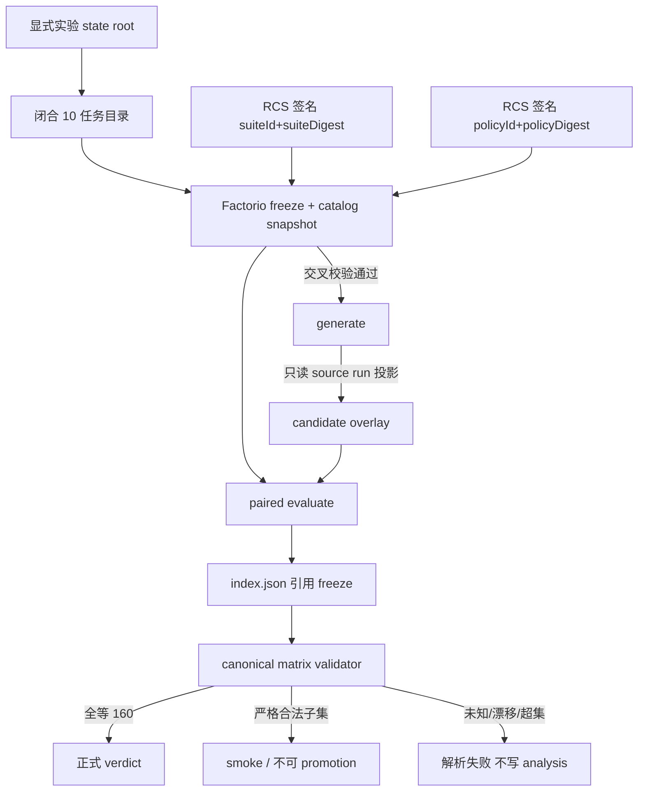

# 【factorio】正式胜率实验任务矩阵

- Issue: #39
- 状态: Approved
- 最后更新: 2026-08-18

## 1. 背景

Issue #39。#29 要求正式实验至少 40 个任务变体 × 4 次独立重复，共 160 个成对单元，且 suite 必须在 candidate 生成前冻结。#35 已把任务身份收成闭合目录上的 `{taskId, taskDigest}`，但当前只认证 `factorio.throughput/iron-ore/v1` 与 `factorio.throughput/iron-plate/v1`，二者同属 `raw-material`。`success-rate-v1` 仍按 10×4×4 描述；#29 L2 写的是 `analyze --experiment/--report`，实现与 README 是 `analyze --index`。本设计把已批准 L1 落成可实施契约：认证恰好 10 个任务、冻结 160-pair 矩阵与类别覆盖、对齐 CLI，并以 dry-run 证明证据链，而不降低 #29 门槛。

L1 批准锚点：https://github.com/xforce-io/helix/issues/39#issuecomment-5327293458 （本会话 `approve`）。

## 2. 名词解释

- **认证任务**：闭合目录中的一条记录，含 `inputRef`、FLE `taskId`、独立 fingerprint 的 `taskDigest`、唯一类别与 instruction。列出名字不等于认证。
- **变体 / variant**：`(certified inputRef, slot)`。`slot` 是已配置 FLE 容器下标，∈ {0,1,2,3}。
- **pair**：`(variant, repetitionIndex ∈ {0,1,2,3})`，绑定 baseline/candidate 两臂。唯一键是 `caseId`。
- **冻结身份**：Factorio-only 不可变记录。它绑定 `freezeId`、RCS `suiteId`+`suiteDigest`、RCS `policyId`+`policyDigest`、自身 `contentDigest`，以及签名时内嵌的 10 任务 catalog snapshot 与 160 行 canonical matrix。`suiteId`/`policyId` 不是可变定位符；必须解析到与 digest 一致的已签名对象。
- **canonical matrix 行**：`{caseId, inputRef, taskId, taskDigest, slot, seed, repetitionIndex, category, weight}`。`seed` 必须等于 `slot`。
- **RCS suite 投影**：suite 实际可表达的规范行 `{caseId, inputRef, seed, weight}`。映射键是 `caseId`，与 matrix 双向一一对应。`taskId` / `taskDigest` / `category` / `slot` / `repetitionIndex` 只由 freeze snapshot/matrix 的 `contentDigest` 认证，不是 suite 字段。
- **holdout 正文**：suite 解析后的任务 instruction、Gym 定义或可让候选选择/回避具体保持集的内容。opaque `inputRef` 不是 holdout 正文。
- **正式分析**：index 经 canonical validator 判定与冻结矩阵全等后的 terminal analysis；其 `passed`/`failed`/`indeterminate` 才可作为 #29 promotion 前置。
- **smoke 分析**：index 经同一 validator 判定为冻结矩阵的严格合法子集时的同一 `analyze --index` 出口；不得作为 promotion 判定。
- **实验 state root**：本次实验显式配置的独立 `HELIX_FACTORIO_HARNESS_STATE_ROOT`。判定用 canonical/realpath：必须与默认耐久 root 既不相等也不重叠（互不为祖先/后代，也不得经符号链接指向或落入默认 root）。

## 3. 设计目标与非目标

- **目标**：在 candidate 生成前发布带不可变身份的正式 suite/policy/freeze；此后生成与正式评估必须引用并校验该身份。
- **目标**：正式目录恰好 10 个已认证任务；矩阵固定为 10×4×4 = 恰好 40 变体、恰好 160 唯一 pair。
- **目标**：关键类别集合、每变体唯一归属、每类覆盖计数与分层分母在冻结时锁定。
- **目标**：文档、本设计与 CLI 只承认 `npm run factorio:experiment -- analyze --index <index.json>`。
- **目标**：dry-run 证明两臂 live/replay、共享 pins、冻结引用可复算，且正式阈值仍完整存在。
- **非目标**：修改 `src/refinement/` 通用契约或 RCS suite/policy schema。
- **非目标**：降低 160-pair、40 变体或 #29 统计/Replay/成本/延迟/分层门槛。
- **非目标**：candidate 生成后改 holdout；自动 promotion；把 holdout 正文或凭证写入仓库。
- **非目标**：扫描 Gym 并开放未认证任务；在本 issue 跑完整 160-pair 正式评估或做出 promotion 决定。

## 4. 能力与功能设计

研究者必须先设置与默认耐久路径 realpath 不相等且不重叠的实验 state root，再：认证 8 个新任务 → 发布 RCS suite/policy 与 Factorio freeze → 在 freeze 与 RCS 对象交叉校验通过后才允许 generate → 用冻结矩阵的声明子集做 dry-run → 用 `--index` 做 smoke 分析并确认正式阈值未被删改。完整 160-pair 正式评估属于 #29，不在本 issue 交付。

### 4.1 UI / UX

N/A。无交互页面。操作面是 Factorio 示例的任务目录、冻结记录、RCS 已有 publish/propose/evaluate 流程，以及 `success-rate-v1` README 与 `analyze --index`。

空态：未配置独立 root、root 经 realpath 等于或重叠默认耐久路径、无 freeze、或 RCS/freeze digest/签名失败时，generate 与评估拒绝，不产生候选 overlay，也不创建或改写默认耐久状态。
错态：未认证 `inputRef`、`seed`/`slot` 不一致、重复或未知 `caseId`、index 含非冻结条目或字段与矩阵行不等、replay/pins/冻结引用缺失，均 fail closed，不写 promotion 相关 verdict。

## 5. 设计思路与折衷

- **选择固定 10 个 FLE 0.4.3 throughput 任务，而不是“不少于 10”或运行时挑选**。否则 40 变体与类别覆盖无法在冻结前判定。任务集合如下，`inputRef` 形如 `factorio.throughput/{slug}/v1`：

  | inputRef slug | FLE taskId | 类别 |
  |---|---|---|
  | iron-ore | `iron_ore_throughput` | `raw-material` |
  | iron-plate | `iron_plate_throughput` | `raw-material` |
  | steel-plate | `steel_plate_throughput` | `intermediate` |
  | iron-gear-wheel | `iron_gear_wheel_throughput` | `intermediate` |
  | electronic-circuit | `electronic_circuit_throughput` | `circuit` |
  | inserter | `inserter_throughput` | `intermediate` |
  | automation-science-pack | `automation_science_pack_throughput` | `science` |
  | logistics-science-pack | `logistics_science_pack_throughput` | `science` |
  | stone-wall | `stone_wall_throughput` | `structure` |
  | plastic-bar | `plastic_bar_throughput` | `oil` |

  已认证两项保持 #35 的 digest 与 `raw-material` 归属。其余 8 项必须在 pinned FLE 0.4.3 上独立 fingerprint 后才能写入目录；digest 未齐不得发布 freeze。排除 late-game（`processing_unit` / `utility_science_pack` 等）与非 Prototype/异常配额任务（`crude_oil`、`sufuric_acid`），避免正式矩阵在认证阶段就不可预检。

- **选择 160 行 RCS suite（唯一 `caseId`），而不是 40 行 suite 外乘重复**。现有 RCS 只保证 `caseId` 唯一，允许相同 `(inputRef, seed)` 出现多次；evaluate 已按 case 各跑一臂。重复编号进入 `caseId` 与 freeze 矩阵，不改通用 suite schema。
- **选择 Factorio-only freeze 同时内嵌 catalog snapshot 并钉死 RCS suite/policy 的内容 digest，而不是只存可变 ref，也不是把统计字段塞进 `src/refinement/` policy**。#29 已决定统计门槛不进通用契约；只存定位符无法防止 suite 被替换后仍通过 freeze 校验。
- **放弃扩槽或堆重复凑 160**。#29 要 40 变体；FLE `run_idx` 只能映射已配置 0–3 槽。
- **放弃按 Gym 扫描一次开放 10 个名字**。#35 已否决「列出即支持」。
- **放弃把 analyze 改回 `--experiment/--report`**。实现、README 与 e35 已走 `--index`；只把 #29 L2 的过时 CLI 描述视为被本文件取代的片段，不新增第二条分析入口。
- **放弃给 dry-run 单独 CLI，也放弃把“任何非 160 集合”都当成 smoke**。同一 `--index` 先走唯一 canonical validator：全等 → 正式；严格合法子集 → smoke；其它（未知/重复/字段漂移/超集）→ 解析失败，不写 analysis。

关键类别合同：`keyCategories = {raw-material, intermediate, circuit, science, structure, oil}`。每任务唯一归属见上表。覆盖按笛卡尔积锁定，冻结后不可改：

| 类别 | 任务数 | 变体 | pair |
|---|---:|---:|---:|
| raw-material | 2 | 8 | 32 |
| intermediate | 3 | 12 | 48 |
| circuit | 1 | 4 | 16 |
| science | 2 | 8 | 32 |
| structure | 1 | 4 | 16 |
| oil | 1 | 4 | 16 |
| 合计 | 10 | 40 | 160 |

#29 的「关键类别回归 ≤5pp」对上表每一类分别计算，分母即该类 pair 数。不得在分析时回填或增删类别。

## 6. 架构设计

### 6.1 逻辑分层



权威边界：

| 对象 | Owner | Authority |
|---|---|---|
| suite/policy 字节与 HRCA 签名 | RCS | 发布、验签、可见性 |
| freeze、catalog snapshot、canonical matrix、generate/analyze 门禁 | Factorio Host | 交叉校验 RCS digest、拒绝无隔离 root、区分正式/smoke |
| run / Trace / Replay / lineage | milkie | 不解释 suite 或统计 |
| 冻结发布与 promotion | 人工 + 既有 RCS 门禁 | Host 只提供前置条件 |

### 6.2 核心业务流程

1. 隔离：调用方提供实验 state root。未设置、不可写、realpath 等于默认耐久路径、或与默认 root 重叠（含子目录/符号链接）→ 立即拒绝，默认 root 不被创建或修改。
2. 认证：对 8 个新 `taskId` 跑与 #35 同级的预检 fingerprint；写入当前目录与 bridge 对照表，缺 digest 则停止。
3. 冻结：构造 160 行 canonical matrix 与 RCS suite（每行 suite 投影 `{caseId, inputRef, seed, weight}`，其中 `caseId = {slug}-slot-{slot}-rep-{rep}`，`inputRef` 为认证键，`seed = slot`，`weight = 1`）；HRCA 发布 suite/policy；Host 读取其不可变 `suiteId`/`suiteDigest` 与 `policyId`/`policyDigest`，把目录 snapshot、矩阵、`keyCategories`、覆盖表、正式阈值与这些 digest 一并签名进 freeze。`contentDigest` 覆盖上述全部字段。
4. 交叉校验（generate、evaluate、analyze 之前均执行）：解析 RCS 对象 → 验 HRCA 签名与 issuer → `suiteDigest`/`policyDigest` 等于 freeze 钉死值 → 按 `caseId` 将 suite 投影与 matrix 投影双向全等（恰好 160 行，且 `inputRef`/`seed`/`weight` 一致）。Factorio 正式阈值只存在于 freeze，不对 RCS policy 做字段级阈值比较。任一步失败则 fail closed。
5. 生成：交叉校验通过，且 generation 投影不含 holdout 正文。失败则不调用模型、不写 overlay。新 generate 只接受当前已发布且校验通过的 freeze。
6. Dry-run：index 只含冻结矩阵的声明子集；每行按 `caseId` 对齐 matrix 并校验完整身份与两臂 evidence。`analyze --index` 走 smoke。
7. 正式评估（#29）：index 必须与 matrix 全等；replay 失败、pins 不对称或未引用同一 freeze 的 pair 不得进入正式统计。

失败路径：独立 root 无效、未认证输入、slot/seed 越界或不一致、重复/未知 `caseId`、RCS 对象缺失/不受信/digest 漂移、suite 与 matrix 不等、候选可读 holdout 正文、index 超集或字段漂移 → fail closed，不写 promotion 相关 analysis。

## 7. 模块设计

| 模块 | 职责 | 非职责 |
|---|---|---|
| 实验 CLI / Host 启动 | 读取并强制实验 state root；拒绝默认耐久路径 | 改全局默认 root |
| `examples/factorio/src/experiment/cases.ts` 与 `workers/bridge_worker.py` | 当前可发布目录恰好 10 条；`seed` 只能等于 `slot` | 扫描 Gym；改 RCS schema；单独充当历史 freeze 的唯一事实源 |
| Factorio freeze | 签名 catalog snapshot、matrix、RCS digest、覆盖表、阈值；供历史校验只读解析 | 通用 policy 字段 |
| `refinement-host.ts` generate/evaluate 门禁 | 交叉校验 freeze↔RCS；无隔离 root、无有效 freeze 或投影含 holdout 正文则拒绝 | 修改 `src/refinement/` workflow |
| `experiment/evidence.ts` / `statistics.ts` | canonical validator；index 绑定 pair、两臂、pins、freeze | 改 milkie replay 语义 |
| `experiment/cli.ts` 与 `success-rate-v1/README.md` | 唯一入口 `--index`；文档与 #29 过时 CLI 对齐 | 新增 analyze 子命令 |
| RCS policy/suite | 签名发布 160 个 opaque case 与 policy 字节 | 承载 Factorio 统计门槛或 taskDigest |

默认 P1 pins 仍为 iron ore；仅实验路径用 profile 覆盖任务身份。历史 freeze 的任务身份以该 freeze 内 snapshot 为准，不以回滚后的当前目录为准。

## 8. API / CLI 设计

没有公共 npm API。Factorio-only 分析入口只有：

```text
npm run factorio:experiment -- analyze --index <experiment-index.json>
```

实验必须显式传入独立 state root（环境变量 `HELIX_FACTORIO_HARNESS_STATE_ROOT`）。Host/CLI 在 generate、evaluate、analyze 前用 canonical/realpath 检查：未设置、不可写、等于默认耐久路径、或与默认 root 重叠时非 0 退出，不写 overlay/analysis，不触碰默认 root。

- 缺 `--index` 或子命令不是 `analyze`：非 0 退出，不写 analysis。
- index 必须引用 `freezeId`+`contentDigest`。Host 先做 §6.2 交叉校验，再跑 canonical validator。
- **canonical validator**（唯一入口）：
  1. 每个 index pair 的 `caseId` 必须在 freeze matrix 中恰好一行。
  2. 该行的 `inputRef`、`taskId`、`taskDigest`、`slot`、`seed`、`repetitionIndex`、`category`、`weight` 必须与 matrix 逐字段相等；`seed` 必须等于 `slot`。
  3. 两臂 live/replay 路径、共享 pins 与 freeze 引用必须存在且可解析。
  4. 重复 `caseId`、未知 `caseId`、非冻结条目、任一字段不等、超集：解析失败，不写 `analysis.json`，非 0 退出。
- **正式模式**：通过 validator 且 pair 集合与 160 行 matrix 全等。此时应用冻结阈值，写出 promotion 相关 `passed`/`failed`/`indeterminate`。
- **smoke 模式**：通过 validator 且 pair 集合是 matrix 的非空严格子集。写出 `analysis.json`，但 `verdict` 必须是 `indeterminate` 且含 `NOT_OFFICIAL_MATRIX`；不得因 pair 数不足给出正式 `failed` 或 `passed`。
- 成功写出时路径为 `artifacts/factorio/experiments/<experimentId>/analysis.json`，stdout 含 `experimentId`、`analysisPath`、`verdict`、统计字段。

正式阈值锁定为：`minPairs=160`、成功率差 ≥10pp、paired bootstrap 95% CI 下界 > 0、单侧 McNemar `p < 0.05`（`p == 0.05` 不通过）、失败率不升、成本 ≤1.2x、延迟 ≤1.5x、每个声明关键类别回归 ≤5pp。freeze 必须原文包含这些比较规则与数值；分析不得用更松 override。浮点比较使用与现有 statistics 实现相同的 IEEE 比较，不另设 epsilon 放宽 `p < 0.05` 或 CI 下界。

规范字段：`slot ∈ {0,1,2,3}`。suite `seed` 仅能作为 `slot` 的同值别名。`caseId` 必须匹配 `{slug}-slot-{slot}-rep-{rep}`。

内部 `preflight_worker.py --task-id` 仍是 worker 私有参数。suite 不接受原始 Gym `taskId`。

## 9. 边界考虑

- 假设：pinned FLE 0.4.3 对上表 8 个新 `taskId` 可注册并算出稳定 digest。任一失败则本 issue 不能发布 freeze，不得用其它任务顶替而不改本设计。
- 无独立 root、root 与默认路径 realpath 相等或重叠、无 freeze、RCS 对象无法解析、签名者不在受信 HRCA、suite/policy digest 与 freeze 钉死值不一致、suite 投影与 matrix 投影不双向全等：generate、evaluate、analyze 均拒绝。
- 候选路径不得读取 suite cases、instruction 或类别表。现有 generation 投影只含 source run 的有界 feedback；本设计把「投影含 holdout 正文」列为显式拒绝。
- 并发：160 pair 仍共享 4 槽；调度不得把同一 slot 的重叠 live 当成独立样本。重复编号区分模型重复，不增加槽位。
- Replay 非通过、两臂 pins 不对称、evidence 未引用同一 freeze：该 pair 不得进入正式统计。#36 缺口不得靠删 slot 或把未回放 arm 计为可重放来回避。
- 安全：不扩大 Factorio action allowlist、网络、文件或模型能力；不把凭证、完整 endpoint、holdout 正文写入 freeze、index 或仓库模板。
- 权限：freeze/suite/policy 发布者与 #29/#35 相同的 HRCA 受信集；人工 promotion 仍走既有 RCS 门禁。
- 性能量级：认证与 dry-run 是小样本；正式 160-pair 不在本 issue 承诺墙钟时间。

## 10. 迁移 / 兼容 / 回滚

- 当前可发布目录从 2 条扩到 10 条；未认证旧 `inputRef` 仍拒绝。iron-ore / iron-plate 的 digest 与类别不变，其既有 evidence 仍按 #35 身份 replay。
- `success-rate-v1` README 与 #29 L2 §8 过时 CLI 以本文件与 `--index` 为准；#29 的 160-pair 与统计门槛不被本文件修改。
- 现有 `<160` 且不能通过 canonical validator 的 index 不再被分析成正式 `failed`；能通过且为严格子集的变为 smoke `indeterminate`。这是有意收紧。e35 一类观察性 artifacts 仍可阅读，不能当 #29 判定。
- 回滚：停止把该 freeze 标为当前可发布，从而禁止新的 generate。已发布 freeze 及其内嵌 catalog snapshot 必须保留；历史 index/evidence 按 `freezeId` 只读解析该 snapshot 做 replay/校验，不要求当前目录仍含全部 10 项。不得删除 snapshot 后再声称历史冻结身份可验证。当前目录回到两项只影响新 freeze，不影响旧 freeze。

## 11. 测试计划

- **E2E / S1**：配置独立 state root 后，在 pinned FLE 0.4.3 上认证 8 个新任务并发布 freeze+suite。解析结果恰为 40 变体、每变体 4 重复、160 唯一 `caseId`；每行得到已认证 `{taskId, taskDigest, slot, repetitionIndex}`；类别覆盖等于 §5 表。无独立 root、root 等于或重叠默认路径（含 symlink / 相同 realpath / 子目录）、无 freeze、RCS digest/签名失败、suite 投影与 matrix 投影不等、或冻结前 generate，均拒绝且无 overlay；默认耐久 root 不被创建或修改。产物不含未认证输入、重复 pair 或候选可见 holdout 正文。环境不能 fingerprint 时记录为认证失败，不得用假 digest 发布。
- **E2E / S2**：README、本设计与 CLI 均只有 `--index`。dry-run 为冻结矩阵的声明子集：每个声明关键类别至少 1 个 pair，4 个 slot 各至少出现一次；每个 arm 有可读 live 与成功 replay；index 逐字段绑定 matrix 行、两臂、共享 pins 与 freeze。smoke 分析 `indeterminate`+`NOT_OFFICIAL_MATRIX`，阈值比较规则等于冻结值。完整 160 行但缺 replay/pins/freeze 引用的 index 不得给出正式 `passed`。
- **Integration**：
  - 身份拒绝：`seed`≠`slot`、slot∉[0,4)、未认证 inputRef、重复 caseId。
  - validator 三类：全等 160 → 正式；严格合法子集 → smoke；未知 caseId / 字段被替换 / 超集 → 解析失败且不写 analysis。
  - 交叉校验：错误 `suiteDigest`/`policyDigest`、不受信 issuer、suite 投影与 matrix 投影不按 `caseId` 双向全等 → generate/evaluate/analyze 失败。`taskDigest` 被改只在 freeze/matrix 上检测，不要求它出现在 suite 字节里。
  - bridge 对当前目录外 taskId/digest 拒绝；历史 freeze snapshot 仍能校验其内任务。
  - generate 在缺 freeze 或默认 root 时不调用模型。
- **Unit**：目录键恰好 10 个且含既有两项；analyze 只认 `--index`；单侧 McNemar `p < 0.05`（含 `p == 0.05` 不通过）；缺路径、缺 freeze 引用、hash 漂移 fail-closed；类别回归分母等于冻结覆盖。

## 12. 开放问题 / 决策记录

- 2026-08-18：L1 由 Issue comment `5327293458` 与本会话 `approve` 批准。
- 2026-08-18：8 个新任务的 `taskDigest` 在认证前未知；它们是冻结前置事实，不是实现期可改名单。
- #35 Issue 仍 OPEN，本设计依赖其 Implemented L2 身份链，不重开该协议。
- #36 replay 缺口仍可能挡住真实正式实验；本 issue 不修复 #36。

## 13. 关联

- Issue: https://github.com/xforce-io/helix/issues/39
- L1：https://github.com/xforce-io/helix/issues/39#issuecomment-5327293458
- 父目标 #29 · `docs/design/29-factorio-evolution-experiment.md`
- 身份链 #35 · `docs/design/35-multitask-evaluation.md`
- Replay 缺口 #36
- `examples/factorio/experiments/success-rate-v1/README.md`
