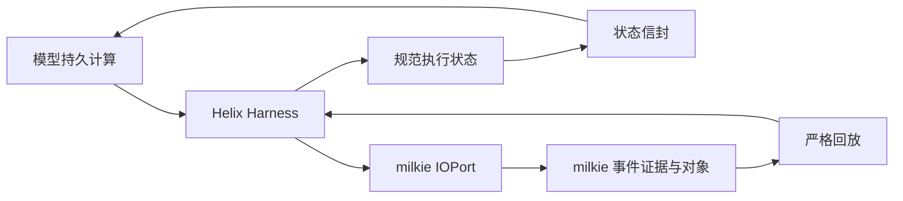

# 【architecture】Helix 与 milkie 状态职责边界

- Issue: #42
- 状态: Draft
- 最后更新: 2026-09-01

## 1. 背景

Helix 的 Factorio Harness 已同时使用持久模型命名空间、宿主侧 `ContextEnvelope`、milkie Trace/Object Store 与可版本化 Harness。两层都保存执行相关信息，却没有明确哪一层对领域真值、事件证据和模型输入预算负责。若继续以提示词历史作为跨层接口，长程运行会发生状态漂移、预算不可控和回放责任不清。

本设计落实 Issue #42 的已批准 L1，为 #43、#44、#45 和 milkie #257 提供唯一的跨项目边界。

## 2. 名词解释

本设计使用[名词表](../glossary.md)中的“规范执行状态”“事件证据”“状态信封”和“Harness”。无新增易混名词。

## 3. 目标与非目标

- 目标：固定 Helix 与 milkie 在执行状态、事件证据、预算、生命周期、回放和 Harness 演进上的唯一职责。
- 目标：让跨层传递物可被版本、大小、引用完整性和归属校验。
- 目标：明确模型可见对话是控制面输入，不是任务正确性的事实源。
- 非目标：不在本 Issue 实现新的状态信封、预算机制或 Factorio 领域行为。
- 非目标：不改变 milkie 的 Trace、IOPort、checkpoint、replay 或对象存储实现。
- 非目标：不把 Helix 的领域语义提升为 milkie 的通用公共 API。

## 4. 能力

### 4.1 UI/UX

N/A。本设计不新增用户界面；命令行和日志通过各自既有输出呈现诊断。

### 4.2 职责矩阵

| 关注点 | Helix | milkie | 跨层约束 |
|---|---|---|---|
| 规范执行状态 | 定义领域 schema、初始值、转换和成功判据 | 不解析或推导领域含义 | 只传递状态信封或事件证据引用 |
| 事件证据 | 选择哪些领域事件构成验证依据 | 记录不可变 I/O、对象、完整性和谱系 | 状态只保存引用，不复制大对象 |
| 预算 | 定义领域所需最小状态和允许的降级语义 | 核算模型输入、区域额度和降级轨迹 | 超额不能由历史文本隐式补全 |
| 生命周期 | 编排领域步骤与验证器 | 管理运行、I/O、checkpoint、终态和重放 | Helix 不重做通用生命周期 |
| 回放 | 对回放得到的证据应用领域验证 | 提供严格 I/O 重放和对象读取 | 回放不重新推断领域状态 |
| Harness 演进 | 冻结/演进领域 Harness 与状态 schema | 提供版本可追溯的运行证据 | pin 与 schema version 必须同时记录 |

## 5. 思路与折衷

选择“领域状态归 Helix、通用执行证据归 milkie”的双平面结构。Helix 负责将事件折叠为可验证的规范执行状态；milkie 对每一次模型或工具 I/O 保留原始证据、对象和回放顺序。模型每轮收到的是 Helix 生成的状态信封以及必要、受限的控制输入，而不是未约束的完整历史。

放弃由 milkie 统一解释所有领域状态：这会把 Factorio 等纵切语义耦合到通用运行时。也放弃仅由模型文本维护状态：它既不可稳定验证，也无法保证对话裁剪后仍保留正确性事实。状态信封只保留小型、规范字段；原始观测和大工具输出以 milkie 对象引用保留，避免重复存储和预算逃逸。

## 6. 架构

### 6.1 分层

Helix 只通过 IOPort 发起模型与工具调用，并在结果返回后折叠领域状态。milkie 不读取或修改 Helix 的领域字段；它持有事件、对象、预算账本和回放序列。Helix 的状态信封可含事件证据引用，但对象正文只由 milkie 按引用读取。

### 6.2 主路径与失败路径

主路径：Harness 固定版本与任务约束，构造初始规范执行状态；每次 I/O 返回后验证记录、折叠状态并生成下一轮状态信封；任务完成时 Helix 以规范状态和事件证据判定结果，milkie 保留可重放证据。

失败路径：状态 schema/version 不匹配、引用缺失或预算无法容纳不可降级控制时，停止该 run 并记录可诊断失败；不得用聊天文本猜测缺失字段，不得由 milkie 代替 Helix 解释领域结果。

## 7. 模块

- Helix Harness：领域状态 schema、fold、验证器、状态信封和 Harness pin。
- milkie runtime：IOPort、Trace/Object Store、预算账本、checkpoint、严格 replay。
- 跨层适配：只负责验证版本、预算和引用完整性，不承载领域转换。

## 8. API/CLI

N/A。本 Issue 不发布新公共 API 或 CLI。后续 #43 的 L2 定义 Helix 内部状态信封契约；milkie #257 的 L2 定义其运行时预算配置。

## 9. 边界

- Helix 不直接写入或扫描 milkie 内部 Trace 以推导领域结论；通过已批准 IOPort/Object Store 接口获取引用和证据。
- milkie 不把模型消息、摘要或 WorkingMemory 认定为 Helix 领域状态。
- 状态信封必须带 schema 与 Harness 版本、限制大小，并只携带可验证的稳定字段和对象引用。
- 事件证据不可因模型输入降级被删除；降级只影响模型可见投影。
- 领域验证失败、预算失败、引用失败均为不同的可观察终态。

## 10. 迁移/兼容/回滚

本 Issue 只新增架构事实源和名词表，不改变运行时数据。后续实现必须提升相关 schema/Harness 版本，并拒绝把旧聊天历史解释为新规范执行状态。回滚文档变更不会删除已录制的 milkie 事件证据。

## 11. 测试计划

- E2E（S1）：从一次受限执行到严格回放，验证 Helix 能用状态信封和事件证据引用得到相同可判定结果。
- E2E（S1）：构造缺失引用、schema 不匹配和预算不足，验证终止原因和责任层可区分。
- Integration：验证 Helix 不向 milkie 传递领域转换逻辑，milkie 不向 Helix 回写聊天历史作为状态。
- Unit：验证职责矩阵涉及的版本、引用和大小不变量。

## 12. 开放问题

- #43 需要在该边界下规定状态信封的闭集字段、演进规则和预算单位。
- #257 需要确定 milkie 的默认预算数值和工具结果投影上限；该数值不由本设计决定。

## 13. 关联

- Issue #42
- Issue #43、#44、#45
- milkie #257
- `docs/design/3-factorio-milkie-runtime-contracts.md`
