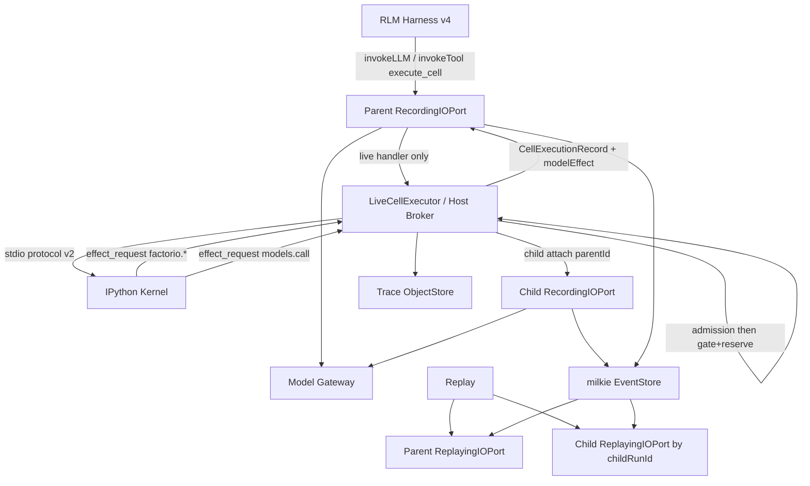
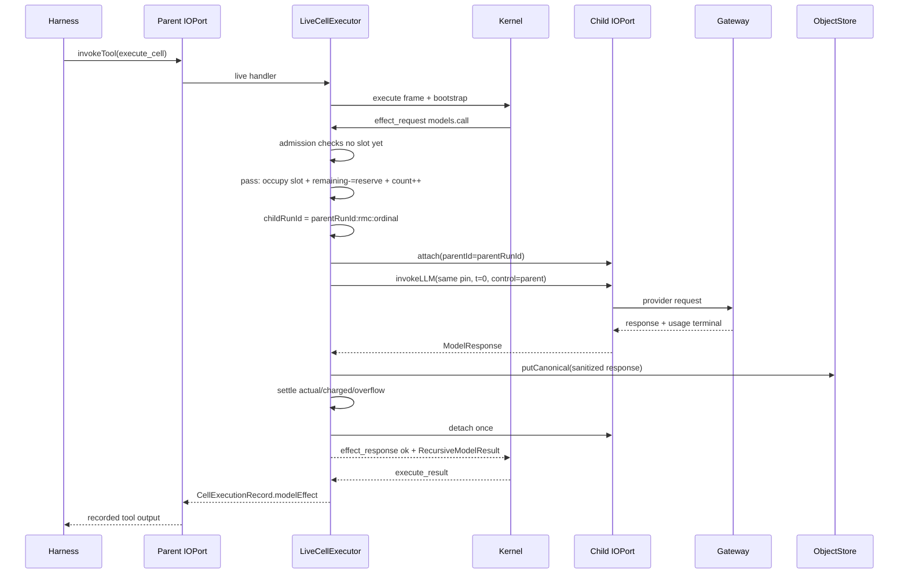

# 【kernel】Factorio 持久 Kernel 递归模型调用（独立 child run）

- Issue: #5
- 状态: Approved
- 最后更新: 2026-08-10

## 1. 背景

Issue #1 / #3 已验证：模型通过外层唯一 tool `helix.kernel.execute_cell` 驱动持久 IPython，Kernel 内 `factorio` binding 经 Host 侧 effect RPC 触达 FLE；父 run 只录制外层 tool 输出 `CellExecutionRecord`，Replay 跳过 handler 且零 live effect。`docs/overview.md` 初始交付序列第 1 项还要求 **programmatic tools 与 recursive model calls**；设计 `docs/design/1-rlm-factorio-harness.md` 明确把递归模型调用列为非目标，并要求出现第二个需求后另立设计。

直接在父 `execute_cell` handler 内对同一 `RecordingIOPort` 调用 `invokeLLM` 会破坏 Replay：父 Replay 命中已录制 tool 后不执行 handler，内层 LLM 记录将欠消费。milkie #47 已提供独立 child run 的 Trace、`agent.run.started.parentId` 关联与按 `childRunId` 的独立 Replay。本设计只在 **Factorio example** 内补齐受控 `helix.models.call` binding 与 Host admission，不把能力提升为 Helix 公共 npm Runtime API，也不在 Helix 复制 milkie 的 lifecycle / Trace / Replay / lineage / task outcomes。

## 2. 名词解释

- **递归模型调用（Recursive Model Call）**：持久 Kernel 内模型代码通过 binding 发起的一次受控 LLM 请求；语义上是「子查询」，不是异步 sub-agent、mailbox 或并行 worker。
- **`helix.models.call`**：注入 Kernel namespace 的窄 binding 入口（经 `helix` bootstrap 暴露），同步等待有界 `RecursiveModelResult`。
- **Child run**：为单次已 admission 的递归调用创建的独立 milkie run；拥有独立 `childRunId`、独立 `RecordingIOPort` / `CausalCursor`，`agent.run.started.parentId` 指向父 run。
- **父剩余模型预算（Parent Model Budget Pool）**：父 run 持有的、供递归调用预留/结算的共享 token 额度池（计量单位对齐 milkie `ModelUsage.inputTokens` + `outputTokens`）。child 不另开总额度。
- **次数预算（Recursive Call Count Budget）**：每父 run 允许的递归调用成功 admission 次数上限；与 token 池并行约束，互不替代。
- **声明上限（Declared Caps）**：单次 call 在 Provider 前用于预留的 **admission 后实际预留声明**（clamp 后）。计算取「调用方请求值（经单次硬上限 clamp）」「单次硬上限」「父池剩余可分配」更严者；**不要求**父池必须覆盖调用方请求的全额上限，见 §5.3 / B4。
- **请求 completion 上限（Requested Completion）**：调用方 `max_output_tokens` 经单次硬上限 clamp 后的值（尚未与父池剩余相交）；可写入 evidence 作审计，**不**等于最终 `declaredCompletionTokens`。
- **预留 / 结算（Reserve / Settle）**：Provider 前按声明上限原子扣减 `remainingTokens`；child LLM request 唯一 terminal 后按实际 usage 回补差额并结算。账务字段分离为 `actualUsageTokens` / `chargedTokens` / `overflowTokens`（见 §5.3、§9.6）。预留状态只体现在 `remainingTokens` 的原子扣减与 terminal 回补；**不**维护独立 `reservedOutstanding` 半吊子字段。
- **`actualUsageTokens`**：terminal 携带的实际计量，`= (inputTokens ?? 0) + (outputTokens ?? 0)`；缺失 usage 时为 0。
- **`chargedTokens`**：实际从父池扣减的量，`= min(reserve, actualUsageTokens)`（本设计选择不透支模型）。
- **`overflowTokens`**：`= max(0, actualUsageTokens - reserve)`；可观测诊断字段，不从父池额外扣减。
- **Host 侧单 effect 计数器（Host Cell Effect Gate）**：`LiveCellExecutor`（Host）在处理任一 `effect_request` 时维护的、不可由 Kernel 伪造的「本 cell 已占用外部 effect 槽」状态；权威于 Kernel 本地计数。
- **`RecursiveModelResult`**：返回给 Python 的有界结果对象，含闭集 `status`、`childRunId`（若已创建）、text preview、usage、错误分类与完整 response 的 object Ref。
- **`modelEffect`**：`CellExecutionRecord` 上与 `factorioEffect` 互斥的至多一个可回放字段，承载 child 关联与结果摘要/Ref。
- **Terminal event**：与一个已开始的 I/O request 因果配对的唯一成功或失败终态（对齐 design/3）；本设计中特指 child 的 `invokeLLM` request-terminal，不是 child run lifecycle 终态的代称。
- **Admission**：Host 在触达 Provider / 创建可计费 child LLM request 之前的权限、参数、单 effect、次数与 token 预留检查；失败为 fail-closed。**仅当全部 admission 检查通过后**才占用 Host effect 槽与 token 预留（见 §5.2、I2）。
- **Execution control（对齐 design/3）**：当前进程实际传给 IOPort 的 `signal` / `deadlineAt`。Live child 继承父 absolute control；child Replay 使用新的本地 safety deadline，不得复用可能已过期的 Live `deadlineAt` 作为 control。
- **Live budget（对齐 design/3）**：录制事实中的原始 absolute `deadlineAt` 与模型可见剩余量。Replay 用录制 clock + 原 `deadlineAt` 重建模型可见 budget；control 本身不进入 request 业务 hash。
- **`requestDigest`**：对已成功规范化并算出 `declared*` 后的业务请求稳定 hash。**硬划分（I4）**：凡 `canonicalizeRecursiveInput` 成功且 `declaredPromptTokens`/`declaredCompletionTokens` 已算出（含随后因 budget/次数/未授权/双 effect 拒绝、`reservedTokens=0`）的 record **必须**有 `requestDigest`；**仅** canonical/参数形态/长度失败且 reservation 全字段为 0、`declared*` 亦 0 或不出现时 **允许无** `requestDigest`。见 §5.9、I4。

## 3. 设计目标与非目标

- **目标**：在 Factorio 持久 Kernel 提供最小 `helix.models.call(...)` binding；固定调用父 run 同一 model pin、`temperature=0`；返回有界 `RecursiveModelResult`。
- **目标**：每次通过 admission 的调用以独立 child run 记录；继承父 absolute deadline / cancellation（Live）；从父剩余模型预算预留并按实际 usage 结算（可审计字段分离）。有效上限 = min(单次硬上限, 父池剩余可分配)；不足最小可发起预留才拒绝（B4 / L1）。
- **目标**：父 run 仍只记录外层 `helix.kernel.execute_cell`；父 / child 可分别零 live effect、零 fallback Replay；父子 I/O 队列隔离。
- **目标**：未授权、参数越界、同 cell 第二 effect、次数/token 不足以满足最小预留时，均在 Provider 前拒绝；每个已开始的 child LLM request 恰有 1 个 terminal；无盲重试。
- **目标**：`childRunId`、有界摘要与 response Ref 进入父 `CellExecutionRecord` 可回放字段；父 Replay 不启动 Kernel/child 仍可校验。
- **目标**：真实 Factorio Live 中模型自主使用递归结果继续行动并达到 FLE verifier；不注入 action program。
- **非目标**：异步 sub-agent、mailbox、并行 / 多 child 同 cell、跨 run 持久 session、任意模型选择、通用 tool registry、Global Evolution。
- **非目标**：提升为 Helix 公共 npm Runtime API 或稳定 SDK 导出。
- **非目标**：在 Helix 复制 milkie lifecycle / Trace / Replay / lineage / task outcomes；不修改 milkie 已批准契约语义。
- **非目标**：改变 FLE 任务、动作 allowlist，或用递归调用绕过 Factorio 单 cell 单环境 effect 约束。
- **非目标**：child Replay 重新写入 / 覆盖 Live finalization；本设计不复制 design/3 的 finalization 路径，父正式 Outcome 仍只由既有 Factorio v3 finalization 产生。

## 4. 能力与功能设计

### 4.1 模型可见能力

Kernel 在每个 cell 前重装 `helix` bootstrap。本 Issue 在既有 `helix.task` / `helix.runtime` 之外增加：

```text
result = helix.models.call(instructions, input=None, max_output_tokens=None)
```

语义：

| 参数 | 约束 |
|---|---|
| `instructions` | 必填 `str`；UTF-8 **byte** 长度 ≤ `MAX_RECURSIVE_INSTRUCTIONS_BYTES`（常量值 8000） |
| `input` | 可选。**缺省语义（IMP-2，锁定）**：Python 省略参数或传入 `None`，与 effect JSON **省略 `input`** 或 **`input: null`** 同义 = **缺省** = 不拼 Input 段 = `inputCanonicalBytes = empty`（`byteLength=0`）。**禁止**把 JSON null 编成 canonical `b"null"`。有值根类型仅 `str \| int \| float \| bool \| dict \| list`（JSON string/number/boolean/object/array；number 须有限）；经 `canonicalizeRecursiveInput` 后 UTF-8 **byte** 长度 ≤ `MAX_RECURSIVE_INPUT_BYTES`（8000）。边界 fixture：缺省/`null`/`0`/`false`/`""` 的 digest 与字节必须可区分（§5.9） |
| `max_output_tokens` | 可选 `int`；缺省 = `MAX_RECURSIVE_COMPLETION_TOKENS`；先 clamp 到 `[1, MAX_RECURSIVE_COMPLETION_TOKENS]` 得 `requestedCompletionTokens`，再与父池剩余可分配相交得 `declaredCompletionTokens`（§5.3） |

返回 `RecursiveModelResult`（普通 Python 对象，支持属性与 mapping 访问），**不**把完整 canonical response 自动展开进外层 LLM context。模型可在后续 cell 读取 `result.text` / `result.status` / `result.usage` / `result.child_run_id` / `result.response_ref`。

**Capability 发现（I5，唯一 schema，锁定）**：

```ts
ContextEnvelope.capabilities.recursiveModel = {
  enabled: boolean
  remainingCalls: number
  remainingTokens: number
  maxCompletionTokens: number
}
```

规则锁定：

1. **唯一** capability 入口为 `capabilities.recursiveModel` 上述四字段对象；**禁止**再用 `capabilities.bindings` 列表项、`recursiveModelCall` manifest 别名或其它等价并行发现面。
2. `enabled === false`（或缺省未写入该对象）时：Kernel **不**注入可用的 `helix.models.call` binding（符号不可用）；若仍收到 `models.call` effect 帧，Host 以 `RECURSIVE_MODEL_NOT_ENABLED` 拒绝且 live Provider = 0、不占槽。
3. `enabled === true` 时：binding 可用；`remainingCalls` / `remainingTokens` / `maxCompletionTokens` 为模型可见投影（与父池 / 次数计数一致，非负）。
4. `maxCompletionTokens` 投影 = `MAX_RECURSIVE_COMPLETION_TOKENS`（单次硬上限常量）；实际单次有效 completion 仍受父池剩余 clamp（§5.3），模型不可假设每次都能拿到投影硬上限全额。

### 4.2 同 cell 单 effect

每个 `execute_cell` **至多一个**外部 effect，effect 种类为：

- Factorio：`reset` | `step`（既有），或
- 递归模型：`models.call`（本设计）

二者不可同 cell 混用；`factorio.status()` 只读，不占 effect 槽。第二 effect 在 **Host 侧** 于 Provider / Bridge 前拒绝，错误码 `MULTIPLE_EFFECTS_IN_CELL`。合法第二 `models.call` 的响应形状锁定为 **`ok: true` + `RecursiveModelResult rejected`**（IMP-B，§8.2）；帧损坏才 `ok: false`。

**占用时点（I2，锁定）**：Host 仅在 **通过全部 Provider 前 admission**（`models.call` 顺序见 §6.2：param → declared*/digest → occupied/enabled/次数/预算）**之后** 才将 `hostEffectOccupied` 置为 true。admission 任一检查失败 → **不新占槽**、不预留、不触达 Provider。一旦占槽，同 cell 后续任何 effect（再次 `models.call` 或 `factorio.reset`/`step`）一律 `MULTIPLE_EFFECTS_IN_CELL`。

测试双向顺序（锁定）：

1. 先非法 `models.call`（admission 拒绝）再合法 `factorio.step` → **成功**（拒绝未占槽）。
2. 先合法 `models.call`（admission 通过并占槽）再 `factorio.step` → **拒绝** `MULTIPLE_EFFECTS_IN_CELL`。
3. 先合法 `factorio.step` 再 `models.call` → **拒绝** `MULTIPLE_EFFECTS_IN_CELL`。
4. 同 cell 第二合法 `models.call`（method 可解析、param 已过）→ **唯一** `ok: true` + `RecursiveModelResult{status:'rejected', error.code:'MULTIPLE_EFFECTS_IN_CELL'}` + 写入 `modelEffect`（I4：有 digest，`reservedTokens=0`）；Python 收到结构化 result，**不是**裸异常（IMP-B）。
5. 帧级协议损坏（非 JSON / 缺 method / 错误 protocolVersion 等，无法解析为合法 `models.call`）→ **仅** `ok: false` 协议错误，Kernel 映射 Python 异常，**不**生成 `RecursiveModelResult`，**不**要求 `modelEffect`（IMP-B）。

### 4.3 父模型预算与次数

| 预算面 | 归属 | 行为 |
|---|---|---|
| 递归次数 | 父 run 计数器 `recursiveCallCount` | 全部 admission 通过并占槽时 +1；达到 `MAX_RECURSIVE_CALLS_PER_RUN` 后拒绝 |
| Token 池 | 父 run `modelBudgetPool.remainingTokens` | Provider 前按 **clamp 后声明上限** 原子扣减；terminal 后按 `chargedTokens` 结算并回补未消费预留（见 §5.3）；**无**独立 `reservedOutstanding` |
| 墙钟 / cancel | 父 `RunBudget.deadlineAt` + `AbortSignal` | Live child 原样继承，不得续期；Replay child 使用本地 safety control（§5.8） |
| 外层模型轮次 | 既有 `MAX_MODEL_CALLS` | 不因 child 调用而增加外层轮次计数 |

ContextEnvelope `budget` 增补（可 Replay 的模型可见字段）：

- `remainingRecursiveModelCalls`
- `remainingRecursiveModelTokens`
- （保留既有 `remainingCells` / `remainingEnvironmentSteps` / `remainingModelCalls` / `remainingWallMs`）

上述 budget 字段与 `capabilities.recursiveModel.remainingCalls` / `remainingTokens` 数值一致（同一父池投影的两处只读视图；capability 侧另含 `enabled` / `maxCompletionTokens`）。

### 4.4 UI / UX

无 GUI。CLI / evidence 在既有 Factorio Live/Replay JSON 上增补可诊断字段：

- Live：`recursiveModel.calls`（次数）、每条 call 的 `childRunId`（若已分配）/ `status` / `usage` / `reservation` 摘要（含 **admission 后** `declaredPromptTokens` / `declaredCompletionTokens`、可选 `requestedCompletionTokens`、以及 `actualUsageTokens` / `chargedTokens` / `overflowTokens`）、`requestDigest`（I4 硬划分）、`attachFailed`（若 §5.6-C1）/ post-attach 码（若 C2）；成功 S1 路径 evidence **必须**含 `recursiveResultWitness`（§11.2）；父池 `remainingRecursiveModelTokensAtEnd`。
- **`evidence.childRunIds`（IMP-1 + IMP-A，锁定）**：凡 **已观察到 `agent.run.started`（或 milkie 确认 attached）** 的 `childRunId` 有序列表——含成功 LLM 路径与 **post-attach failure**（§5.6-C2，可独立 Replay：lifecycle 事件 + 可能为空的 LLM 队列）。**`attachFailed=true`（§5.6-C1，never-started）** 已分配 id **不得**进入该列表；此类 id 只出现在对应 `modelEffect.childRunId`（及 `RecursiveModelResult.child_run_id`）+ `attachFailed=true`。可选并列 `evidence.nonReplayableChildRunIds`（或 verifier 扫描 `modelEffect.attachFailed`）供审计，**不**替代 / 混入 `childRunIds`。**禁止**「已 attach + `attachFailed=true` + 不进 `childRunIds`」三元组。
- Replay（父）：`childRunIds` 与 Live 一致；`modelEffect` 字段 hash 一致（含 C1 attachFailed：退款、无 LLM terminal、无 started、digest、`childRunId` 仍在 modelEffect；含 C2 post-attach：id **在** `childRunIds`、有 lifecycle/started、可能无 LLM terminal、退款或按 terminal 结算）；live effect = 0；**绝不**对 `attachFailed`（C1）id 打开 child Replay / CacheIndex / child 工厂；**必须**对 `childRunIds` 内 id（含 C2）开 child Replay。对 `requestDigest`（I4 硬划分）：有 digest → 用同一算法重算比对（预算拒绝路径可有非零 `declared*` 与 `reservedTokens=0`）；无 digest → **必须** `status=rejected` 且 `declared*`/`reserved`/`actual`/`charged`/`overflow` 全 0（或字段缺席）。
- Replay（子）：**仅**遍历 `evidence.childRunIds`（含 post-attach C2：空 LLM 队列 + lifecycle 事件消费）；按 id 独立入口或同一 verifier 内子检查；child live effect = 0；child I/O remaining 全 0；**不**写 finalization。C1 `attachFailed` id 不在此集合，不得尝试打开不存在的 cache。
- 拒绝路径：exit 不强制失败父 run（除非触发 §5.7 / §9.7 的确定父 termination 规则）；结构化 `status=rejected` 出现在 cell 结果中。递归 token 池归零本身 **不**结束父 run（IMP-3 / §5.7）。
- secrets / stack / SDK body / abort reason 不进入 Trace 与 CLI 默认输出。

## 5. 设计思路与折衷

### 5.1 独立 child run，而非父 IOPort 嵌套 LLM

**选择**：Kernel→Host effect RPC 发起调用，但 LLM 记在独立 child `RecordingIOPort`；父只保留 `execute_cell` 的完整 `CellExecutionRecord`（含 `modelEffect`）。

**放弃**：父 port 内嵌 `invokeLLM`（Replay 欠消费）；Kernel 直连 Provider（绕过 milkie control / Trace / Replay）。

### 5.2 Host 权威单 effect 门闩（admission 后占槽）

**选择**：`LiveCellExecutor` 在每个 cell 开始时 `hostEffectOccupied=false`。收到 `effect_request`（factorio 或 models.call）时：

1. 若 method 为 `models.call`：按 §6.2 固定顺序（**先** param/canonical → 算 declared*/digest → 再 occupied/enabled/次数/预算）；任一步失败不占槽（occupied 已 true 时保持已占）。
2. 若 method 为 factorio：若 `hostEffectOccupied === true` → 立即 `MULTIPLE_EFFECTS_IN_CELL`；否则跑 Bridge 前 admission。
3. **仅当 admission 全部通过** 后：原子置 `hostEffectOccupied=true`，并提交 token 预留（`remainingTokens -= reserve`）与次数 +1（models.call）或进入 Bridge（factorio）。
4. admission 失败（合法可解析的 `models.call` 帧）：本次不新占槽；不预留；**唯一**返回 `ok: true` + `RecursiveModelResult.status='rejected'`（含 `MULTIPLE_EFFECTS_IN_CELL`）；写入 `modelEffect`。`models.call` 在 param 已通过后的拒绝 **必须** 携带 `requestDigest` 与已算 `declared*`（I4）。**`ok: false` 仅**用于帧级协议损坏（无法解析为合法 `models.call`），不生成 `RecursiveModelResult`（IMP-B）。

Kernel 本地 `_effect_count` 仅作快速失败与 UX，**不**作为安全/Replay 边界。

**放弃**：仅信任 Kernel 回报的 `effectCount`；admission 拒绝仍占槽（会导致「先非法 call 再合法 factorio」被误拒，违背 I2）。

### 5.3 预留-结算式父预算：clamp-to-available + 分离 actual / charged / overflow（B4 / I3）

**选择**：父池共享；不透支；**有效上限取更严者（可 clamp）**，不要求父池全额覆盖调用方请求上限。字段与不变量锁定如下。

**预留计算（Provider 前，与占槽同一原子提交）—— clamp-to-available（B4，锁定）**：

```text
// 1) prompt：估计后夹单次硬上限
estimatedPromptTokens   = estimatePromptTokens(instructions, input)   // §5.9
declaredPromptTokens    = min(estimatedPromptTokens, MAX_RECURSIVE_PROMPT_TOKENS)

// 2) 调用方 completion 请求：先夹单次硬上限
requestedCompletionTokens = clamp(
  max_output_tokens ?? MAX_RECURSIVE_COMPLETION_TOKENS,
  1,
  MAX_RECURSIVE_COMPLETION_TOKENS
)

// 3) 父池剩余可分配给 completion 的额度
availableCompletionTokens = max(0, remainingTokens - declaredPromptTokens)

// 4) 最终声明 completion = 请求、硬上限、父池可分配 三者更严
declaredCompletionTokens = min(
  requestedCompletionTokens,
  MAX_RECURSIVE_COMPLETION_TOKENS,   // 已含于 requested，显式重申
  availableCompletionTokens
)

// 5) 预留合计（admission 后实际声明）
reserve = declaredPromptTokens + declaredCompletionTokens
```

**拒绝条件（仅此，锁定）**：

```text
if declaredPromptTokens > remainingTokens:
    → RECURSIVE_BUDGET_INSUFFICIENT   // prompt 声明已超过父池，无法发起
if reserve < MIN_RESERVE_TOKENS:
    → RECURSIVE_BUDGET_INSUFFICIENT   // clamp 后仍不满足最小可发起预留
// 注意：requestedCompletionTokens > availableCompletionTokens 时 **不**拒绝，
// 而是把 declaredCompletionTokens clamp 到 availableCompletionTokens；
// 只要 clamp 后 reserve >= MIN_RESERVE_TOKENS 且 prompt 可覆盖，即 admission 通过。
```

等价判定（实现必须与上式同义）：

- 通过 ⟺ `declaredPromptTokens <= remainingTokens` **且** `reserve >= MIN_RESERVE_TOKENS`
- 其中 `reserve = declaredPromptTokens + declaredCompletionTokens`，且 `declaredCompletionTokens` 已按 available 夹紧
- 当 `remainingTokens == 0` 或 `availableCompletionTokens == 0` 且 `declaredPromptTokens == 0` 导致 `reserve == 0` → 若 `MIN_RESERVE_TOKENS >= 1` 则 `RECURSIVE_BUDGET_INSUFFICIENT`（有 digest；`reservedTokens=0`；**不占槽**）
- 当父池小于「调用方请求的 completion 上限」但仍 ≥ `declaredPromptTokens + MIN_RESERVE` 可分配路径 → **clamp 后成功**，不拒绝
- **池归零与父 run（IMP-3，锁定）**：`remainingTokens == 0` **仅**使后续 `models.call` 在 admission 预算步被拒；**不**自动结束父 run，**不**映射新 `termination`，**不**视同 `model_budget_exhausted`。外层既有 model/cell/wall 循环与 verifier 路径继续，直至既有预算面或任务终局

通过后原子提交（I3，锁定）：

```text
remainingTokens     -= reserve
recursiveCallCount  += 1
hostEffectOccupied   = true
// 可选：将未 settle 的 in-flight 描述追加到 openRecursiveCalls[]
//   { childRunId, reserve, declaredPromptTokens, declaredCompletionTokens, requestedCompletionTokens }
// 该列表仅作在途审计；**不是**第二套账本；settle 时移除对应项。
// **禁止** reservedOutstanding 或任何与 remainingTokens 平行的半吊子预留累加字段。
```

**结算（child LLM request 唯一 terminal 后）**：

```text
actualUsageTokens = (usage.inputTokens ?? 0) + (usage.outputTokens ?? 0)
chargedTokens     = min(reserve, actualUsageTokens)
overflowTokens    = max(0, actualUsageTokens - reserve)
remainingTokens  += (reserve - chargedTokens)   // 释放未消费预留
// 等价：remaining_after = remaining_before_settle - chargedTokens
// 其中 remaining_before_settle 已在预留时减过 reserve，
// 故 remaining_after = remaining_before_reserve - chargedTokens
// 若维护 openRecursiveCalls，terminal 后移除对应项；终态后列表不含该 call。
```

不变量（全程）：

1. `chargedTokens = min(reserve, actualUsageTokens)`
2. `overflowTokens = max(0, actualUsageTokens - reserve)`
3. `remaining_after_full_cycle = remaining_before_reserve - chargedTokens`
4. `remainingTokens >= 0` 恒成立；禁止 NaN / 未定义
5. `overflowTokens > 0` 时 **必须** 写入 `reservation.overflowTokens` 与 evidence/settlement 记录，供 S3 断言；**不**从父池额外扣减，不隐式扩大池
6. Provider 前拒绝：`reserve` 未提交；`actualUsageTokens = chargedTokens = overflowTokens = 0`；参数/canonical 已成功时 **必须** 记录 clamp 后 `declared*` 与 `requestDigest`，且 `reservedTokens = 0`；仅 param fail 时 `declared*=0` 且无 digest；池不变
7. 已开始 request 后的失败 / deadline / cancel：仍按 terminal 实际 usage 结算；不得假设「失败即全额退回」或「失败即全额扣光」
8. **账本唯一真相**：在途预留 = 已成功 admission 且尚未 terminal 的各 call 的 `reserve` 之和，隐含于 `initialTokens - remainingTokens - Σ charged(已 settle)`；实现 **不得**再维护可漂移的 `reservedOutstanding` 计数器

**evidence / reservation 字段语义（B4，锁定）**：

| 字段 | 含义 |
|---|---|
| `reservedTokens` | 预留量 `reserve` = admission 后 `declaredPromptTokens + declaredCompletionTokens` |
| `declaredPromptTokens` | **admission 后实际预留声明**（已 `min(estimate, MAX_PROMPT)`） |
| `declaredCompletionTokens` | **admission 后实际预留声明**（已与硬上限及 `availableCompletion` clamp） |
| `requestedCompletionTokens` | 可选审计字段：调用方请求经硬上限 clamp 后、与父池相交前的值 |
| `actualUsageTokens` | terminal usage 合计 |
| `chargedTokens` | 父池实扣 |
| `overflowTokens` | usage 超出预留的可观测差额 |

**用词统一**：全文与 evidence **禁止** 再使用歧义名 `settledTokens` 表达「扣减量」或「usage 合计」。一律使用上表字段。`declared*` **永远**指 clamp 后实际预留声明，不是调用方原始请求。

**放弃**：child 独立总额度；成功路径事后扣费；透支父池；用单一 `settledTokens` 同时表示 usage 与扣减；`reserve > remainingTokens` 因「未覆盖调用方全额请求上限」而拒绝；`reservedOutstanding` 平行账本。

### 5.4 有界对象化返回

**选择**：Python 内联 preview + metadata；完整 `ModelResponse`（经 sanitizer、无 raw secrets）入 milkie object store；`ObjectRef.kind = 'helix.model-response'`。

**放弃**：把完整 response 写入 stdout / 外层 tool_result（撑爆 context）；通用 pickle namespace。

### 5.5 固定 pin 与 temperature=0

**选择**：child `ModelRequest.model = pins.model`，`temperature = 0`，`maxTokens = declaredCompletionTokens`（admission 后实际声明，非调用方原始请求）；不允许模型点名其他模型或升温。

**放弃**：任意模型路由（扩大权限与归因面）。

### 5.6 拒绝不创建可计费 LLM request；attach 原子性（IMP-A，两支收敛）

**选择**：admission 失败 → 不 `attach` 可计费 child LLM 路径，不创建 child run；父 cell 得 `status=rejected`；live Provider = 0。

milkie **attach 必须视为原子**（IMP-A，锁定）：先 **reserve 本地 id**（admission commit 时分配 `childRunId`）；再调用 milkie create/attach；**以是否观察到 `agent.run.started`（或 milkie 确认 attached）为唯一分界**。禁止「已 attach + `attachFailed=true` + 不进 `childRunIds`」三元组。

对「是否创建 child run / 是否已 commit admission」的细化（锁定四路，无开口）：

- **A. 纯 admission 拒绝**（未授权、参数越界、次数耗尽、最小预留不足；以及同 cell 第二合法 `models.call` 在 param 通过后命中 occupied → `MULTIPLE_EFFECTS_IN_CELL`）：**不**创建 child run，**不** 分配 `childRunId`，**不** attach/detach，无 child LLM request/terminal；`RecursiveModelResult.childRunId = null`，`modelEffect.childRunId` 缺省；**不新占** Host effect 槽（第二 effect 时槽本已占用则保持）；预留未提交。响应形状（IMP-B）：合法可解析 `models.call` → **唯一** `ok: true` + `status='rejected'` + `modelEffect`。I4：param 失败无 digest；其余（declared* 已算）必须有 digest。
- **B. 已 attach 且已开始 LLM request 后的失败**（Provider error / deadline / cancel）：admission 已 commit；**已** observed started；id **在** `childRunIds`；恰 1 个 LLM terminal；detach once；槽已占用；按 terminal usage 结算。**不得**标 `attachFailed`。
- **C1. attachFailed（never-started，IMP-A）**：atomic admission commit 之后调用 milkie create/attach，API 返回失败或抛错，且 **从未**观察到 `agent.run.started` / attached：
  1. **已分配 `childRunId`**（admission 成功即分配，格式 `{parentRunId}:rmc:{ordinal}` 不变）——本地 reserve id。
  2. **不创建** child LLM request（无 request-terminal；live Provider = 0）。
  3. **保证**从未产生 `agent.run.started` / attached / child Trace / CacheIndex 条目；**不**假造 run 事件；`modelEffect.attachFailed = true`。
  4. **reserve 全额回补**：`remainingTokens += reserve`；`chargedTokens = actualUsageTokens = overflowTokens = 0`；若维护 `openRecursiveCalls` 则移除对应项。
  5. **次数已消耗不回滚**（`recursiveCallCount` 保持 +1）；**effect 槽保持占用**。
  6. 父 cell：`status=failed`，`error.code = RECURSIVE_CHILD_ATTACH_FAILED`；`childRunId` **仍写入** `modelEffect` / `RecursiveModelResult`；无 `responseRef`。
  7. **`evidence.childRunIds` 不收录该 id**：无 started、无 child trace → **不得**进入 Replay 集合；可选 `nonReplayableChildRunIds`。父 Replay **校验** attachFailed 记录（全额退款、无 LLM terminal、无 started、digest、次数/槽），**绝不**对该 id 开 child Replay / CacheIndex。
  8. **不**因此自动结束父 run；禁止自动重试同一 reserve；同 cell 后续 effect → `MULTIPLE_EFFECTS_IN_CELL`（IMP-B 形状）。
- **C2. post-attach failure（已 started，IMP-A）**：已观察到 `agent.run.started`（或 milkie 确认 attached）之后的 **任何**失败（含 attach 返回后立即抛错、factory 后续步骤失败、在 invokeLLM **之前**崩溃等）——**不得**标 `attachFailed`：
  1. id **进入** `evidence.childRunIds`（存在 child trace / lifecycle，可独立 Replay）。
  2. **detach once**（必做）。
  3. 若尚未开始 LLM request：无 LLM terminal，但 child run 仍可独立 Replay（**空 LLM 队列** + lifecycle 事件消费）；live Provider = 0。
  4. 若已开始 LLM request：归入 **B**（恰 1 terminal + 按 usage 结算）。
  5. 预算：尚未开始 LLM → **全额回补** reserve；`charged=actual=overflow=0`；`openRecursiveCalls` 移除。
  6. 父 cell：`status=failed`，`error.code = RECURSIVE_CHILD_POST_ATTACH_FAILED`；`childRunId` 写入 modelEffect/result；`attachFailed` **缺席或 false**；`requestDigest` 必有；无 `responseRef`（无成功 response 时）。
  7. 次数不回滚；槽保持；**不**自动结束父 run；禁止盲重试。
  8. 父/子 Replay：对该 id **必须**开 child Replay（lifecycle + 可能空 LLM 队列 remaining=0）；**禁止**把它当 C1 attachFailed。

故障注入分两支（S3 必备）：**never-started**（C1）vs **post-started**（C2）。

### 5.7 父 termination 确定规则（对齐 design/3，无可选措辞）

**选择**：父 run termination 规则确定如下，**禁止**「若 Harness 决定结束」类可选措辞。

**不自动结束父 run 的情形**（cell 级结构化结果，Harness 继续既有外层循环，除非其它既有预算面同时耗尽）：

- 单次 child `status ∈ {rejected, failed}`（含 Provider 业务/网络失败、`RECURSIVE_MODEL_FAILED`、`RECURSIVE_CHILD_ATTACH_FAILED`、`RECURSIVE_CHILD_POST_ATTACH_FAILED`）
- 单次 child admission 拒绝（含未授权、参数非法、双 effect、次数/预算不足）

**必须结束父 run 并走既有 finalization 路径的 control 类情形**（观察到 child 路径上的 control 结算，且该 control 绑定父 run 共享的 absolute deadline / caller signal）：

| 触发 | 父 `termination` | 正式 Outcome（design/3 映射） | 退出码风格 |
|---|---|---|---|
| 父/共享 caller cancellation（child 上观察到 `IO_CANCELLED` / caller abort） | `cancelled` | `unknown` | 130 |
| 父/共享 wall deadline（child 上观察到 `IO_DEADLINE_EXCEEDED` 且原因是父 `deadlineAt`） | `wall_budget_exhausted` | `failure` | 1 |
| 递归 token 池 `remainingTokens==0` / 后续 call 预算拒绝（IMP-3，锁定） | **不**自动结束父 run；**不**映射新 termination；**不**视同 `model_budget_exhausted`。后续 `models.call` → `RECURSIVE_BUDGET_INSUFFICIENT` rejected（预算步在占槽前失败 → 不占槽；param 已过则有 digest）。外层既有 cell/model/wall 循环与 verifier 继续，直至既有预算面或任务终局 | 按既有路径终局 | 按既有 |
| 递归次数耗尽本身 | **不**单独产生新 termination；仅 cell `rejected`；若外层模型/cell 预算同时耗尽则走既有 `model_budget_exhausted` / `cell_budget_exhausted` | 按既有 | 按既有 |
| policy / 未授权在「能力被关掉却持续违规」且 Harness 已有 policy 终局路径 | `policy_violation` | `failure` | 非 0 |
| kernel 资源耗尽 | `kernel_resource_exhausted` | 按 design/3 | 非 0 |

说明：

- control 类（cancel / wall deadline）**必须**结束父 run 并 finalize；不得只把 cancelled/failed 留在 cell 结果后继续无 deadline 的空转。
- 单次普通 `failed` / `rejected`（含预算不足、次数耗尽、C1 attachFailed、C2 post-attach failure）**不得**自动结束父 run。
- **禁止**「外层策略将递归 token 池耗尽视为 `model_budget_exhausted`」类开口（IMP-3）；池归零 ≠ 父 termination。
- 不新增与 design/3 冲突的 `TerminationReason` 值；复用既有闭集；递归池耗尽 **不**新增 termination 枚举。
- child 路径的 uncertain effect（若未来 tool 化）对齐 design/3：`uncertain_effect` → Outcome `unknown`；本 Issue 首版 child 仅 `invokeLLM`，LLM control 不映射 `uncertain_effect`。

### 5.8 Child Replay：fresh local safety control（对齐 design/3 §5.1）

**选择**（与 Factorio v3 Replay 同一原则）：

1. **Live budget 事实**：录制 child 请求时，模型可见 budget / Context 相关字段使用父 run 原始 `deadlineAt` 与录制 `port.now()` 计算的剩余量（若 child 请求构造需要）；这些进入 **request 业务内容** 的部分参与 request hash。
2. **Execution control**：child Replay **不得**把可能已过期的 Live `deadlineAt` 传给 ReplayingIOPort control。Replay 使用 **新的本地 safety deadline**，固定为 **`CHILD_REPLAY_SAFETY_WALL_MS = 300_000`（5 分钟）**，与 design/3 Replay safety 对齐；`signal` 为 Replay 进程本地 controller，不复现 Live abort 原语。
3. **control 不进 request 业务 hash**：`deadlineAt` / `signal` 作为 IOPort invocation control 传播，**不**纳入 child LLM request 的 business hash / `requestDigest` 输入；因此 Replay 严格校验实际业务请求的同时，control 可刷新。
4. **Replay 不写 finalization**：child Replay 只消费 FIFO、校验 response hash / parentId / remaining I/O；**禁止**调用 `finalizeTaskOutcome` 或覆盖父/child 任何 finalization 记录。父正式 Outcome 仍只读 Live 已写入的 Factorio finalization（design/3）。
5. **禁止 live fallback**：child Replay 禁止 Model / Kernel / Bridge / FLE / Provider live source。

**放弃**：Replay 复用 Live deadline 作 control（必然过期 preflight 失败）；Replay 丢弃原 deadline 以致无法重建模型可见 budget；Replay 重写 finalization。

### 5.9 Canonical input、token 估计与 requestDigest 硬划分（I1 / I4，锁定）

**唯一规范化函数** `canonicalizeRecursiveInput(value) → Uint8Array`（canonical UTF-8 bytes）：

**缺省归一（IMP-2，锁定，decode 层）**：

- 外部 API / effect JSON：`input` **省略** 与 JSON **`null` 同义** = 缺省 = **missing**。
- decode 层在进入 canonical 之前把 missing/`null` **归一为缺省**；**不**调用「有值 root」序列化。
- 缺省结果：`inputCanonicalBytes = empty`（`Uint8Array(0)`），`inputByteLength = 0`；prompt **省略** Input 段。
- **禁止**把 JSON null 编成 canonical 字节 `b"null"`（或任何非空 null 字面量）。
- **canonical 有值根类型禁止 JSON null**：有值 root 闭集仅为 `boolean | number | string | array | object`；null 只可能作为 **array/object 的嵌套值** 出现在有值 tree 内（嵌套 null 按 JSON `null` 紧凑序列化，计 1 节点），**不得**作为「有值 input」的 root。

1. **有值允许类型**（JSON 类型闭集，root）：`boolean` | `number` | `string` | `array` | `object`（**无** root `null`）。
2. **number**：必须是有限值（`Number.isFinite`）；**禁止** `NaN` / `±Infinity`；序列化为 JSON number 标准形式（与 `JSON.stringify` 对有限数一致，无多余 `+`、无十六进制）。
3. **object 键序**：按键的 UTF-16 code unit 字典序 **升序** 稳定排序后序列化；不保留插入序。
4. **array**：保序；元素可为嵌套 null/bool/number/string/array/object。
5. **空白**：无多余空白（separator 为紧凑 JSON：`:` / `,` 两侧无 space；无尾随换行）。
6. **深度与节点数**：
   - `MAX_CANONICAL_JSON_DEPTH = 8`（root 深度计 1；缺省 input 不进入深度计算）
   - `MAX_CANONICAL_JSON_NODES = 1024`（每个嵌套 null/bool/number/string 计 1；每个 array/object 计 1 + 子节点）
   - 超限 → `RECURSIVE_PARAM_INVALID`，不占槽。
7. **string 输入特化**：若 Python 传入 `str`，等价于 JSON string 值规范化（不是把 raw 字节当 object）。
8. **Python 类型**：`str | int | float | bool | dict | list | None`；`None` = 缺省；`int`/`float` 须有限并映射 JSON number。
9. **边界可区分（fixture 锁定）**：缺省（省略/`None`/JSON null）→ empty bytes；有值 `0` → canonical `b"0"`；有值 `false` → `b"false"`；有值 `""` → `b"\"\""`；四者 digest / `inputByteLength` / prompt 拼装 **必须**可区分，且缺省 **不得**与 `b"null"` 混淆。

**长度计量**：一律对 canonical UTF-8 **byte** 长度计。

```text
instructionsBytes = UTF-8 encoding of instructions string (no canonical JSON wrapper)
// decode: omitted | JSON null | Python None  →  missing
inputCanonicalBytes = missing ? empty : canonicalizeRecursiveInput(valuedInput)
instructionsByteLength = instructionsBytes.byteLength
inputByteLength = inputCanonicalBytes.byteLength
```

越界：`instructionsByteLength > MAX_RECURSIVE_INSTRUCTIONS_BYTES` 或 `inputByteLength > MAX_RECURSIVE_INPUT_BYTES` → `RECURSIVE_PARAM_INVALID`。

**token 估计**（仅用于预留，结算用 Provider usage）：

```text
estimateTokens(byteLength) = ceil(byteLength / PROMPT_TOKEN_ESTIMATE_DIVISOR)
// PROMPT_TOKEN_ESTIMATE_DIVISOR = 4
estimatedPromptTokens = estimateTokens(instructionsByteLength + inputByteLength + PROMPT_FRAMING_BYTES)
declaredPromptTokens  = min(estimatedPromptTokens, MAX_RECURSIVE_PROMPT_TOKENS)
```

`PROMPT_FRAMING_BYTES = 64`（固定：拼装头/分隔符的常量开销，写入同源常量，禁止实现期改义）。

**`requestDigest`（I4 硬划分，锁定；删除「可以携带」）**：

算法（凡进入「必须有 digest」分区时计算并写入）：

```text
requestDigest = sha256_hex(
  "helix.rmc.req/v1\n" +
  "instructions_utf8_sha256=" + sha256_hex(instructionsBytes) + "\n" +
  "input_canonical_sha256=" + sha256_hex(inputCanonicalBytes) + "\n" +
  "max_output_tokens=" + decimal(declaredCompletionTokens) + "\n" +
  "model=" + pins.model + "\n" +
  "temperature=0\n"
)
```

**唯一硬划分（二选一，无第三态）**：

1. **必须有 `requestDigest`**：凡 `canonicalizeRecursiveInput` 成功且 `declaredPromptTokens` / `declaredCompletionTokens` 已算出的 record——**包括**随后因 budget / 次数 / 未授权 / 双 effect 拒绝、且 `reservedTokens = 0`（预留未提交）的路径；**包括**成功 admission 与 post-start 全路径；**包括** §5.6-C1 attachFailed 与 §5.6-C2 post-attach failure（declared* 已算出）。预算拒绝路径：**非零 `declared*` + `reservedTokens=0` + 有 digest** 为规范形态。
2. **允许无 `requestDigest`**：**仅** canonical / 参数形态 / 长度失败（`RECURSIVE_PARAM_INVALID` 等），且 reservation 全字段为 0、`declared*` 亦为 0 或不出现。`requestDigest` **缺席**（字段不写）；**禁止**填占位空串冒充。

附加规则：

1. control（deadline/signal）**不**进入 `requestDigest`。
2. digest 输入中的 `max_output_tokens` = **`declaredCompletionTokens`**（按 §5.3 公式算出的 clamp 后值，即使预留未提交），不是调用方原始 `max_output_tokens`，也不是仅硬上限 clamp 的 `requestedCompletionTokens`。当 `declaredPromptTokens > remainingTokens` 时 `availableCompletionTokens = 0`，故 `declaredCompletionTokens = 0`；prompt 越池拒绝仍属「declared* 已算出」分区，digest **必须有**。
3. **禁止**「可以携带」类措辞与实现分支：分区 1 缺 digest = 实现 bug（fail closed）；分区 2 有非空 digest = 实现 bug。

**Replay 校验（I4，锁定）**：

- **有 digest** → 用同一算法按录制字段重算比对，不一致 fail closed。允许同时存在：非零 `declared*` 与 `reservedTokens=0`（预算/次数/未授权等拒绝未提交预留）；成功路径则 `reservedTokens = declaredPrompt + declaredCompletion`（或 C1/C2 未开始 LLM 回补后的 settlement 形态见 §5.6-C1/C2）。
- **无 digest** → **必须** `status === 'rejected'` **且** `declared*` / `reserved` / `actual` / `charged` / `overflow` 全 0（或对应字段缺席）；不要求重算 digest。任一非零或 `status≠rejected` → fail closed。

**prompt 拼装**（child `messages` 单轮 user 文本，确定性）：

```text
USER_CONTENT =
  "Instructions:\n" + instructions + "\n"
  + (inputCanonicalBytes.byteLength === 0 ? "" : "Input-JSON:\n" + utf8_decode(inputCanonicalBytes) + "\n")
```

缺省 / JSON null / Python `None` 均使 `inputCanonicalBytes` 为空，故 **不**拼 Input 段（与有值 `""` 不同：有值空串仍拼 `Input-JSON:\n""\n`）。该 `USER_CONTENT` 的 UTF-8 bytes 即 child LLM 业务请求的核心；其 hash 与 `requestDigest` 字段绑定关系由上式固定。

## 6. 架构设计

### 6.1 逻辑分层



依赖方向：

- Harness 只依赖 `execute` 回调与父 `IIOPort`；不直接知道 child 实现细节，但 ContextEnvelope 需读父预算投影；父 termination 按 §5.7 确定规则折叠。
- `LiveCellExecutor` 持有 Host effect 门闩、递归次数/token 池、child port 工厂与 object store；调用 `src/factorio/recursive-model.ts` 纯函数完成 canonical / 声明上限 / reserve-settle / digest / 映射。
- Kernel 只发版本化 effect 帧（`kernelProtocol: "2"`），不持有 Provider 凭证，不 import milkie。
- child lifecycle/Trace/Replay 只使用 milkie；Helix 做 binding、映射、admission 与领域验收。
- child Replay 使用 fresh safety control；不写 finalization。

### 6.2 核心业务流程

#### Live 主路径（成功 call）



步骤固定：

1. Harness 外层 `invokeLLM` 后 `invokeTool('helix.kernel.execute_cell', ...)`（父队列唯一 tool 边界不变）。
2. Kernel 执行 cell；`helix.models.call` 发送 `effect_request`（`protocolVersion: "2"`, `method: "models.call"`）。
3. Host admission（顺序固定，短路；**通过前不占槽**；顺序对齐 I4：先 param，再算 declared*/digest，再门闩/权限/次数/预算）：
   1. 参数形态/canonical/长度合法（`canonicalizeRecursiveInput` + byte 上限），否则 `RECURSIVE_PARAM_INVALID`（**唯一**无 `requestDigest` 路径；reservation 全 0；`declared*=0`）；
   2. 按 §5.3 计算 declared*/reserve，并 **立即** 计算 `requestDigest`（此后任意拒绝均属 I4 分区 1，digest **必须**存在）：
      - `declaredPromptTokens = min(estimate, MAX_RECURSIVE_PROMPT_TOKENS)`
      - `requestedCompletionTokens = clamp(max_output_tokens, 1, MAX_RECURSIVE_COMPLETION_TOKENS)`
      - `availableCompletionTokens = max(0, remainingTokens - declaredPromptTokens)`
      - `declaredCompletionTokens = min(requestedCompletionTokens, MAX_RECURSIVE_COMPLETION_TOKENS, availableCompletionTokens)`
      - `reserve = declaredPromptTokens + declaredCompletionTokens`
      - `requestDigest = sha256_hex(...)`（§5.9）
   3. 若 `hostEffectOccupied` → `MULTIPLE_EFFECTS_IN_CELL`：**ok:true** + rejected RecursiveModelResult（IMP-B）；有 digest；`reservedTokens=0`；不新占槽（槽本已占用）；写 modelEffect；
   4. `capabilities.recursiveModel.enabled === true`，否则 `RECURSIVE_MODEL_NOT_ENABLED`（有 digest；`reservedTokens=0`；不占槽）；
   5. `recursiveCallCount < MAX_RECURSIVE_CALLS_PER_RUN`，否则 `RECURSIVE_CALL_LIMIT_EXCEEDED`（有 digest；`reservedTokens=0`；不占槽）；
   6. 若 `declaredPromptTokens > remainingTokens` 或 `reserve < MIN_RESERVE_TOKENS` → `RECURSIVE_BUDGET_INSUFFICIENT`（有 digest；`declared*` 保持计算值，可非零；`reservedTokens=0`；不占槽）；
   7. **原子提交**：`remainingTokens -= reserve`；`recursiveCallCount += 1`；`hostEffectOccupied = true`；**分配** `childRunId = {parentRunId}:rmc:{ordinal}`（ordinal 从 0 单调递增）；（可选：登记 `openRecursiveCalls` 在途项；**无** `reservedOutstanding`）。
4. `attach` child port（**原子语义 IMP-A**；失败按是否 observed `agent.run.started` 分 C1/C2；**不**回滚次数与槽）：
   - 实现序：本地 id 已 reserve → milkie create/attach → 观察 started/attached
   - never-started 失败 → §5.6-C1 `attachFailed`（不进 `childRunIds`）
   - 已 started 后失败 → §5.6-C2 post-attach（**进** `childRunIds`，可 Replay）
   - `agentId = 'helix.factorio.recursive-model'`
   - `goal` = instructions 的有界摘要（≤ `MAX_RECURSIVE_GOAL_CHARS`，按 UTF-16 code unit 截断）
   - `input` = `requestDigest`（必有）
   - `contextId` = 父 `episodeId`
   - `parentId` = 父 `runId`
5. child `invokeLLM`：
   - `model = pins.model`
   - `temperature = 0`
   - `maxTokens = declaredCompletionTokens`（admission 后实际声明）
   - `messages` = 单轮 user：§5.9 的 `USER_CONTENT`
   - `metadata`：`parentRunId`、`childRunId`、`cellId`、`recursiveOrdinal`、`pinsDigest`、`requestDigest`
   - `control` = 父已解析的 `{ deadlineAt, signal }`（同一 absolute deadline，不续期）—— **control 不进 requestDigest**
6. 唯一 terminal 后结算：
   ```text
   actualUsageTokens = (inputTokens??0) + (outputTokens??0)
   chargedTokens     = min(reserve, actualUsageTokens)
   overflowTokens    = max(0, actualUsageTokens - reserve)
   remainingTokens  += (reserve - chargedTokens)
   ```
   写入 settlement 与 `reservation`（含 declared* 为 admission 后值；可选 `requestedCompletionTokens`）。
7. `putCanonical` 完整可回放 response 视图 → `responseRef`；构造 `RecursiveModelResult`；`detach` child once（`status` 映射 completed/error/interrupted）。
8. `effect_response` 回 Kernel；cell 结束写入 `CellExecutionRecord.modelEffect`（不得同时存在 `factorioEffect`）。

#### Admission 拒绝路径

- 不占槽；不 attach child（§5.6-A）；预留未提交（`remainingTokens` 不变）；
- 合法可解析 `models.call`：**唯一** `ok: true` + `RecursiveModelResult.status = 'rejected'`，稳定 `error.code`（含 `MULTIPLE_EFFECTS_IN_CELL`）；Python 得结构化 result，**非**裸异常（IMP-B）；
- `modelEffect` 仍写入父 record（无 `childRunId` / 无 `responseRef`；`reservation.reservedTokens=0`，用量三字段为 0），以便父 Replay 校验拒绝事实；
- `requestDigest`（I4 硬划分）：
  - 参数/canonical 失败 → **缺席**；`declared* = 0`；
  - budget / 次数 / 未授权 / 双 effect（canonical 已成功）→ **必须有** digest；写入 clamp 后 `declared*`（可非零）与 `reservedTokens=0`；
- live Provider 调用计数 = 0。
- 帧损坏（无法解析为合法 `models.call`）→ **仅** `ok: false` 协议错误，无 `RecursiveModelResult` / 无强制 `modelEffect`（IMP-B）。

#### Attach 失败路径两支（§5.6-C1/C2，admission 已 commit，IMP-A）

**公共**：已分配 `childRunId`；次数已 +1 **不回滚**；槽 **保持占用**；`requestDigest` **必须有**；**不**自动结束父 run；禁止盲重试。

**C1 attachFailed（never-started）**：
- **从未** observed `agent.run.started` / attached；无 child Trace / CacheIndex；
- **不**创建 child LLM request / **无** request-terminal；live Provider = 0；不假造 run 事件；
- `attachFailed=true`；全额回补 reserve；`charged=actual=overflow=0`；
- 父 cell：`status=failed`，`error.code=RECURSIVE_CHILD_ATTACH_FAILED`；`childRunId` 写入 modelEffect/result；
- **`evidence.childRunIds` 不收录**；可选 `nonReplayableChildRunIds`；父 Replay 只校验 modelEffect，**不**开 child CacheIndex / 工厂。

**C2 post-attach failure（已 started）**：
- **已** observed started/attached → id **进入** `evidence.childRunIds`；**不得**标 `attachFailed`；
- detach once；若尚未 invokeLLM：无 LLM terminal，child Replay = 空 LLM 队列 + lifecycle；live Provider = 0；全额回补；
- 若已 invokeLLM：归 §6.2 Deadline/Cancel 或 Provider 失败路径（B）；
- 父 cell：`status=failed`，`error.code=RECURSIVE_CHILD_POST_ATTACH_FAILED`；`childRunId` 写入；
- 父/子 Replay：**必须**对该 id 开 child Replay（lifecycle + 可能空 LLM）。

#### Deadline / Cancel 路径（child Live）

- control 在 child `invokeLLM` 前已 latched：按 milkie 行为形成失败 terminal 或 preflight 失败；
- 已开始 request：恰 1 个失败 terminal；
  - caller cancel → cell `status = 'cancelled'` + `RECURSIVE_MODEL_CANCELLED`；父 termination = `cancelled`，Outcome = `unknown`（§5.7）；
  - wall deadline → cell `status = 'failed'` + `RECURSIVE_MODEL_DEADLINE`；父 termination = `wall_budget_exhausted`，Outcome = `failure`（§5.7）；
- 结算按 terminal 携带的实际 usage（可为 0），写入 actual/charged/overflow，并回补 `remainingTokens`；
- 必须在 **deadlineAt/cancel + `CONTROL_SETTLE_TOLERANCE_MS`** 内结束可观测 wait；
- 禁止自动重试；
- 父 run **必须** finalize（design/3 路径），不得只停在 cell 结果。

#### 父 Replay 路径

1. pin/schema gate 要求本设计版本（§10）；
2. `ReplayingIOPort` + `DenyLivePort`：禁止 Model / Kernel / Bridge / FLE / child 工厂 live fallback；
3. 消费父队列 LLM + tool + clock + uuid；**不**执行 `execute` handler；
4. 折叠含 `modelEffect` 的 `CellExecutionRecord`；校验 preview / `responseRef` / reservation / `attachFailed` / `childRunId`（modelEffect 内）字段 hash 与 Live 一致；
5. **`childRunIds`（IMP-1 + IMP-A）**：与 Live evidence 一致——含成功 LLM 与 **C2 post-attach** id；对每条 `modelEffect.attachFailed===true`（**仅 C1**）：断言 id **不在** `childRunIds`、无 started/LLM terminal、退款/digest/次数/槽不变量成立，且 **不**打开该 id 的 CacheIndex；对每条 C2（`error.code=RECURSIVE_CHILD_POST_ATTACH_FAILED` 或等价且 `attachFailed` 非 true）：断言 id **在** `childRunIds`，父侧将触发对该 id 的 child Replay；
6. **`requestDigest` Replay 规则（I4 硬划分）**：有 digest → 同一算法重算比对（含预算拒绝：非零 `declared*` + `reserved=0` + 有 digest）；无 digest → **必须** `status=rejected` 且 `declared*`/reserved/actual/charged/overflow 全 0（或缺席）；
7. 父侧 remaining I/O 全 0；不读取 C1 attachFailed id 的 child 队列；**不**写 finalization。

#### Child Replay 路径

1. **仅**对 `evidence.childRunIds` 中的 id 打开独立 `CacheIndex` / `ReplayingIOPort`（IMP-1 + IMP-A；含 C2 post-attach）；**禁止**对 C1 `attachFailed` / `nonReplayableChildRunIds` id 开 Replay；
2. 禁止一切 live source；
3. **Execution control** = 新本地 safety：`deadlineAt = port.now() + CHILD_REPLAY_SAFETY_WALL_MS`（5 分钟），本地 `AbortSignal`；**不**使用 Live 过期 deadline 作 control；
4. 若需重建模型可见 budget / 与录制一致的业务字段：使用 **录制 clock** + 原始 Live `deadlineAt`；这些只影响与 Live 一致的业务请求校验，不充当 control；
5. 消费 child 已声明录制队列：成功/LLM 失败路径至少 LLM；**C2 无 LLM** 路径消费 lifecycle 事件 + 空 LLM 队列（remaining LLM=0 即通过）；若录制了 clock/uuid 则一并消费；
6. 有 LLM 时 response hash / 有界结果与 Live 一致；`requestDigest`（admission 后路径必有）与 Live 一致；`agent.run.started.parentId === parentRunId`；
7. child remaining I/O 全 0；detach 事实存在（C2 必有 detach once）；
8. **禁止** `finalizeTaskOutcome` / 任何 finalization 写入。

### 6.3 关键失败路径

| 场景 | child LLM request | Provider | 父 cell status | 父池 | 占槽 | 父 termination |
|---|---|---|---|---|---|---|
| 未授权 / 参数非法 | 无 | 0 | rejected | 不变 | 否 | 不自动结束 |
| 同 cell 第二合法 `models.call`（IMP-B） | 无 | 0 | rejected（`ok:true`+RecursiveModelResult；code=`MULTIPLE_EFFECTS_IN_CELL`） | 不变 | 已占则保持 | 不自动结束 |
| 帧损坏无法解析为 models.call（IMP-B） | 无 | 0 | 无 RecursiveModelResult（`ok:false` 协议错→Python 异常） | 不变 | 不因损坏帧新占 | 不自动结束 |
| 次数耗尽 | 无 | 0 | rejected | 不变 | 否 | 不自动结束 |
| 最小预留不足 / prompt>remaining / 池已归零 | 无 | 0 | rejected | 不变 | 否 | **不**自动结束（IMP-3；不映射 `model_budget_exhausted`） |
| 父池 < 调用方请求上限但 clamp 后 ≥ MIN | 1 success/fail terminal | 按路径 | 非因预算 rejected | 按 settle | 是 | 按 §5.7 |
| Provider 业务/网络失败 | 1 failure terminal | ≥0 已发生 | failed | chargedTokens 结算 | 是 | 不自动结束 |
| wall deadline | 1 failure terminal | 可能 | failed (`RECURSIVE_MODEL_DEADLINE`) | chargedTokens 结算 | 是 | **必须** `wall_budget_exhausted` → failure |
| caller cancel | 1 failure terminal | 可能 | cancelled | chargedTokens 结算 | 是 | **必须** `cancelled` → unknown |
| C1 attachFailed never-started（IMP-A） | **无** | 0 | failed (`RECURSIVE_CHILD_ATTACH_FAILED`) | 全额回补；charged=actual=overflow=0；次数不回滚 | **是（保持）** | **不**自动结束；`attachFailed=true`；无 started/trace；id **不**进 `childRunIds`；不开 child Replay |
| C2 post-attach 已 started、尚未 LLM（IMP-A） | **无** LLM terminal | 0 | failed (`RECURSIVE_CHILD_POST_ATTACH_FAILED`) | 全额回补；次数不回滚 | **是（保持）** | **不**自动结束；detach once；`attachFailed` 非 true；id **进** `childRunIds`；child Replay=lifecycle+空 LLM |
| C2/B 已 started 且已 LLM | 1 failure terminal | maybe | failed/cancelled（既有码） | 按 terminal settle | 是 | 按 §5.7（control 类必须结束父） |
| child detach 失败（request 已开始） | 若 request 已开始仍须有 terminal | — | failed + 诊断 | 已 terminal 则已结算 | 是 | 不自动结束；fail-closed 不盲重试 |

## 7. 模块设计

| 模块 | 责任 | 明确不负责 |
|---|---|---|
| `examples/factorio/workers/kernel_worker.py` | 当 `capabilities.recursiveModel.enabled` 时暴露 `helix.models.call`；发 `effect_request`（protocol 2 + method `models.call`）；本地快速单 effect 提示；构造 Python `RecursiveModelResult` | 预算权威、Provider、Trace |
| `src/factorio/live-executor.ts` | Host effect 多路复用（factorio \| models.call）；**权威**单 effect 门闩（admission 后占槽）；编排 admission；调用 recursive-model 纯函数；原子 `remainingTokens` 扣减/回补；child attach/invoke/detach；§5.6-C1/C2 attach **原子**两支（never-started→attachFailed 不进 childRunIds；post-started→进 childRunIds+detach+可 Replay）；合法第二 `models.call`→ok:true+rejected（IMP-B）；写 `modelEffect` | milkie Replay 实现、FLE 语义、finalization 写入；**不**内联 recursive-model 算法 |
| `src/factorio/recursive-model.ts`（**锁定** example-internal 模块边界，I5） | **本设计全部** recursive-model 纯职责：`canonicalizeRecursiveInput`；§5.3 声明上限 / clamp-to-available；reserve/settle 纯函数（actual/charged/overflow）；结果/错误映射；prompt 拼装；`requestDigest` 计算（I4 硬划分） | 公共 API；IOPort / child 生命周期副作用（由 live-executor 编排） |
| `src/factorio/harness.ts` | ContextEnvelope 增补 `capabilities.recursiveModel` 与 remaining 递归预算；system/capability 文案；折叠 `modelEffect` 进投影；按 §5.7 **确定** termination 映射 | child port 细节；复制 milkie lifecycle |
| `src/factorio/types.ts` | `RecursiveModelResult` 状态闭集、`ModelEffect`（`requestDigest?` 仅 param-fail 可缺席；`attachFailed?` 仅 C1）；错误码含 `RECURSIVE_CHILD_POST_ATTACH_FAILED`；`ModelBudgetPool`（**无** `reservedOutstanding`）、reservation 字段、版本 pins（含 `kernelProtocol: '2'`）、`RecursiveModelCapability` | — |
| `src/factorio/live.ts` / `replay.ts` | Live evidence：`childRunIds` = 已 started/attached 可 Replay id（成功 LLM + C2 post-attach；IMP-1+IMP-A）；C1 attachFailed 可选 `nonReplayableChildRunIds`；预算快照；`recursiveResultWitness`（S1）；父 Replay gate（C1 不进集合且不开 CacheIndex；C2 必须开 child Replay）；child Replay **只**遍历 `childRunIds`（含空 LLM+lifecycle；fresh safety；不写 finalization）；`requestDigest` I4；DenyLive 拒 child 工厂 | 改写 milkie EventStore；Replay finalization；对 C1 attachFailed id 开 CacheIndex |
| `src/factorio/verification.ts` | request-terminal 配对（父 LLM/tool + `childRunIds` 内有 LLM 的 child；C2 无 LLM 则断言 LLM remaining=0 + lifecycle）；parentId；单 effect；预算非负；overflow mock；`recursiveResultWitness`；C1 不变量（不在 childRunIds、无 started、退款）；C2 不变量（在 childRunIds、detach、可 Replay）；禁止已 attach+attachFailed 三元组；池归零不杀父（IMP-3）；IMP-B 第二 call 形状；termination 真值表；clamp；input 边界 | 成功策略调参 |
| `src/factorio/cli-common.ts` | pins 版本提升与默认递归预算常量；`CHILD_REPLAY_SAFETY_WALL_MS`；`kernelProtocol: '2'` pin | 用户可调公共 CLI 旗标（首版不暴露） |

**I5 模块边界锁定**：对外设计边界固定为新建 `src/factorio/recursive-model.ts`。允许该文件内部再拆私有 helper，但 **禁止** 把上述纯职责内联进 `live-executor.ts` 作为并行实现轨，也 **禁止** 另建等价公共入口。`live-executor.ts` 只编排副作用并调用该模块导出函数。

Python 侧结构（example-internal）：

- `HelixModelsBinding.call(...)` 与 `FactorioBinding` 并列；仅当 capability `enabled` 时注册；共享 cell 级「本地 effect 计数」仅 UX。
- `RecursiveModelResult` dataclass：`status`、`text`、`text_truncated`、`child_run_id`、`usage`、`response_ref`、`error`、`reservation`。

## 8. API / CLI 设计

本需求 **不** 新增 Helix 公共 npm API。以下均为 Factorio example 内部版本化契约。

### 8.1 Python binding（模型可见）

```python
class RecursiveModelResult:
    status: Literal["succeeded", "rejected", "failed", "cancelled"]
    text: str                    # 有界 preview，可能空
    text_truncated: bool
    child_run_id: str | None     # admission commit 后即有（含 attach 失败）
    usage: dict | None           # {input_tokens, output_tokens}
    response_ref: dict | None    # ObjectRef metadata
    error: dict | None           # {code, message}
    reservation: dict | None     # 可观测预留/结算（见下）
    request_digest: str | None   # I4：param-fail 为 None；其余已算出 declared* 则必有
    attach_failed: bool          # §5.6-C1 never-started；默认 False；C2 必须为 False

def call(
    instructions: str,
    input: str | int | float | bool | dict | list | None = None,
    max_output_tokens: int | None = None,
) -> RecursiveModelResult: ...
```

`input` 语义（IMP-2）：`None` / 省略 = 缺省 = empty canonical bytes（与 effect JSON `null`/省略同义）；**禁止**编成 `b"null"`。有值允许 `str | int | float | bool | dict | list`（有限 number）。

`reservation` 字典键（稳定）：

```python
{
  "reserved_tokens": int,
  "declared_prompt_tokens": int,       # admission 后实际预留声明
  "declared_completion_tokens": int,   # admission 后实际预留声明（已 clamp-to-available）
  "requested_completion_tokens": int | None,  # 可选审计：硬上限 clamp 后、父池相交前
  "actual_usage_tokens": int,
  "charged_tokens": int,
  "overflow_tokens": int,
}
```

绑定路径：`helix.models.call`（`helix.models` 为 bootstrap 子命名空间；仅 `capabilities.recursiveModel.enabled === true` 时注入）。

### 8.2 Kernel ↔ Host effect RPC（**锁定 kernelProtocol: "2"**）

既有帧壳为 `protocolVersion: "2"` 的 `effect_request` / `effect_response`，method 为 Host 闭集分发（当前实现：`reset` | `step`）。本设计在 **不改帧壳** 的前提下把 method 闭集扩展为：

```text
"reset" | "step" | "models.call"
```

**锁定**：

- `kernelProtocol: "2"`（pins 与帧 `protocolVersion` 均为 `"2"`）
- **禁止**实现期升 `3`；帧语义已足够承载 method 分发扩展
- `bindingSet: "factorio/v3"` 标记 binding 能力集变更（与 protocol 帧版本正交）

**请求**（Kernel → Host）:

```json
{
  "protocolVersion": "2",
  "type": "effect_request",
  "method": "models.call",
  "params": {
    "instructions": "string",
    "input": null,
    "maxOutputTokens": 2048
  }
}
```

`params.input`（IMP-2）：**省略**与 JSON `null` 同义 = 缺省 = `inputCanonicalBytes=empty`，**禁止** Host 将其 canonical 为 `b"null"`。有值时为 JSON string/number/boolean/array/object（number 有限）。

**成功/结构化响应**（Host → Kernel，`ok: true`）:

```json
{
  "type": "effect_response",
  "ok": true,
  "result": {
    "schema": "helix.recursive-model-result/v1",
    "status": "succeeded",
    "text": "...",
    "textTruncated": false,
    "childRunId": "factorio-…:rmc:0",
    "usage": { "inputTokens": 123, "outputTokens": 45 },
    "responseRef": {
      "hash": "sha256:…",
      "kind": "helix.model-response",
      "schema": "helix.model-response/v1",
      "mediaType": "application/json",
      "bytes": 2048,
      "truncated": false
    },
    "reservation": {
      "reservedTokens": 1500,
      "declaredPromptTokens": 500,
      "declaredCompletionTokens": 1000,
      "requestedCompletionTokens": 2048,
      "actualUsageTokens": 168,
      "chargedTokens": 168,
      "overflowTokens": 0
    },
    "requestDigest": "sha256:…",
    "error": null
  }
}
```

说明：上例 `requestedCompletionTokens=2048` 而 `declaredCompletionTokens=1000` 表示父池 available completion 将声明夹到 1000；`reservedTokens=1500` 为 admission 后实际预留。

**参数拒绝示例**（I4 分区 2：无 digest）：

```json
{
  "type": "effect_response",
  "ok": true,
  "result": {
    "schema": "helix.recursive-model-result/v1",
    "status": "rejected",
    "text": "",
    "textTruncated": false,
    "childRunId": null,
    "usage": null,
    "responseRef": null,
    "reservation": {
      "reservedTokens": 0,
      "declaredPromptTokens": 0,
      "declaredCompletionTokens": 0,
      "actualUsageTokens": 0,
      "chargedTokens": 0,
      "overflowTokens": 0
    },
    "error": { "code": "RECURSIVE_PARAM_INVALID", "message": "input exceeds byte limit" }
  }
}
```

（无 `requestDigest` 字段；`declared*` 全 0。）

**预算拒绝示例**（I4 分区 1：必须有 digest；非零 declared*；reserved=0）：

```json
{
  "type": "effect_response",
  "ok": true,
  "result": {
    "schema": "helix.recursive-model-result/v1",
    "status": "rejected",
    "text": "",
    "textTruncated": false,
    "childRunId": null,
    "usage": null,
    "responseRef": null,
    "reservation": {
      "reservedTokens": 0,
      "declaredPromptTokens": 120,
      "declaredCompletionTokens": 0,
      "requestedCompletionTokens": 2048,
      "actualUsageTokens": 0,
      "chargedTokens": 0,
      "overflowTokens": 0
    },
    "requestDigest": "sha256:…",
    "error": { "code": "RECURSIVE_BUDGET_INSUFFICIENT", "message": "declared prompt exceeds remaining pool" }
  }
}
```

**C1 attachFailed 示例**（§5.6-C1 never-started；admission 已 commit）：

```json
{
  "type": "effect_response",
  "ok": true,
  "result": {
    "schema": "helix.recursive-model-result/v1",
    "status": "failed",
    "text": "",
    "textTruncated": false,
    "childRunId": "factorio-…:rmc:0",
    "usage": null,
    "responseRef": null,
    "attachFailed": true,
    "reservation": {
      "reservedTokens": 0,
      "declaredPromptTokens": 80,
      "declaredCompletionTokens": 200,
      "requestedCompletionTokens": 2048,
      "actualUsageTokens": 0,
      "chargedTokens": 0,
      "overflowTokens": 0
    },
    "requestDigest": "sha256:…",
    "error": { "code": "RECURSIVE_CHILD_ATTACH_FAILED", "message": "child run attach never started" }
  }
}
```

（`reservedTokens=0` = 回补后可观测值；次数已消耗、槽保持；id **不**进 `evidence.childRunIds`。）

**C2 post-attach failure 示例**（§5.6-C2 已 started；尚未 LLM；admission 已 commit）：

```json
{
  "type": "effect_response",
  "ok": true,
  "result": {
    "schema": "helix.recursive-model-result/v1",
    "status": "failed",
    "text": "",
    "textTruncated": false,
    "childRunId": "factorio-…:rmc:0",
    "usage": null,
    "responseRef": null,
    "attachFailed": false,
    "reservation": {
      "reservedTokens": 0,
      "declaredPromptTokens": 80,
      "declaredCompletionTokens": 200,
      "requestedCompletionTokens": 2048,
      "actualUsageTokens": 0,
      "chargedTokens": 0,
      "overflowTokens": 0
    },
    "requestDigest": "sha256:…",
    "error": { "code": "RECURSIVE_CHILD_POST_ATTACH_FAILED", "message": "post-attach failure before LLM" }
  }
}
```

（id **进入** `evidence.childRunIds`；detach once；child Replay = lifecycle + 空 LLM 队列。）

**同 cell 第二合法 `models.call`（IMP-B，唯一形状）**：

```json
{
  "type": "effect_response",
  "ok": true,
  "result": {
    "schema": "helix.recursive-model-result/v1",
    "status": "rejected",
    "text": "",
    "textTruncated": false,
    "childRunId": null,
    "usage": null,
    "responseRef": null,
    "reservation": {
      "reservedTokens": 0,
      "declaredPromptTokens": 80,
      "declaredCompletionTokens": 200,
      "requestedCompletionTokens": 2048,
      "actualUsageTokens": 0,
      "chargedTokens": 0,
      "overflowTokens": 0
    },
    "requestDigest": "sha256:…",
    "error": { "code": "MULTIPLE_EFFECTS_IN_CELL", "message": "one external effect per cell" }
  }
}
```

（param 已通过 → 有 digest 与 declared*；`reservedTokens=0`；写入 `modelEffect`；I4；Python 收到 `RecursiveModelResult` rejected，**不是**裸异常。factorio 第二 effect 在 Bridge 前同码拒绝时，若走 factorio 帧形状可保持既有 factorio 错误映射，但 **不得**对合法 `models.call` 使用 `ok:false` 表达该业务拒绝。）

**帧级协议损坏（IMP-B，`ok: false` 唯一用途）**：

```json
{
  "type": "effect_response",
  "ok": false,
  "error": {
    "code": "KERNEL_PROTOCOL_INVALID",
    "message": "unparseable effect frame",
    "stateCertainty": "unchanged"
  }
}
```

约定（IMP-B，锁定，删除「rejected / ok:false 两种路径」二选一）：

1. 凡可解析为合法 `effect_request` 且 `method="models.call"` 的业务结果（含 admission 拒绝、`MULTIPLE_EFFECTS_IN_CELL`、成功、C1/C2/B 失败）→ **一律** `ok: true` + `result: RecursiveModelResult{...}` +（除纯协议短路外）写入 `modelEffect`。
2. **`ok: false` 仅**用于帧级协议损坏：非 JSON、缺字段以致无法识别为合法 `models.call`、错误 `protocolVersion` 等 → Kernel 映射为 Python 异常；**不**生成 `RecursiveModelResult`；**不**要求 `modelEffect`。
3. 尚未开始 LLM request 的拒绝/失败均不得触达 Provider；admission 拒绝不新占槽（第二 effect 时槽本已占用则保持）。

### 8.3 `CellExecutionRecord` 可回放扩展

```ts
// schema 升级见 §10
interface ModelEffectReservation {
  reservedTokens: number
  declaredPromptTokens: number          // admission 后实际预留声明
  declaredCompletionTokens: number      // admission 后实际预留声明（clamp-to-available）
  requestedCompletionTokens?: number    // 可选审计
  actualUsageTokens: number
  chargedTokens: number
  overflowTokens: number
}

interface ModelEffect {
  method: 'models.call'
  childRunId?: string                   // admission commit 后必有（含 C1/C2）；C1 不进 childRunIds；C2/成功/B 进 childRunIds
  status: RecursiveModelStatus
  requestDigest?: string                // I4：仅 param/canonical 失败可缺席；其余必有
  attachFailed?: boolean                // 仅 §5.6-C1 never-started；true ⇒ 无 started/trace/responseRef/LLM terminal、不进 childRunIds；C2 禁止 true
  textPreview: string
  textTruncated: boolean
  usage?: { inputTokens: number; outputTokens: number }
  responseRef?: ObjectRef  // kind: 'helix.model-response'
  reservation: ModelEffectReservation
  error?: { code: string; message: string }
}

interface CellExecutionRecord {
  // …既有字段
  factorioEffect?: FactorioEffect
  modelEffect?: ModelEffect  // 与 factorioEffect 互斥
}
```

不变量：

- `reservation.chargedTokens === min(reservation.reservedTokens, reservation.actualUsageTokens)`
- `reservation.overflowTokens === max(0, reservation.actualUsageTokens - reservation.reservedTokens)`
- admission 拒绝：`reservedTokens = actualUsageTokens = chargedTokens = overflowTokens = 0`
  - 参数/canonical 失败：`declared* = 0` 且 **无** `requestDigest`
  - budget/次数/未授权/双 effect（合法 models.call）：`declared*` 为 clamp 后计算值（可非零）且 **必须有** `requestDigest`；响应 **唯一** `ok:true`+rejected（IMP-B）
- 成功 admission（含随后 C1/C2 回补前）：`declared*` 为 clamp 后值；预留提交时 `reservedTokens === declaredPromptTokens + declaredCompletionTokens`
- **C1 attachFailed** settle 后：`reservedTokens = charged = actual = overflow = 0`；`declared*` 与 `requestDigest` 保留；`attachFailed=true`；`childRunId` 必有；**该 id 不进入 `evidence.childRunIds`**；无 started
- **C2 post-attach**（尚未 LLM）settle 后：`reservedTokens = charged = actual = overflow = 0`；`declared*`+digest 保留；`attachFailed` 非 true；`childRunId` 必有；**该 id 进入 `evidence.childRunIds`**；有 started；detach once
- 若存在 `requestedCompletionTokens`：`declaredCompletionTokens <= requestedCompletionTokens`
- `managedObjects` 在存在 `responseRef` 时必须包含该 Ref
- **`evidence.childRunIds`**：已 observed started/attached 的 id（成功 LLM + C2）；与「`modelEffect.childRunId` 有值」**不等价**（C1 有 childRunId 但不进列表）
- **禁止**三元组：started/attached ∧ `attachFailed=true` ∧ id∉`childRunIds`

### 8.4 预算与 Harness 内部类型

```ts
interface ModelBudgetSettlement {
  childRunId?: string
  reservedTokens: number
  declaredPromptTokens: number
  declaredCompletionTokens: number
  requestedCompletionTokens?: number
  actualUsageTokens: number
  chargedTokens: number
  overflowTokens: number
  status: RecursiveModelStatus
  requestDigest?: string
  attachFailed?: boolean
}

/** 可选在途审计项；非第二账本 */
interface OpenRecursiveCall {
  childRunId: string
  reserve: number
  declaredPromptTokens: number
  declaredCompletionTokens: number
  requestedCompletionTokens: number
}

interface ModelBudgetPool {
  /** 父 run 递归调用共享池初始额度（token = input+output 计量） */
  initialTokens: number
  remainingTokens: number
  recursiveCallCount: number
  settlements: ModelBudgetSettlement[]
  /** 可选：未 settle 的 call 列表，仅审计；terminal 后移除；禁止用其替代 remainingTokens */
  openRecursiveCalls?: OpenRecursiveCall[]
}

interface RecursiveModelCapability {
  enabled: boolean
  remainingCalls: number
  remainingTokens: number
  maxCompletionTokens: number
}

type RecursiveModelStatus = 'succeeded' | 'rejected' | 'failed' | 'cancelled'

/** S1 Live evidence：验收扫描后续 cell 自动写入 */
interface RecursiveResultWitness {
  cellIndex: number
  matchedField: 'childRunId' | 'textPrefix' | 'responseRefId'
  matchedValueHash: string  // sha256_hex(matchedSubstring)
}
```

池不变量：每次完整 reserve→settle 循环后

```text
remainingTokens_after = remainingTokens_before_reserve - chargedTokens
```

**禁止** `ModelBudgetPool.reservedOutstanding` 字段。在途预留只通过 `remainingTokens` 扣减体现；settle 时回补 `reserve - chargedTokens`。

### 8.5 CLI

维持：

```text
npm run verify:factorio:live -- --model <model-ref>
npm run verify:factorio:replay -- --run <run-id>
```

首版 **不** 新增用户可调递归预算 CLI；测试通过依赖注入覆盖短 deadline / 小 token 池。Replay 父入口保持；child 校验集成在 replay verifier（**仅**读取父 evidence 中的 `childRunIds`——已 started 可 Replay 集合，含 C2——并逐个零 live Replay + fresh safety control；**不对** C1 `attachFailed` id 开 Replay），不强制新公开命令。

## 9. 边界考虑

### 9.1 版本化验收常量（L2 锁定，测试不得临时改义）

| 常量 | 值 | 含义 |
|---|---|---|
| `MAX_RECURSIVE_CALLS_PER_RUN` | `4` | 每父 run 递归 admission 次数上限（L1） |
| `MAX_RECURSIVE_INSTRUCTIONS_BYTES` | `8000` | instructions UTF-8 **byte** 硬上限 |
| `MAX_RECURSIVE_INPUT_BYTES` | `8000` | input canonical UTF-8 **byte** 硬上限 |
| `MAX_RECURSIVE_PROMPT_TOKENS` | `4096` | 单次声明 prompt 计量硬上限 |
| `MAX_RECURSIVE_COMPLETION_TOKENS` | `2048` | 单次 completion / maxTokens 硬上限 |
| `MAX_RECURSIVE_RESULT_TEXT_CHARS` | `4096` | 返回 Python / modelEffect 的 text preview 上限（UTF-16 code unit） |
| `MAX_RECURSIVE_GOAL_CHARS` | `512` | child attach goal 摘要上限（UTF-16 code unit） |
| `DEFAULT_PARENT_RECURSIVE_TOKEN_POOL` | `16384` | 父 run 默认递归 token 池 |
| `MIN_RESERVE_TOKENS` | `1` | clamp 后 reserve 低于此不发起预留 |
| `CONTROL_SETTLE_TOLERANCE_MS` | `100` | deadline/cancel 后允许的结束容差（对齐 design/3 +100ms） |
| `CHILD_REPLAY_SAFETY_WALL_MS` | `300000` | child Replay 本地 safety deadline（5 分钟，对齐 design/3） |
| `RECURSIVE_TEMPERATURE` | `0` | 固定 |
| `PROMPT_TOKEN_ESTIMATE_DIVISOR` | `4` | `estimateTokens = ceil(utf8ByteLength / 4)` |
| `PROMPT_FRAMING_BYTES` | `64` | prompt 拼装固定开销（byte） |
| `MAX_CANONICAL_JSON_DEPTH` | `8` | `canonicalizeRecursiveInput` 最大深度 |
| `MAX_CANONICAL_JSON_NODES` | `1024` | `canonicalizeRecursiveInput` 最大节点数 |
| `KERNEL_PROTOCOL` | `"2"` | 锁定；pins 与帧一致 |

以上写入 `cli-common` / 测试 fixture 同源常量模块；E2E 断言引用同一常量。

### 9.2 错误码闭集（稳定、无秘密）

| code | 阶段 | Provider | 占槽 | 典型 status |
|---|---|---|---|---|
| `RECURSIVE_MODEL_NOT_ENABLED` | admission | 0 | 否 | rejected |
| `RECURSIVE_PARAM_INVALID` | admission | 0 | 否 | rejected（ok:true+result） |
| `MULTIPLE_EFFECTS_IN_CELL` | admission（合法第二 models.call / 已占槽后再 effect） | 0 | 若先前已占则保持 | **rejected（ok:true+RecursiveModelResult；IMP-B）** |
| `RECURSIVE_CALL_LIMIT_EXCEEDED` | admission | 0 | 否 | rejected（ok:true+result） |
| `RECURSIVE_BUDGET_INSUFFICIENT` | admission | 0 | 否 | rejected（ok:true+result） |
| `RECURSIVE_MODEL_FAILED` | post-start LLM | maybe | 是 | failed |
| `RECURSIVE_MODEL_DEADLINE` | post-start LLM | maybe | 是 | failed |
| `RECURSIVE_MODEL_CANCELLED` | post-start LLM | maybe | 是 | cancelled |
| `RECURSIVE_CHILD_ATTACH_FAILED` | §5.6-C1 never-started attachFailed | 0 | **是（保持）** | failed；id∉childRunIds |
| `RECURSIVE_CHILD_POST_ATTACH_FAILED` | §5.6-C2 已 started、尚未/非 B 的 post-attach | 0 if pre-LLM | **是（保持）** | failed；id∈childRunIds；可 Replay |
| `KERNEL_PROTOCOL_INVALID`（或既有协议码） | 帧损坏无法解析为合法 models.call | 0 | 不因损坏帧新占 | **ok:false 唯一路径**；无 RecursiveModelResult（IMP-B） |
| `RECURSIVE_MODEL_INTERNAL` | 其它不变式破坏 | 0 if pre | 视阶段 | failed |

消息字段可展示简短原因；禁止 stack、凭证、SDK body。

`RECURSIVE_BUDGET_INSUFFICIENT` **仅**在 §5.3 拒绝条件成立时使用（`declaredPromptTokens > remainingTokens` 或 clamp 后 `reserve < MIN_RESERVE_TOKENS`，含 `remainingTokens==0` 导致的最小预留失败）。**不得**仅因 `requestedCompletionTokens > availableCompletionTokens` 触发该码。该码 **只**产生 cell 级 `rejected`：**不**自动结束父 run，**不**映射 `model_budget_exhausted`（IMP-3）。

I4 与错误码：`RECURSIVE_PARAM_INVALID` → 无 digest；`RECURSIVE_MODEL_NOT_ENABLED` / `MULTIPLE_EFFECTS_IN_CELL`（合法 models.call）/ `RECURSIVE_CALL_LIMIT_EXCEEDED` / `RECURSIVE_BUDGET_INSUFFICIENT` → 在 param 已通过时 **必须**有 digest 且 `reservedTokens=0`，且 **ok:true+rejected**（IMP-B）；`RECURSIVE_CHILD_ATTACH_FAILED`（C1）→ 必须有 digest 与 `modelEffect.childRunId`，`attachFailed=true`，settle 后 reserved/charged/actual/overflow=0，id **不**进 `evidence.childRunIds`，无 started；`RECURSIVE_CHILD_POST_ATTACH_FAILED`（C2）→ 必须有 digest 与 childRunId，`attachFailed` 非 true，id **进** `childRunIds`，detach once，可独立 Replay。

### 9.3 `RecursiveModelResult.status` 闭集

```ts
type RecursiveModelStatus =
  | 'succeeded'  // 唯一成功 terminal 且业务完成
  | 'rejected'   // Provider 前 admission 失败
  | 'failed'     // 已开始 request 的失败 terminal（含 deadline）
  | 'cancelled'  // caller cancellation 导致的失败 terminal
```

映射：

- milkie `IO_CANCELLED` → `cancelled` + `RECURSIVE_MODEL_CANCELLED`；父 termination → `cancelled`
- milkie `IO_DEADLINE_EXCEEDED` → `failed` + `RECURSIVE_MODEL_DEADLINE`；父 termination → `wall_budget_exhausted`
- 其他 provider/model error → `failed` + `RECURSIVE_MODEL_FAILED`；父 **不**自动结束
- C1 attachFailed（§5.6-C1）→ `failed` + `RECURSIVE_CHILD_ATTACH_FAILED` + `attachFailed=true`；父 **不**自动结束；次数不回滚、槽保持；id∉childRunIds
- C2 post-attach（§5.6-C2）→ `failed` + `RECURSIVE_CHILD_POST_ATTACH_FAILED`；`attachFailed` 非 true；父 **不**自动结束；次数不回滚、槽保持；id∈childRunIds
- admission（合法 models.call）→ `rejected` + 上表 code，**ok:true+RecursiveModelResult**；父 **不**自动结束
- 帧损坏 → `ok:false`，无 RecursiveModelResult（IMP-B）

### 9.4 并发、幂等与顺序

- 首版单父 run、单 Kernel、单在途 cell；cell 内同步等待唯一 effect。
- 禁止并行 child、禁止 background call。
- `childRunId` ordinal 单调；同一 cell 不会产生两个 modelEffect。
- child `invokeLLM` 禁止自动重试；Harness 不得在同一 reserve 上重入。

### 9.5 权限与安全

- Provider 凭证只在 Host/milkie adapter；Kernel 环境 allowlist 不变。
- AST policy 继续拒绝 import/文件/网络/动态执行；`helix.models.call` 为显式登记 binding，不是自由 HTTP。
- child metadata / Trace 走 milkie sanitizer；`ModelResponse.raw` 不入 object store 时必须剥离。
- `enabled === false` 与「未注入 binding」不得被测试当成成功 call。

### 9.6 预算原子性可观测面（统一 actual/charged/overflow + clamp-to-available）

测试与 evidence **必须**可断言：

1. **admission 拒绝后**：`remainingTokens` 与调用前相等；`settlements` 无对应 charge，或仅有 `reservedTokens=0` 且用量三字段为 0 的 rejected 记录；`hostEffectOccupied` 仍为 false（同 cell 后续合法 factorio 可成功）；无平行 `reservedOutstanding` 残留。
2. **成功 call 后**：
   - `declaredCompletionTokens == min(requestedCompletionTokens, MAX_RECURSIVE_COMPLETION_TOKENS, availableCompletionTokens_at_admit)`
   - `reservedTokens == declaredPromptTokens + declaredCompletionTokens`
   - `actualUsageTokens == (usage.inputTokens ?? 0) + (usage.outputTokens ?? 0)`（usage 可见时）
   - `chargedTokens == min(reservedTokens, actualUsageTokens)`
   - `overflowTokens == max(0, actualUsageTokens - reservedTokens)`
   - `remainingTokens_after == remainingTokens_before_reserve - chargedTokens`
3. **父池小于调用方请求的 completion 上限，但 clamp 后 reserve ≥ MIN_RESERVE_TOKENS 且 prompt 可覆盖**：admission **通过**；`declaredCompletionTokens < requestedCompletionTokens` 可观察；非 `RECURSIVE_BUDGET_INSUFFICIENT`。
4. **usage > reserve**：`overflowTokens > 0` 写入 reservation 与 settlement；父池只减 `chargedTokens`（= reserve）；S3 可断言 overflow 字段存在且等于差额。
5. **最小预留不足 / prompt>remaining**：无 child LLM events；`RECURSIVE_BUDGET_INSUFFICIENT`；池不变；不占槽。
6. **池值**永不出现未定义/NaN；不为负。
7. **禁止**再用 `settledTokens` 作为扣减或 usage 的唯一名称；**禁止** `reservedOutstanding`。
8. 若实现 `openRecursiveCalls`：每个成功 admission 追加一项；对应 terminal settle **或** C1/C2 未开始 LLM 回补后移除；父 run 终态后列表为空。
9. **C1 attachFailed（§5.6-C1）后**：`remainingTokens` 恢复为 admission 前值；`recursiveCallCount` 仍 +1；`hostEffectOccupied=true`；无 started/child LLM events；`settlements` 含一条 `status=failed` / `attachFailed=true`、charged=actual=overflow=0、保留 declared* 与 digest；`modelEffect.childRunId` 有值但 **`evidence.childRunIds` 不含**该 id；父 Replay **不**打开该 id cache。
10. **C2 post-attach（§5.6-C2，尚未 LLM）后**：余额同 C1 全额回补；次数+1/槽保持；`attachFailed` 非 true；code=`RECURSIVE_CHILD_POST_ATTACH_FAILED`；**id∈`childRunIds`**；detach once；child Replay 可消费 lifecycle + 空 LLM；**禁止**与 C1 混淆。
11. **预算拒绝 digest**：`requestDigest` 存在；`declared*` 可非零；`reservedTokens=0`；父 Replay 用同一算法比对 digest。
12. **池归零（IMP-3）**：`remainingTokens==0` 后下一次合法形态的 `models.call` → `RECURSIVE_BUDGET_INSUFFICIENT`、不占槽、父 run **仍可**继续既有外层循环；evidence **不得**仅因池归零写入父 `termination=model_budget_exhausted`。
13. **input 缺省边界（IMP-2）**：省略 / JSON null / Python `None` → `inputByteLength=0` 且 prompt 无 Input 段；有值 `0`/`false`/`""` 各有非空 canonical；**无** `b"null"` 字节。
14. **第二 models.call（IMP-B）**：合法帧 → Python 侧 `RecursiveModelResult.status=='rejected'` 且 `error.code=='MULTIPLE_EFFECTS_IN_CELL'`；**禁止**因该业务拒绝抛裸异常；帧损坏才 `ok:false`→异常。

### 9.7 与父 termination 关系（确定规则，重申）

- 单次 `rejected` / 普通 `failed`（含 `RECURSIVE_CHILD_ATTACH_FAILED`、`RECURSIVE_CHILD_POST_ATTACH_FAILED`、`RECURSIVE_BUDGET_INSUFFICIENT`、次数耗尽）：**不**自动结束父 run，不新增 termination。
- **递归 token 池归零（IMP-3）**：**不**自动结束父 run；**不**映射 `model_budget_exhausted`；**删除**「外层策略将此视为模型预算耗尽」开口。后续 call 仅 cell 级 rejected；父最终按既有 model/cell/wall/verifier 路径终局。
- child 路径观察到 **caller cancel**：**必须**父 `termination = cancelled`，正式 Outcome = `unknown`，走 finalization。
- child 路径观察到 **wall deadline**：**必须**父 `termination = wall_budget_exhausted`，正式 Outcome = `failure`，走 finalization。
- policy 类仍 `policy_violation`；kernel 资源 `kernel_resource_exhausted`。
- 映射表与 design/3 §5.2 一致；无平行语义、无可选分支。

### 9.8 Replay gates

- 父：Kernel start = 0，Bridge start = 0，FLE = 0，child attach 工厂 = 0，live LLM/tool = 0；不写 finalization。
- **`childRunIds`（IMP-1 + IMP-A）**：Replay 集合 = 已 observed started/attached 的 id（成功 LLM + **C2 post-attach**）；C1 `attachFailed` id 只在 `modelEffect`；父 Replay：C1 校验退款/无 started/无 terminal/digest，**禁止**开 CacheIndex；C2 **必须**开 child Replay（lifecycle+可能空 LLM）；禁止「已 attach + attachFailed + ∉childRunIds」三元组。
- 子：**仅** `childRunIds`（含 C2）；live LLM = 0，无 Gateway 实调；有 LLM 则 llm remaining=0，C2 无 LLM 则空队列 remaining=0；clock/uuid 若录制则耗尽；fresh safety control（5 分钟）；control 不参与 business hash 比对失败；**不写 finalization**。
- `requestDigest`（I4 硬划分）：有 digest → 同一算法重算比对（预算拒绝允许非零 declared* + reserved=0）；无 digest → **必须** `status=rejected` 且 declared*/reserved/actual/charged/overflow 全 0（或缺席）。
- 缺 `responseRef` 对象（成功路径）、hash 漂移、`requestDigest` 不一致（有值时）、分区 1 缺 digest、分区 2 出现非空 digest、parentId 缺失、双 terminal、零 terminal（已开始 request）、overflow 字段缺失（当 actual>reserve）、C1 却存在 started/LLM terminal 或未回补、**C1 id 出现在 `childRunIds`**、**对 C1 打开 child Replay**、**C2 id 不在 `childRunIds`**、**C2 标 attachFailed=true**、合法第二 models.call 走 `ok:false` 而非 rejected result → fail closed。

## 10. 迁移 / 兼容 / 回滚

- 版本提升（**全部锁定，无实现期二选一**）：
  - `harness`: `factorio-rlm/v3` → **`factorio-rlm/v4`**
  - **`kernelProtocol`: 保持 `"2"`**（method 闭集扩展，帧不改）
  - `bindingSet`: `factorio/v2` → **`factorio/v3`**
  - ContextEnvelope：`helix.context/v2` → **`helix.context/v3`**（budget + **唯一** `capabilities.recursiveModel` 四字段）
  - Cell record：`helix.cell-execution/v1` → **`helix.cell-execution/v2`**（`modelEffect`，`requestDigest?` I4 硬划分，`attachFailed?`）
  - Live/Replay evidence：`helix.factorio.live/v2` → **`v3`**（含 `recursiveResultWitness`、I4 digest 分区），replay 同理
  - 新增 schema：`helix.recursive-model-result/v1`、`helix.model-response/v1`
  - `ObjectRef.kind` 扩展：`'helix.model-response'`
- pins gate evidence 必须包含：`kernelProtocol === "2"`、`harness === "factorio-rlm/v4"`、`bindingSet === "factorio/v3"`。
- 旧 v3 artifacts 不改写；新 runner 在 pin/schema gate 拒绝用 v4 解释 v3，反之亦然。
- 回滚：切回 v3 入口/commit；不删除已有 child trace 文件；不得用旧 runner 重写 finalization。
- 无公共 API 迁移面；`enabled=false` 的构建路径保持 TypeScript 核心可测。
- **不**接受「实现时再升 kernelProtocol 3」；若未来帧必须破改，另立 Issue / L1，不在本 L2 开口子。
- **不**接受 capability 改走 bindings 列表或双轨发现；**不**接受 recursive-model 算法内联进 executor 替代 `recursive-model.ts`。

## 11. 测试计划

### 11.1 Stories → 测试映射

| Story | 核心断言 | 层级 |
|---|---|---|
| **S1** 模型在 Kernel 内程序化调用模型 | 真实 Live：独立 cell 一次 `helix.models.call`；唯一 `childRunId`；`RecursiveModelResult` 有界且含 metadata；**后续至少 1 个已录制 cell 的 source/input 含对本次结果的受控引用 witness**（`recursiveResultWitness` 可自动判定）；无同 cell Factorio effect；最终 FLE verifier success；object store 存在 response；父 record 含 `modelEffect`；禁止 gold/fixed action | E2E |
| **S2** 父子分别确定性 Replay | 禁 live Provider/Kernel/FLE/child 工厂；父 Replay live effect=0、父 I/O remaining=0、不启动 Kernel、`modelEffect` 与 Live 一致；I4：有 digest 重算比对（含预算拒绝非零 declared*+reserved=0）/ 无 digest 则 rejected+全 0；**仅** `evidence.childRunIds`（已 started：成功 LLM + **C2 post-attach**）做 child Replay：fresh 5min safety control、live effect=0、child I/O remaining=0（C2 可空 LLM+lifecycle）、response/`requestDigest` 与 Live 一致、`parentId` 正确、**不写 finalization**；C1 `attachFailed` id **不在** `childRunIds`、不对之开 CacheIndex；C2 id **在**列表且必须 Replay；禁止已 attach+attachFailed 三元组 | E2E |
| **S3** 预算、取消、权限跨边界收敛 | 短 deadline / caller cancel：在 `deadline/cancel + 100ms` 内结束；已开始 child LLM request 恰 1 terminal；父 termination/Outcome 映射确定；未授权/双 effect/次数耗尽/最小预留不足/池归零：Provider=0，无 child LLM request，拒绝不占槽，**父不因池归零自动 termination**（IMP-3）；**父池小于调用方请求上限时 clamp 后成功**；成功路径 `remaining` 按 `chargedTokens` 减少；**S3 overflow mock 必备**；**attach 两支故障注入（IMP-A）**：C1 never-started（id∉childRunIds、attachFailed）与 C2 post-started（id∈childRunIds、可 Replay、POST_ATTACH 码）；**第二 models.call（IMP-B）**：Python 得 RecursiveModelResult rejected 而非裸异常；帧损坏才 ok:false；预算拒绝父 Replay（有 digest）；input 缺省边界；错误码稳定；无盲重试；effect 槽双向 | E2E + Integration |

### 11.2 E2E

- **E2E-S1（真实 Factorio Live）**  
  - preflight：adapter=fle/live，pins=`factorio-rlm/v4` + `kernelProtocol=2` + `bindingSet=factorio/v3`；`capabilities.recursiveModel.enabled=true`。  
  - 模型至少一次在**独立 cell** 调用 `helix.models.call`，且该 cell 无 `factorioEffect`。  
  - 后续 cell 消费返回 text/metadata 并继续 FLE；`task_verification.success=true`。  
  - 断言：该成功 call 恰 1 个 `childRunId`；`modelEffect.responseRef` 可读且 hash 匹配；`status=succeeded`；`recursiveCallCount` 增量正确；`reservation.declared*` 为 admission 后值；`reservation.chargedTokens` 与 usage 一致关系满足 §5.3；`requestDigest` 存在。  
  - **`recursiveResultWitness`（S1 可判定，锁定）**：验收扫描该次 call **之后**至少 1 个已录制 cell 的 `source` / input 文本，**必须**命中下列之一对本次 `RecursiveModelResult` 的受控引用：
    1. cell source 含本次 `childRunId` 字符串；或
    2. cell source 含 `result.text` 的稳定前缀（≥16 chars，按录制 text 取）；或
    3. cell source 含 `responseRef` object id / hash 字符串。
    Live evidence **必须**写入：
    ```text
    recursiveResultWitness: {
      cellIndex: number,           // 引用所在后续 cell 下标
      matchedField: "childRunId" | "textPrefix" | "responseRefId",
      matchedValueHash: sha256_hex(matchedSubstring)
    }
    ```
    witness 由验收扫描 cell records **自动判定**；**禁止** gold/fixed action program，**禁止**测试注入递归结果或手写假 witness。无后续引用 cell → S1 fail。
  - 禁止 gold/fixed action 与注入递归结果。

- **E2E-S2（同 run 双 Replay）**  
  - 父：`verify:factorio:replay` 扩展检查 `modelEffect`；liveEffectCount=0；remainingIO 全 0；不写 finalization；digest I4 硬划分（有则重算比对；无则 rejected+全 0）；`childRunIds` = 已 started 可 Replay 集合（成功 + C2）；C1 attachFailed 记录校验且 **不**开该 id CacheIndex；C2 id 必须出现在 `childRunIds`。  
  - 子：**仅**对 evidence `childRunIds` 逐个 child Replay（含 C2：lifecycle + 空 LLM remaining=0）；safety wall = 5min；parentId=父 runId；有 LLM 则 LLM remaining=0；clock/uuid 若录制则 0；不写 finalization；**不对** C1 attachFailed id 开 Replay/CacheIndex。  
  - projection / finalization 规则保持 design/3（只读 Live finalization）；递归字段不破坏 verifier success 证据链。

- **E2E-S3（控制与 admission）**  
  - 注入短 `deadlineAt`：child 在途时到期 → 结束 ≤ +100ms；1 failure terminal；cell `RECURSIVE_MODEL_DEADLINE`；**父 termination=`wall_budget_exhausted`**，Outcome=`failure`。  
  - caller `AbortSignal`：cell `cancelled` + 1 terminal；≤ +100ms；**父 termination=`cancelled`**，Outcome=`unknown`。  
  - 未登记 capability / `enabled=false` / 错误 pins：Provider 调用计数 0；不占槽；binding 不可用。  
  - **effect 槽双向 + IMP-B 形状**：  
    - 先非法 `models.call` 再合法 `factorio.step` → step **成功**；  
    - 先合法 `models.call` 再 `factorio.step` → **MULTIPLE_EFFECTS_IN_CELL**；  
    - 先合法 `factorio.step` 再 `models.call` → **MULTIPLE_EFFECTS_IN_CELL**；  
    - 同 cell 第二合法 `models.call`：Host 返回 `ok:true` + `RecursiveModelResult{status:'rejected', error.code:'MULTIPLE_EFFECTS_IN_CELL'}` + `modelEffect`（有 digest，reserved=0）；**Python 断言收到 RecursiveModelResult rejected，而非裸异常**（`S3.multiple-models-call-rejected-result`）；  
    - 注入帧损坏（非 JSON / 缺 method）：`ok:false` → Kernel 映射 Python 异常；**无** RecursiveModelResult（`S3.frame-corrupt-ok-false`）。  
  - 将 `MAX_RECURSIVE_CALLS_PER_RUN` 次成功后的第 5 次：`RECURSIVE_CALL_LIMIT_EXCEEDED`，Provider=0。  
  - **预算 clamp（B4，修正）**：  
    - 将父池设为小于 `MIN_RESERVE_TOKENS`（例如 0）：`RECURSIVE_BUDGET_INSUFFICIENT`，池不变，不占槽；**父 run 不因此 termination**（IMP-3）。  
    - 将父池设为 **小于调用方请求的 completion 上限**（例如 `requestedCompletionTokens=2048`，父池仅够 `declaredPrompt + 100` 且 ≥ `MIN_RESERVE_TOKENS`）：admission **成功**；可观察 `declaredCompletionTokens == availableCompletion == 100`（或实际 available）；`reservedTokens == declaredPrompt + declaredCompletion`；`requestedCompletionTokens`（若记录）仍为 2048；**不得**因此拒绝。  
    - 将父池设为小于 `declaredPromptTokens`（prompt 已超过剩余）：`RECURSIVE_BUDGET_INSUFFICIENT`，池不变。  
  - **池归零不杀父（IMP-3，S3 fixture 必备）**：先将池消耗至 `remainingTokens==0`（或直接注入 0）；再发起一次形态合法的 `models.call` → `RECURSIVE_BUDGET_INSUFFICIENT` rejected、不占槽、有 digest（param 已过）；断言父 run **仍 running/继续**既有外层循环，evidence **无**仅因池归零产生的 `termination=model_budget_exhausted`；最终父按既有 model/cell/wall/verifier 路径结束。  
  - 一次成功 call：断言 `remainingTokens_after == remainingTokens_before - chargedTokens`，且 `chargedTokens == actualUsageTokens`（在 actual ≤ reserve 时）。  
  - **S3 overflow（受控 Provider mock/fixture 必备，测试依赖，锁定）**：测试套件 **必须** 提供可注入 `actualUsageTokens > reserve` 的 Provider mock/fixture（删除「若可注入」）。断言：
    - `overflowTokens == actualUsageTokens - reserve`
    - `chargedTokens == reserve`
    - `remainingTokens_after == remainingTokens_before_reserve - chargedTokens`（= before_reserve - reserve）
    - evidence / `reservation.overflowTokens` 与 settlement 均写入该差额
  - **预算拒绝 + 父 Replay（I4）**：构造 `RECURSIVE_BUDGET_INSUFFICIENT`（非零 `declared*`、`reservedTokens=0`、**有** `requestDigest`）；父 Replay 用同一算法重算比对 digest 通过；无 digest 或 reserved≠0 → fail。  
  - 参数非法路径：无 `requestDigest`；`declared*=0`；Replay 断言 rejected + reservation 全 0。  
  - **attach 故障注入两支（§5.6-C1/C2，IMP-A，必备）**：
    - **C1 never-started**（attach/API 失败且未 observed `agent.run.started`）：
      - 余额恢复 admission 前；`openRecursiveCalls`（若有）移除该项；无 LLM terminal；Provider=0；无 started/trace；
      - 槽仍占用：同 cell 再 effect → `MULTIPLE_EFFECTS_IN_CELL`（IMP-B 形状）；
      - `recursiveCallCount` +1 不回滚；
      - `status=failed`，`error.code=RECURSIVE_CHILD_ATTACH_FAILED`，`attachFailed=true`，`childRunId`+digest 有；
      - **id ∉ `evidence.childRunIds`**；可选 `nonReplayableChildRunIds`；
      - 父 Replay：**不**打开该 id CacheIndex；校验退款/无 started/无 terminal/digest；
      - 父 run **未**自动 termination；
      - check：`S3.attach-fail-never-started`、`S3.attach-fail-not-in-childRunIds`。
    - **C2 post-started**（已 observed started 后、invokeLLM 前失败）：
      - 全额回补；次数+1/槽保持；detach once；Provider=0；无 LLM terminal；
      - `status=failed`，`error.code=RECURSIVE_CHILD_POST_ATTACH_FAILED`，`attachFailed` 非 true，`childRunId`+digest 有；
      - **id ∈ `evidence.childRunIds`**；
      - 父/子 Replay：**必须**对该 id 开 child Replay（lifecycle + 空 LLM remaining=0）；
      - 父 run **未**自动 termination；
      - **禁止**出现「已 attach + attachFailed=true + ∉childRunIds」；
      - check：`S3.attach-fail-post-started`、`S3.post-attach-in-childRunIds-replayable`。
  - **input 缺省/null 边界（IMP-2，fixture 必备）**：
    - 省略 `input` / JSON `input: null` / Python `None` → 三者 `inputCanonicalBytes` 均为 empty、`inputByteLength=0`、prompt 无 Input 段、相同 `input_canonical_sha256`（empty）；
    - 有值 `0` / `false` / `""` → 非空 canonical，分别为 `b"0"` / `b"false"` / `b"\"\""`，与缺省 digest **不同**；
    - **禁止**任何路径产生 canonical `b"null"` 作为缺省或 root 有值。

### 11.3 Integration

- Kernel codec：`models.call` 请求/响应帧往返（`protocolVersion: "2"`）；非法 params → `RECURSIVE_PARAM_INVALID` 且无 digest。
- Host 门闩：admission 失败不占槽；连续两个 **已通过 admission** 的 effect_request，第二次 Host 拒绝即使 Kernel 未计数；第二合法 `models.call` → ok:true+rejected RecursiveModelResult（非 ok:false）。
- `canonicalizeRecursiveInput`：键序、深度/节点上限、NaN/Infinity 拒绝、byte 长度边界 8000；**缺省/null→empty**（禁止 `b"null"`）；有值 root 无 null；嵌套 null 允许；`0`/`false`/`""` 边界。
- `requestDigest` 稳定性与硬划分：相同 instructions/input/`declaredCompletionTokens`/model → 相同 digest；control 变化不改变 digest；digest 使用 admission 后 `declaredCompletionTokens`；预算拒绝必有 digest；param fail 必无 digest；缺省 input 与 `""` digest 不同。
- clamp-to-available 纯函数：父池小于请求上限 → declared completion 被夹；reserve 公式与拒绝边界。
- child attach/detach：成功路径 exactly once detach；C2 必 detach once；C1 never-started **无** detach 假造；C1：回补/次数不回滚/槽保持/无 LLM/**id∉childRunIds**/不开 cache；C2：回补（未 LLM）/次数不回滚/槽保持/**id∈childRunIds**/child Replay 空 LLM+lifecycle。
- parentId 写入 `agent.run.started`；`findDescendantRuns` / 事件可读（**childRunIds 内** descendant，含 C2）。
- 父 record 与 child events 队列隔离：父 CacheIndex 不含 child LLM 队列项；C1 无 child 队列；C2 可有 lifecycle 无 LLM。
- prompt 估计与 clamp；`max_output_tokens` 越界先夹硬上限再与 available 相交。
- object preview 截断在 `MAX_RECURSIVE_RESULT_TEXT_CHARS`。
- DenyLivePort / child 工厂在 Replay 被调用则 fail。
- child Replay safety control 为本地 5min，且不写 finalization。
- `ModelBudgetPool` 无 `reservedOutstanding`；settle 或 attach 失败回补后 `openRecursiveCalls`（若有）不含已完成项。
- 父 Replay 预算拒绝 fixture：非零 declared* + reserved=0 + digest 重算一致。
- 池归零 fixture：call rejected 后父仍可继续；无错误 `model_budget_exhausted` 映射。
- S3 overflow mock fixture：注入 actual>reserve；三字段与 remaining 公式。
- S1 witness 扫描器：给定 call cell 与后续 cell records，产出/校验 `recursiveResultWitness`。
- `childRunIds` 构建器：observed started/attached 才追加（成功 LLM + C2）；C1 attachFailed 只进 modelEffect / 可选 nonReplayable；禁止三元组。
- IMP-B codec：第二 models.call → ok:true+rejected；帧损坏 → ok:false 无 result。

### 11.4 Unit

- `RecursiveModelStatus` 与错误码真值表。
- reserve/settle 纯函数：充足、clamp-to-available、不足（MIN / prompt>remaining）、usage 缺失、usage>reserve（overflow）、拒绝不改池；断言 actual/charged/overflow 三字段与池余额不变量。
- 次数边界 0/3/4/5。
- `CellExecutionRecord` 互斥：`factorioEffect` 与 `modelEffect` 不能共存的校验函数。
- pin/schema gate 拒绝旧 evidence；断言 `kernelProtocol === "2"`。
- ContextEnvelope v3：`capabilities.recursiveModel` 四字段；`enabled=false` 时 binding 不可用。
- 父 termination 映射表：cancel / deadline / 普通 failed / rejected / **预算不足与池归零均不自动结束**（IMP-3）。
- `canonicalizeRecursiveInput` 金样例（键序、嵌套、非法 number；**缺省/null→empty 非 `b"null"`**；`0`/`false`/`""`；root null 拒绝为有值）。
- `requestDigest` I4 硬划分：declared* 已算出 → 必有；param/canonical 失败 → 缺席；预算拒绝有 digest + reserved=0；Replay 两分支；缺省 vs `""` digest 不同。
- C1/C2 settle 纯路径：回补 reserve、charged=0；executor 测次数不回滚；**C1∉childRunIds**；**C2∈childRunIds 且 attachFailed≠true**。
- IMP-B 映射表：合法 MULTIPLE → rejected result；帧损坏 → 无 result。
- overflow 公式：actual>reserve → overflow=actual-reserve，charged=reserve。

### 11.5 验收命令（实现后）

```text
npm run verify:factorio:live -- --model <model-ref>
npm run verify:factorio:replay -- --run <run-id>
```

`verdict=pass` 须同时覆盖 S1 成功路径（含 `recursiveResultWitness`）与 S2 父子 Replay；S3 由专用集成/E2E 套件出独立 evidence 或 checks 列表（`S3.deadline`、`S3.cancel`、`S3.unauthorized`、`S3.budget-min-reject`、`S3.budget-clamp-success`、`S3.budget-reject-digest-replay`、`S3.budget-pool-zero-no-parent-term`、`S3.single-effect`、`S3.overflow-mock-fixture`、`S3.effect-slot-order`、`S3.multiple-models-call-rejected-result`、`S3.frame-corrupt-ok-false`、`S3.digest-param-fail-absent`、`S3.attach-fail-never-started`、`S3.attach-fail-not-in-childRunIds`、`S3.attach-fail-post-started`、`S3.post-attach-in-childRunIds-replayable`、`S3.input-null-default-empty`、`S3.input-valued-boundaries`）。

## 12. 开放问题 / 决策记录

### 决策记录

| 日期 | 决策 | 原因 |
|---|---|---|
| 2026-08-09 | L1 锁定独立 child run + 父只记 execute_cell + 同 cell 单 effect + 固定 pin t=0 + 父预算预留/结算 fail-closed + request-terminal 配对 + 零 live 父子 Replay | Issue #5 / milkie #47；避免父队列欠消费 |
| 2026-08-09 | 次数上限验收常量 = 4 | L1 明确 |
| 2026-08-09 | deadline/cancel 容差 = +100ms | 对齐 design/3 已验收风格 |
| 2026-08-09 | `RecursiveModelStatus` 闭集 = succeeded \| rejected \| failed \| cancelled | L1 要求闭集；cancel 与 deadline 分码 |
| 2026-08-09 | Host 侧 cell effect 门闩为权威；**仅全部 admission 通过后占槽** | Kernel 不可伪造；I2；先非法 call 再 factorio 必须成功 |
| 2026-08-09 | admission 拒绝不创建 child run；post-start 失败保留 child run | 区分「无 LLM request」与「1 terminal」验收 |
| 2026-08-09 | 默认父递归 token 池 16384；单次 prompt 4096 / completion 2048；preview 4096 chars | 可实施的有界默认；E2E 同源常量 |
| 2026-08-09 | 预留用 `ceil(utf8ByteLength/4)` 估计，结算用 milkie usage；长度单位 = UTF-8 byte | I1；无需新 tokenizer 依赖 |
| 2026-08-09 | 账务分离 `actualUsageTokens` / `chargedTokens` / `overflowTokens`；不透支；废除歧义 `settledTokens` | B1；S3 可审计 |
| 2026-08-09 | child Replay：5min fresh safety control；录制 deadline 只重建模型可见 budget；control 不进 business hash；Replay 不写 finalization | B2；对齐 design/3 §5.1 |
| 2026-08-09 | 父 cancel→`cancelled`/unknown；wall deadline→`wall_budget_exhausted`/failure；单次普通 failed/rejected 不自动结束父 run | B2；去掉可选措辞 |
| 2026-08-09 | **锁定 `kernelProtocol: "2"`**；method 闭集加 `models.call`；删除升 3 口子 | B3；现有 effect_request 帧已是 method 分发 |
| 2026-08-09 | `canonicalizeRecursiveInput`：JSON 有值 root 闭集（无 root null）、键 UTF-16 字典序、紧凑序列化、深度 8 / 节点 1024、禁 NaN/Infinity；缺省/null→empty（IMP-2） | I1 / IMP-2 |
| 2026-08-09 | 版本升至 harness v4 / bindingSet v3 / context v3 / cell-execution v2 / evidence v3；kernelProtocol 保持 2 | 可回放字段与 capability 变更需 pin gate |
| 2026-08-09 | 不暴露递归预算 CLI；仅依赖注入 | 避免实验参数变公共契约 |
| 2026-08-09 | `CHILD_REPLAY_SAFETY_WALL_MS = 300000` | 对齐 design/3 Replay safety 5 分钟 |
| 2026-08-09 | `PROMPT_FRAMING_BYTES = 64` | 估计确定性，禁止实现期改义 |
| 2026-08-09 | **B4 clamp-to-available**：`declaredCompletion = min(requested, MAX_COMPLETION, available)`；仅 `prompt>remaining` 或 clamp 后 `reserve < MIN` 拒绝；E2E 父池小于请求上限 → clamp 成功 | 对齐 L1 有效上限 = min(硬上限, 父池剩余)；非全额预留调用方请求 |
| 2026-08-09 | **I3**：删除 `reservedOutstanding`；预留只体现在 `remainingTokens` 原子扣减与 terminal 回补；可选 `openRecursiveCalls` 仅审计 | 避免漏结算的第二账本 |
| 2026-08-09 | **I4（初版）**：`ModelEffect.requestDigest?`；参数失败可无 digest；Replay：有则比对，无则 `rejected`+reservation 全 0 | 非法参数时无法构造 canonical 请求 |
| 2026-08-09 | **I5**：唯一 `capabilities.recursiveModel = {enabled, remainingCalls, remainingTokens, maxCompletionTokens}`；`enabled=false` binding 不可用；模块锁定 `src/factorio/recursive-model.ts` | 删除 bindings 列表等价与「内联 executor」双轨 |
| 2026-08-09 | **I4 硬划分（R3）**：必须有 digest = canonical 成功且 declared* 已算出（含 budget/次数/未授权/双 effect 拒绝、reserved=0）；允许无 digest = 仅 param/canonical 失败且全 0；Replay 两分支锁定；预算拒绝父 Replay 必备 | 删除「可以携带」；审计与 Replay 唯一划分 |
| 2026-08-09 | **attach/factory 失败初版收敛（R3）**：admission commit 后分配 childRunId；无 LLM request；detach once 或 attachFailed；全额回补；次数不回滚；槽保持；failed/`RECURSIVE_CHILD_ATTACH_FAILED`；不自动结束父 run | 后由 IMP-A 拆为 C1/C2 两支 |
| 2026-08-09 | **S1 `recursiveResultWitness`（R3）**：后续 cell source 必须含 childRunId 或 text 前缀≥16 或 responseRef id；evidence 写 cellIndex/matchedField/matchedValueHash；验收自动扫描；禁 gold/fixed | 可判定「模型真实使用结果」 |
| 2026-08-09 | **S3 overflow mock fixture 必备（R3）**：Provider mock 注入 actual>reserve；断言 overflow/charged/remaining 公式；删除「若可注入」 | S3 可观测强制依赖 |
| 2026-08-10 | **IMP-1 `childRunIds` 可 Replay 集合**：初版「仅成功 attach」；经 **IMP-A** 精确为「已 observed started/attached」（成功 LLM + C2 post-attach）；C1 attachFailed 不得进列表 | 避免对无 trace id 开 Replay |
| 2026-08-10 | **IMP-2 input null=缺省=empty**：外部省略与 JSON null 同义；decode 归一 missing；`inputCanonicalBytes=empty`；canonical 有值 root 禁止 null；禁止 `b"null"`；Python `str|int|float|bool|dict|list|None`；fixture 区分缺省/`0`/`false`/`""` | 删除 null 字面量与缺省歧义 |
| 2026-08-10 | **IMP-3 池归零不杀父**：`remainingTokens==0` 不自动结束父 run；后续 call → `RECURSIVE_BUDGET_INSUFFICIENT` rejected（不占槽；param 过则有 digest）；不映射新 termination；删除「外层策略视为 model_budget_exhausted」开口；S3 fixture：池耗尽后 call rejected，父仍继续，终局走既有路径 | 与 L1「单次 child 失败不自动结束父」一致 |
| 2026-08-10 | **IMP-A attach 原子两支**：以 observed `agent.run.started`/attached 为分界；C1 never-started → `attachFailed=true` + `RECURSIVE_CHILD_ATTACH_FAILED` + id∉childRunIds + 无 trace；C2 post-started → 不得 attachFailed + `RECURSIVE_CHILD_POST_ATTACH_FAILED` + id∈childRunIds + detach once + 可 Replay（空 LLM+lifecycle）；禁止「已 attach+attachFailed+∉childRunIds」三元组；故障注入分两支 | 闭合 attach 原子性与 L1 Replay |
| 2026-08-10 | **IMP-B 第二 models.call 唯一响应**：合法 `models.call` 触发的 `MULTIPLE_EFFECTS_IN_CELL` → **唯一** ok:true + RecursiveModelResult rejected + modelEffect + I4；ok:false **仅**帧损坏 → Python 异常、无 RecursiveModelResult；删除 rejected/ok:false 二选一；S3 断言 Python 收 rejected result 非裸异常 | 模型可程序化分支；协议错与业务拒分离 |

### 开放问题

- N/A — 本 L2 已关闭 kernelProtocol 二选一、账务字段歧义、Replay control、effect 槽占位时点、canonical 长度单位、有效上限/clamp、reservedOutstanding、requestDigest 硬划分、capability/模块双轨、attach 失败收敛、S1 witness 可判定性、S3 overflow fixture 依赖、**childRunIds 与 attachFailed 边界（IMP-1）**、**input null/缺省 canonical（IMP-2）**、**递归池归零父 termination（IMP-3）**、**attach 原子 C1/C2（IMP-A）**、**第二 models.call 唯一 ok:true+rejected（IMP-B）** 全部开口；实现不得改写上述锁定值；全文禁止实现期「或/可以/若可」开口；**禁止**「外层策略」类 termination 开口；**禁止**「已 attach+attachFailed+∉childRunIds」三元组；**禁止**合法 models.call 业务拒绝走 ok:false。

## 13. 关联

- Issue #5 · Issue #1 · Issue #3 · PR #4
- milkie #47（child run Trace / Replay / parentId）
- L1：Issue #5 设计概要（已批准）
- `docs/overview.md` · `docs/design/1-rlm-factorio-harness.md` · `docs/design/3-factorio-milkie-runtime-contracts.md`
- 代码边界：`src/factorio/{harness,live-executor,recursive-model,live,replay,types,verification,cli-common}.ts` · `examples/factorio/workers/kernel_worker.py`

---

## 附录 A — Stories → 测试计划速查

| ID | 验收一句话 | 主要 checks |
|---|---|---|
| S1 | 真实 Live 中模型用 `helix.models.call` 得到有界结果并形成唯一 child，后续 cell 含可自动判定的 result witness，且继续 verifier success | `S1.call-once` `S1.child-run-unique` `S1.bounded-result` `S1.model-owned-fle` `S1.recursive-result-witness` |
| S2 | 父/子分别零 live Replay，I/O 耗尽，关联可追溯；**仅** `childRunIds`（已 started：成功+C2）child Replay；C1 attachFailed 不进列表、不开 CacheIndex；C2 必须 Replay（可空 LLM）；5min safety；不写 finalization；digest I4 | `S2.parent-replay-zero-live` `S2.child-replay-zero-live` `S2.parent-child-link` `S2.model-effect-fields` `S2.child-fresh-safety-control` `S2.no-replay-finalization` `S2.digest-hard-partition` `S2.childRunIds-replayable-only` `S2.post-attach-child-replay` |
| S3 | 控制与预算 fail-closed，clamp-to-available，未授权不触达 Provider，terminal 配对，overflow mock，effect 槽双向，**IMP-B 第二 call→rejected result**，**IMP-A attach 两支**（C1∉列表 / C2∈列表可 Replay），池归零不杀父，input null=empty，预算拒绝 digest Replay，父 termination 确定 | `S3.deadline-100ms` `S3.cancel-100ms` `S3.unauthorized-no-provider` `S3.single-effect` `S3.effect-slot-order` `S3.multiple-models-call-rejected-result` `S3.frame-corrupt-ok-false` `S3.overflow-mock-fixture` `S3.budget-clamp-success` `S3.budget-min-reject` `S3.budget-reject-digest-replay` `S3.budget-pool-zero-no-parent-term` `S3.call-limit-4` `S3.parent-termination-map` `S3.digest-param-fail-absent` `S3.attach-fail-never-started` `S3.attach-fail-not-in-childRunIds` `S3.attach-fail-post-started` `S3.post-attach-in-childRunIds-replayable` `S3.input-null-default-empty` `S3.input-valued-boundaries` |

## 附录 B — 相对 L1 新增的 L2 决策清单（版本化参数）

| 类别 | 名称 | L2 取值 |
|---|---|---|
| 次数 | `MAX_RECURSIVE_CALLS_PER_RUN` | `4` |
| Token | `DEFAULT_PARENT_RECURSIVE_TOKEN_POOL` | `16384` |
| Token | `MAX_RECURSIVE_PROMPT_TOKENS` | `4096` |
| Token | `MAX_RECURSIVE_COMPLETION_TOKENS` | `2048` |
| Token | `MIN_RESERVE_TOKENS` | `1` |
| Token | `PROMPT_TOKEN_ESTIMATE_DIVISOR` | `4` |
| Token | `PROMPT_FRAMING_BYTES` | `64` |
| Token 语义 | 有效上限 / 预留 | **clamp-to-available**（§5.3）；`declaredCompletion = min(requested, MAX_COMPLETION, available)`；拒绝仅 MIN / prompt>remaining |
| Byte | `MAX_RECURSIVE_INSTRUCTIONS_BYTES` | `8000` |
| Byte | `MAX_RECURSIVE_INPUT_BYTES` | `8000` |
| 字符 | `MAX_RECURSIVE_RESULT_TEXT_CHARS` | `4096` |
| 字符 | `MAX_RECURSIVE_GOAL_CHARS` | `512` |
| Canonical | `MAX_CANONICAL_JSON_DEPTH` | `8` |
| Canonical | `MAX_CANONICAL_JSON_NODES` | `1024` |
| 控制 | `CONTROL_SETTLE_TOLERANCE_MS` | `100` |
| 控制 | `CHILD_REPLAY_SAFETY_WALL_MS` | `300000` |
| 采样 | `RECURSIVE_TEMPERATURE` | `0` |
| 状态闭集 | `RecursiveModelStatus` | `succeeded\|rejected\|failed\|cancelled` |
| 错误码 | 见 §9.2 | 稳定闭集（含 `RECURSIVE_CHILD_ATTACH_FAILED`、`RECURSIVE_CHILD_POST_ATTACH_FAILED`；IMP-B：MULTIPLE 仅 rejected result） |
| 账务字段 | `actualUsageTokens` / `chargedTokens` / `overflowTokens` | §5.3 / §8.3 / §9.6；废除 `settledTokens` |
| 预留账本 | `remainingTokens` 扣减/回补 | **无** `reservedOutstanding`；可选 `openRecursiveCalls[]` 仅审计 |
| declared* | admission 后实际预留声明 | evidence 必记；可选 `requestedCompletionTokens` 审计 |
| requestDigest | `ModelEffect.requestDigest?` | I4 硬划分：declared* 已算出必有；仅 param fail 可缺席；Replay 见 §5.9 |
| attach 原子 | §5.6-C1/C2（IMP-A） | C1 never-started：attachFailed+ATTACH_FAILED+∉childRunIds；C2 post-started：POST_ATTACH_FAILED+∈childRunIds+detach+可 Replay；禁三元组 |
| S1 witness | `recursiveResultWitness` | cellIndex + matchedField + matchedValueHash；自动扫描 |
| S3 overflow | Provider mock fixture | **必备**；actual>reserve → overflow/charged/remaining 公式 |
| childRunId | 格式 | `{parentRunId}:rmc:{ordinal}` |
| childRunIds | evidence Replay 集合（IMP-1+IMP-A） | 已 started/attached（成功 LLM + C2）；C1 attachFailed 只在 modelEffect；可选 nonReplayableChildRunIds |
| 第二 models.call | IMP-B 响应形状 | 合法帧 → ok:true+RecursiveModelResult rejected+modelEffect；ok:false 仅帧损坏 |
| input 缺省 | IMP-2 | 省略/JSON null/Python None = empty bytes；禁 b"null"；有值 root 无 null |
| 池归零 | IMP-3 | 不自动杀父；后续 call rejected；不映射 model_budget_exhausted |
| agentId | child | `helix.factorio.recursive-model` |
| RPC method | effect | `models.call` |
| 协议 | `kernelProtocol` | **`"2"`（锁定）** |
| Capability | `capabilities.recursiveModel` | `{enabled, remainingCalls, remainingTokens, maxCompletionTokens}` **唯一**；enabled=false binding 不可用 |
| 模块 | recursive-model 职责 | **锁定** `src/factorio/recursive-model.ts`；禁止内联双轨 |
| 结果 schema | | `helix.recursive-model-result/v1` |
| response 对象 | kind/schema | `helix.model-response` / `helix.model-response/v1` |
| 预算可观测 | `reservation.{reserved,declared*,requestedCompletion?,actualUsage,charged,overflow}Tokens` + pool `remainingTokens` + `settlements[]` | §8.4 / §9.6 |
| Cell 字段 | `modelEffect` | §8.3；与 `factorioEffect` 互斥 |
| 单 effect 权威位置 | `LiveCellExecutor` Host 门闩 | 每 cell 重置；**admission 全通过后占槽**；Kernel 计数非权威 |
| pins | harness / kernelProtocol / bindingSet / context / cell / evidence | v4 / **2** / v3 / v3 / v2 / v3 |
| 父 termination | cancel / wall deadline / 普通 failed\|rejected\|预算不足\|池归零\|C1\|C2 | `cancelled`+unknown / `wall_budget_exhausted`+failure / **均不**自动结束（IMP-3 池归零含） |
| child Replay | safety control / finalization | 5min fresh local；**不写** finalization |
| 公共 API | | **无**；example-internal only |

### 附录 C — Review findings 逐项回应

| ID | 结论 | 落点 |
|---|---|---|
| **B1** | 采用不透支模型；分离 `actualUsageTokens` / `chargedTokens` / `overflowTokens`；`remaining_after = remaining_before_reserve - chargedTokens`；`chargedTokens = min(reserve, actual)`；overflow 强制可观测；全文废除 `settledTokens` 歧义 | §2、§5.3、§6.2、§8.2–8.4、§9.6、§11、附录 B |
| **B2** | child Replay：5min fresh safety control；原 deadlineAt+clock 只重建模型可见 budget；control 不进 business hash / requestDigest；Replay 不写 finalization。父路径：cancel→`cancelled`/unknown；wall deadline→`wall_budget_exhausted`/failure；单次普通 failed/rejected 不自动结束；去掉「若 Harness 决定」 | §2、§5.7、§5.8、§6.2、§6.3、§9.7、§9.8、§11 |
| **B3** | 现有 v2 `effect_request` 已是 method 闭集分发，可加 `models.call` 不改帧 → **锁定 `kernelProtocol: "2"`**；删除升 3 口子；pins/evidence gate 固定 | §8.2、§9.1、§10、§12、附录 B |
| **B4** | **clamp-to-available**：`declaredPrompt=min(estimate,MAX_PROMPT)`；`availableCompletion=max(0,remaining-declaredPrompt)`；`declaredCompletion=min(requested,MAX_COMPLETION,available)`；`reserve=prompt+completion`；仅 `prompt>remaining` 或 `reserve<MIN` 拒绝；E2E-S3 父池小于调用方请求上限 → clamp 后成功（仍≥MIN）；evidence `declared*` = admission 后实际预留声明，可选 `requestedCompletionTokens` | §2、§3、§4.1、§5.3、§5.5、§6.2、§6.3、§8.2–8.4、§9.2、§9.6、§11.2、附录 A/B |
| **I1** | 定义 `canonicalizeRecursiveInput`（类型/键序/紧凑 JSON/深度 8/节点 1024/禁 NaN∞）；长度 = canonical UTF-8 **byte**；`estimateTokens = ceil(bytes/4)`；`requestDigest` 固定拼装（基于 declaredCompletion） | §4.1、§5.9、§9.1、§11.3–11.4 |
| **I2** | Host 在通过全部 Provider 前 admission 之后才占 effect 槽；拒绝不占槽；双向顺序测试锁定 | §4.2、§5.2、§6.2、§6.3、§9.2、§11.2 |
| **I3** | **删除 `reservedOutstanding`**；预留只体现在 `remainingTokens` 原子扣减与 terminal 回补；可选 `openRecursiveCalls[]` 仅在途审计，settle 移除，终态为空；禁止半吊子平行账本 | §2、§5.3、§6.2、§8.4、§9.6、§11.3、附录 B |
| **I4** | **`requestDigest` 硬划分（R3 锁定）**：必须有 = canonical 成功且 declared* 已算出（含 budget/次数/未授权/双 effect 拒绝、reserved=0）；允许无 = 仅 param/canonical 失败且全 0；删除「可以携带」；Replay：有 digest 同一算法重算比对；无 digest → rejected+全 0；预算拒绝父 Replay 必备 | §2、§4.4、§5.3、§5.9、§6.2、§8.2–8.3、§9.6、§9.8、§11.2–11.4、附录 A/B |
| **I5** | **唯一** `ContextEnvelope.capabilities.recursiveModel = {enabled, remainingCalls, remainingTokens, maxCompletionTokens}`；`enabled=false` binding 不可用；删除 bindings 列表等价项；模块职责锁定 `src/factorio/recursive-model.ts`，禁止内联 executor 双轨 | §4.1、§4.3、§6.1、§7、§8.1、§8.4、§10、§11、§13、附录 B |
| **R3-attach** | 初版单一收敛；**已被 IMP-A 细化为 C1/C2 两支**（见附录 F） | §5.6-C1/C2、附录 F |
| **R3-S1-witness** | `recursiveResultWitness`：后续 cell source 含 childRunId 或 textPrefix≥16 或 responseRef id；evidence 自动扫描写入；禁 gold/fixed | §7、§11.1–11.2、附录 A/B |
| **R3-S3-overflow** | Provider mock/fixture **必备**注入 actual>reserve；断言 overflow=actual-reserve、charged=reserve、remaining 公式；删除「若可注入」 | §9.6、§11.1–11.2、附录 A/B |

### 附录 D — Round 3 residual important 逐项 addressed

| ID | 要求 | 本 L2 锁定结论 | 落点 |
|---|---|---|---|
| **I4 digest 硬划分** | 必须 vs 仅 param fail 可无；Replay 规则；预算拒绝 Replay 测试；删「可以携带」 | **必须有 digest**：canonical 成功且 declared* 已算出（含 budget/次数/未授权/双 effect 拒绝、reserved=0；含 attach 失败）。**允许无 digest**：仅 param/canonical/长度失败且全 0。Admission 顺序：先 param → 算 declared*/digest → 再 occupied/enabled/count/budget。Replay：有 digest → 同算法重算比对（预算拒绝允许非零 declared*+reserved=0）；无 digest → status=rejected 且 declared*/reserved/actual/charged/overflow 全 0。E2E：`S3.budget-reject-digest-replay`。全文无「可以携带」开口。 | §2、§4.4、§5.2、§5.3、§5.9、§6.2、§8.2–8.3、§9.2、§9.6、§9.8、§11.2–11.5、附录 A/B/C |
| **Attach/factory 失败唯一收敛** | 退款、次数不回滚、槽保持、detach、status/error、不自动杀父；故障注入 | **IMP-A 细化**：C1 never-started → attachFailed+ATTACH_FAILED+∉childRunIds；C2 post-started → POST_ATTACH_FAILED+∈childRunIds+detach+可 Replay；两支故障注入。 | §5.6-C1/C2、附录 F |
| **S1 witness + S3 overflow fixture** | S1 recursiveResultWitness 可判定；S3 overflow 必备 mock；删「若可注入」 | S1：后续 ≥1 cell source 必须含 childRunId 或 textPrefix≥16 或 responseRef id；evidence 写 `recursiveResultWitness{cellIndex,matchedField,matchedValueHash}`；验收自动扫描；禁 gold/fixed。S3：Provider mock/fixture **必备**注入 actual>reserve；断言 overflow=actual-reserve、charged=reserve、remaining 公式；check `S3.overflow-mock-fixture`。 | §4.4、§7、§8.4、§9.6、§11.1–11.5、附录 A/B/C |

### 附录 E — L2ReviewFinal residual IMP 逐项 addressed

| ID | 要求 | 本 L2 锁定结论 | 落点 |
|---|---|---|---|
| **IMP-1 attachFailed vs childRunIds** | Replay 集合语义；attachFailed id 边界 | 初版「仅成功 attach」。**IMP-A 精确化**：`childRunIds` = 已 observed started/attached（成功 LLM + **C2**）；**仅 C1** attachFailed id 不进列表、不开 CacheIndex；C2 必须进列表且可 Replay。 | §4.4、§5.6-C1/C2、附录 F |
| **IMP-2 input None/null/缺省** | 省略与 JSON null 同义=缺省=empty；禁 b"null"；有值 root 无 null；边界 fixture | 外部 API：`input` 省略或 JSON `null` **同义** = 缺省 = 不拼 Input 段 = `inputCanonicalBytes=empty`。decode 层归一 missing；canonical 有值 root **禁止** JSON null（嵌套 null 可）。允许有值：string/number(有限)/boolean/array/object。Python：`str\|int\|float\|bool\|dict\|list\|None`。**禁止**编成 `b"null"`。Fixture：缺省/显式 null/`0`/`false`/`""` digest 与字节可区分。 | §4.1、§5.9、§8.1–8.2、§9.6、§11.2–11.4、附录 A/B |
| **IMP-3 池归零父 termination** | remainingTokens==0 不自动结束父；后续 call rejected；删外层策略开口 | 递归 token 池 `remainingTokens==0` **不**自动结束父 run；后续 `models.call` → `RECURSIVE_BUDGET_INSUFFICIENT` rejected（预算步在占槽前失败 → 不占槽；param 已过 → 有 digest）。外层既有 cell/model/wall 循环与 verifier 继续。**删除**「外层策略将此视为 model_budget_exhausted」开口；不映射新 termination。S3 fixture：池耗尽后一次 call rejected，父仍 running/继续，最终按既有路径结束。 | §4.4、§5.3、§5.7、§6.3、§9.2、§9.6–9.7、§11.1–11.5、§12、附录 A/B |

### 附录 F — L2ReviewFinal2 residual IMP 逐项 addressed（本版闭合）

| ID | 要求 | 本 L2 锁定结论 | 落点 |
|---|---|---|---|
| **IMP-A attach 原子性** | attachFailed 永未 started；post-attach failure 进 childRunIds 可 Replay；禁三元组；故障注入两支 | milkie attach **原子**：先 reserve 本地 id，再 create/attach，以 observed `agent.run.started`/attached 为唯一分界。**C1 never-started**：无 started/trace/CacheIndex；`attachFailed=true`；code=`RECURSIVE_CHILD_ATTACH_FAILED`；全额回补；次数+1/槽保持；id **∉** `childRunIds`；父 Replay 不开 CacheIndex。**C2 post-started**：不得 `attachFailed`；code=`RECURSIVE_CHILD_POST_ATTACH_FAILED`；id **∈** `childRunIds`；detach once；尚未 LLM → 空 LLM 队列 + lifecycle 可独立 Replay + 全额回补；已 LLM → 归 B（1 terminal）。**禁止**「已 attach + attachFailed=true + ∉childRunIds」。S3：`S3.attach-fail-never-started` / `S3.attach-fail-post-started` / `S3.post-attach-in-childRunIds-replayable`。 | §4.4、§5.6-C1/C2、§5.7、§5.9、§6.2–6.3、§7、§8.1–8.5、§9.2–9.3、§9.6–9.8、§11.1–11.5、附录 A/B、本表 |
| **IMP-B 第二 models.call 唯一响应** | 合法 MULTIPLE → 唯一 ok:true+rejected RecursiveModelResult；ok:false 仅帧损坏；删二选一；S3 Python 断言 | 合法可解析 `method=models.call` 的 `MULTIPLE_EFFECTS_IN_CELL`（param 已过）→ **唯一** `ok:true` + `RecursiveModelResult{status:'rejected', error.code:'MULTIPLE_EFFECTS_IN_CELL'}` + `modelEffect` + I4（有 digest，reserved=0）。**`ok:false` 仅**帧级协议损坏（非 JSON/缺字段/错 protocol 等）→ Kernel→Python 异常；**不**生成 RecursiveModelResult；不要求 modelEffect。删除「rejected / ok:false 两种路径」开口。S3 双向：`S3.multiple-models-call-rejected-result`（Python 收 rejected result 非裸异常）、`S3.frame-corrupt-ok-false`。 | §4.2、§5.2、§5.6-A、§6.2–6.3、§8.2、§9.2–9.3、§9.6、§9.8、§11.1–11.5、附录 A/B、本表 |

---

**状态**: Draft · **Issue**: #5 · **最后更新**: 2026-08-10
