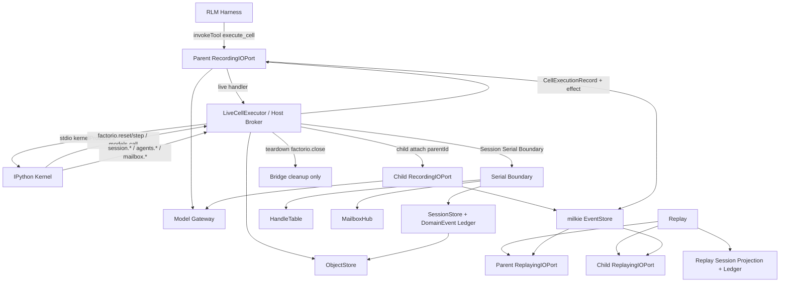

# 【session】持久 session 与异步 sub-agent handle、mailbox

- Issue: #7
- 状态: Approved
- 最后更新: 2026-08-10
- 交付面: Factorio example-internal（不提升公共 npm Runtime API）
- 前置: Issue #1 / #3 / #5 已交付；本设计与 #5 同步 `helix.models.call` **切割并存**
- 基线: `/tmp/issue-7-l2-revised.md` · Draft: `/tmp/issue-7-l2-draft.md` · L1: `/tmp/issue-7-l1-approved.md` · Review: `/tmp/issue-7-l2-review.md`

## 1. 背景

`docs/overview.md` 初始交付序列第 1 项（对象化 context、沙箱 IPython、programmatic tools、recursive model calls）已在 Factorio 纵切经 Issue #1 / #3 / #5 交付。第 2 项要求 **persistent sessions、asynchronous sub-agent handles 与 mailboxes**：模型须能在跨 cell / 跨 turn 的会话中挂起与恢复工作，并程序化派生子执行体、以有界消息通信。

当前能力边界不足以覆盖该项：

1. 既有「持久 Kernel」是 **单 milkie run 内** 的进程/namespace 存活，不是跨 run 可恢复的 session 契约；run 结束后依赖 live 进程偶然状态不可验收。
2. Issue #5 的 `helix.models.call` 是 **同步子查询**：admission 后阻塞等待有界 `RecursiveModelResult`，经独立 child run 录制一次 LLM；明确将 **异步 sub-agent、mailbox、跨 run 持久 session** 列为非目标。
3. 若把异步 fan-out 硬塞进 #5 同步路径，或无 handle 地起裸线程/后台任务，将破坏预算预留、唯一 terminal、父子 Trace 关联与 Replay 队列隔离。
4. 若 spawn / 阻塞 wait / mailbox 持久变更与 Factorio 环境 effect 或 #5 `models.call` 同 cell 混用，将破坏 #1/#5 已锁定的「每 cell 至多一个外部 effect」与 Replay 跳过 handler 时的消费序。

本设计在 **Factorio example-internal** 实验面另立契约：扩展 `kernelProtocol: "2"` 方法面，交付可回放的 session / handle / mailbox 能力；Helix 只补 Kernel 可见 binding、Host admission、领域投影与验收，**不**在 Helix 复制 milkie lifecycle / Trace / Replay / lineage / task outcomes。跨 run 恢复优先衔接 milkie 已有 `contextId` / checkpoint / child run（`parentId`）事实。

## 2. 名词解释

- **Helix session（`sessionId`）**：跨 turn / run-boundary 的稳定工作边界。一次 session 可跨越多个 milkie run；每个 turn / 恢复点通常对应独立 `runId` + 独立 Trace。`sessionId` 稳定、可记录，实现上关联 milkie `contextId`（字段名见 §8），但 **session ≠ 单个 milkie run ≠ 单个 Kernel 进程寿命**。
- **Session 投影（Session Projection）**：显式、可哈希的已提交状态面——工作记忆摘要、handle 表、mailbox 游标与有界消息摘要、capability 快照、episode/session 元数据、对象 Ref。跨 run 恢复的 **唯一权威**；Live Kernel namespace 仅作同 run 加速缓存，不得充当 S1 闭环依据。返回给模型的 `SessionView` 必须按 actor **过滤**（§4.6.4）：child 不得经 lookup/view 枚举 peer handle 或 `session.control`。
- **Session 版本（`sessionVersion` / `commitSeq`）**：每个 `sessionId` 上严格单调递增的提交序（`uint64`，从 1 起）。仅 **已提交（committed）** 版本可作为跨 run `session.resume` 的起点。
- **Checkpoint**：将当前 live 变更截断并提交为版本 `V` 的投影快照（含因果前界内的 handle 终态与 mailbox 入队）。提交后产生可 resume 的 `V`；提交后事件属于后界，不得进入该版本投影。
- **Session 串行化边界（Session Serial Boundary）**：每个 `sessionId` 唯一的 Host 侧互斥执行点。凡分配 `causalSeq`、追加 domain-event ledger、checkpoint 截断与版本提交、mailbox 入队/消费、handle 终态合并，**必须**经同一 serial boundary 线性化（§5.2）。
- **Domain-event / merge ledger**：**严格 append-only**、可 fsync 的 session 级追加日志，只记录 Helix **领域投影/合并事实**。记录种类闭集：`handle.terminal` / `mailbox.enqueue` / `mailbox.consume`（领域事件）以及 `merge.commit`（合并提交记录）。**禁止**对既有 ledger 条目原地改写 `merged` 或其它字段。**不**记录 child lifecycle、Trace、Replay 控制流——后者仍委托 milkie。
- **Exactly-once 合并**：跨挂起/恢复边界，子 handle 终态通知与 mailbox 投递在父侧观察面恰好合并一次。合并键为稳定事件身份（`handleId`+`terminalGeneration`，或 mailbox `msgId`/`msgSeq`）；某事件是否已 commit-merged **仅**由以下二者之一判定（见 §5.2）：(a) 已提交版本 `V` 的投影 + 随 `V` 原子提交的 `dedupeSnapshot` 含该 `mergeKey`；或 (b) ledger 中存在引用该 `mergeKey` 且 `sessionVersion` 已提交的 `merge.commit` 记录。**禁止**仅因 resume 期 live 应用就永久过滤事件。
- **异步 sub-agent handle**：模型经 `agents.spawn` 派生的一等可查询子执行体引用。暴露 `handleId`、关联 `childRunId`、状态闭集、有界 preview、结果 Ref、错误分类。子执行递归使用同一 RLM session 形状，经 Host admission 创建，不新建无 Trace 平行 runtime。
- **Handle 状态机**：闭集 `pending → running → {completed | failed | cancelled}`，以及 admission 拒绝的 `rejected`（从不进入 running）。终态不可逆；详见 §5.4。
- **Mailbox**：session 内显式有界通信介质。本设计锁定 **每 handle 一个收件箱 + session 控制面通道 `session.control`**（拓扑见 §5.5）。消息有硬上限；授权端可 `send`/`receive`；未授权 fail-closed。
- **Actor**：Host 权威的调用方身份，闭集：`parent`（父 harness / 当前父 run）、`handle:<handleId>`（某子执行体）、`none`（无有效绑定）。由 Host 从当前 run/bootstrap 注入的 capability 绑定推导，**禁止**模型自报。
- **占槽写路径（Write-path effects）**：计入 Host 单 effect 槽的操作集合扩展成员——`agents.spawn`、`agents.wait`（阻塞到外部）、`mailbox.send`、`mailbox.receive`（成功消费游标前进），以及既有 `factorio.reset`/`step`、`models.call`、session 写路径。彼此互斥。**不含** `factorio.close`（cell 外 Host cleanup，不在模型可发 method 闭集）。
- **只读本地快照**：`agents.poll`（child 仅 self）/ `mailbox.peek`（矩阵内）/ `session.lookup`（**仅** permissions 含 lookup 的 parent）——纯读已录制/已提交或本 run live 观察快照，无 live I/O RPC、不推进游标、不改已提交版本，**不占槽**；返回体 actor-filtered。
- **SessionCreationCapability**：harness 签发的、**无 `sessionId` 绑定**、仅 `scope=create` 的不可转移凭证；用于 `session.create`。
- **SessionCapability（session-bound）**：harness 在 create 原子步骤中签发的、**绑定具体 `sessionId` + principal** 的不可转移凭证；用于 resume / lookup / checkpoint / spawn / mailbox 等 session 内动作。
- **Principal**：运行 harness 的主体标识（如 `principalId` = harness 配置的 owner / run 绑定身份）。跨主体 resume 不可枚举拒绝。
- **Host Cell Effect Gate**：`LiveCellExecutor`（Host）维护的、不可由 Kernel 伪造的「本 cell 已占用外部 effect 槽」状态；权威于 Kernel 本地计数（对齐 #5）。
- **Child run / `parentId`**：每个成功派生的 handle 对应独立可回放子记录（milkie child run）；`agent.run.started.parentId` 指向派生子的父 run。父 Live 与子记录可分别定位、分别 Replay。
- **`kernelProtocol: "2"`**：既有 stdio effect 帧协议主版本保持 `"2"`（与 #5 一致）；本 Issue **扩展 method 闭集**，不新开 protocol 主版本。未知 method → 协议错误。
- **`sessionEffect` / `agentEffect` / `mailboxEffect`**：`CellExecutionRecord` 上与 `factorioEffect` / `modelEffect` 互斥的至多一个可回放 effect 摘要字段族（实现可归一为单一 `cellEffect` 判别联合；逻辑上互斥）。
- **Barrier fixture（M1）**：测试桩——子在 terminal 前被 barrier 阻塞，用于证明 spawn 非阻塞与因果序（产品 API 不暴露 barrier）。

## 3. 设计目标与非目标

### 3.1 目标

- 提供可标识、可挂起/恢复的 **Helix session** 边界：同一 `sessionId` 下至少跨越 2 个 turn / run-boundary 恢复关键投影；完整大值走对象存储 / Ref，不强制展开进外层 LLM context。
- Session 具有 **单调 `sessionVersion`**；checkpoint 对 handle 终态与 mailbox 入队有明确 **included / excluded** 前后界；恢复只从已提交版本开始；跨挂起/恢复异步事件 **exactly-once 合并**；serial boundary + **append-only** merge ledger + 仅 checkpoint 原子 commit-merge 保证崩溃可恢复线性化（含 resume 后、checkpoint 前崩溃可重放）。
- 模型可从 Kernel binding **派生异步 sub-agent handle**（非 #5 同步 `models.call`）：`agents.spawn` 立即返回 handle；父可继续；稍后 `agents.wait` / `agents.poll` 得有界终态或结果；子有独立可回放记录与 `parentId` lineage。
- 提供 **有界 mailbox**：授权矩阵锁定的端可收发；未授权 fail-closed 且 live 副作用为 0、无秘密可枚举；消息序与消费在 Replay 下可校验，相关 I/O remaining = 0。
- **同 cell 单外部 effect**：spawn、mailbox 持久变更、阻塞 wait 与 Factorio effect 及 #5 `models.call` **互斥**，计入该 cell 唯一外部 effect 槽。
- Session create / resume / lookup **按 principal + 不可转移 capability（create-scope 与 session-bound 分离）授权**；不匹配时无秘密拒绝、不可枚举、无 session 读改、无 Kernel/Provider/环境副作用。
- deadline / cancellation / 模型预算 / 权限跨 session 与 sub-agent / mailbox 路径 **fail-closed 收敛**：子路径不得擅自续期父 deadline；已开始的外部模型或 effect 请求保持唯一 terminal；spawn 预算对齐 design/5 的 clamp / actual / charged / overflow 词义；无秘密泄漏。
- 不破坏 milkie Trace / Replay / lineage / 预算与权限门禁；Helix 不复制 milkie lifecycle / Trace / Replay / lineage / task outcomes。

### 3.2 非目标

- 不把异步 / mailbox / 跨 run session **塞进 #5** 或改写 `helix.models.call` 同步语义；#5 保持同步子查询 + 独立 child run。
- 不提供 **无 handle 的裸线程 / 后台 fire-and-forget** 作为一等能力。
- 不提供 **无界 mailbox**（容量、单条大小、在途条数、handle 并发与历史表均有硬上限，见 §8.6）。
- **不**提升为 Helix 公共 npm Runtime API / 稳定 SDK；首版仅 Factorio example-internal。
- 不做 Global Evolution / harness promotion、通用分布式多租户产品化、跨无关 session 的任意通信。
- 不替换 Factorio 任务/allowlist，不绕过既有单 cell 环境 effect 约束；与 FLE 交互仍走既有 broker。
- 不在 Helix 复制 milkie 的 session/checkpoint/run 生命周期实现；merge ledger **仅**记领域合并事实。
- 不允许多个外部 effect 同 cell 并行占槽；不允许多主体共享可枚举 session 命名空间而无授权门闩。
- 不静默 pickle 整个 Kernel 地址空间作为跨 run 恢复权威。
- 不把 `factorio.close` 暴露为模型可发 Kernel effect method。

## 4. 能力与功能设计

### 4.1 模型可见 binding（example-internal）

Kernel 在每个 cell 前重装 `helix` bootstrap。本 Issue 在既有 `helix.task` / `helix.runtime` / `helix.models` / `factorio` 之外增加三组命名空间（名称全文唯一，锁定）：

```text
# Session
# create 使用 bootstrap 注入的 SessionCreationCapability opaque token（无 sessionId）
view = helix.session.create(capability_token, metadata=None)
# resume/lookup/checkpoint 使用 create 返回或 bootstrap 当前绑定的 SessionCapability opaque token
view = helix.session.resume(session_id, capability_token, version=None)
view = helix.session.checkpoint(note=None)          # 使用当前绑定 SessionCapability
view = helix.session.lookup(session_id=None, capability_token=None)
# lookup：仅 parent（permissions 含 lookup）；child 默认无 lookup
# session_id 缺省=当前；capability_token 缺省=当前绑定 token
# 返回 SessionView 必须 actor-filtered（§4.6.4）

# Async sub-agent
handle = helix.agents.spawn(instructions, input=None, max_output_tokens=None, mailbox=True)
view   = helix.agents.wait(handle_id, timeout_ms=None)   # 阻塞到终态或超时/cancel
view   = helix.agents.poll(handle_id)                    # 只读本地快照，不占槽

# Mailbox
receipt = helix.mailbox.send(to, payload, to_handle_id=None)
msg     = helix.mailbox.receive(mailbox_id=None, timeout_ms=0)  # timeout_ms=0 非阻塞尝试消费
msg     = helix.mailbox.peek(mailbox_id=None)                   # 只读，不推进游标，不占槽
```

语义总表见 §8。所有写路径经 `effect_request` 上送 Host；Kernel 不持有 Provider 凭证，不 import milkie。

**Capability / actor 注入（锁定，H3/H2）**：

1. 父 harness bootstrap 注入：
   - `helix.session._creation_token`：`SessionCreationCapability` opaque 字符串（仅 create）。
   - 当前若已绑定 session：`helix.session._session_token` + `helix.session._session_id` + `helix.session._actor = "parent"`。
2. child bootstrap 注入（spawn 时由 Host 写入 child Kernel 启动环境，**不可由模型改写或伪造**）：
   - `helix.session._session_token`：该 child 的 session-bound capability（**默认无 `lookup`** 的 permissions 子集，见 §4.6.1）。
   - `helix.session._session_id`、`helix.session._actor = "handle:<handleId>"`、`helix.session._handle_id`。
   - **不**注入 `_creation_token`；**不**注入可枚举 peer/control 的目录 API。
3. Host 处理任何 effect 时，**忽略** params 内任何自报 `actor` / `principalId` / `handleId` 声称；权威 actor 仅从当前 run 绑定的 capability 与 child bootstrap 记录推导。
4. Python 签名、effect `params` schema、Host 校验 schema **必须同构**（字段名 snake_case 在 Python，effect JSON 用 schema 规定的 camelCase/snake 对照表 §8；不得一边 optional 一边 required）。

### 4.2 Capability 发现（与 #5 切割；M1 拆分配额投影）

**唯一** session/async/mailbox 发现入口（禁止与 `capabilities.recursiveModel` 混名）：

```ts
ContextEnvelope.capabilities.sessionAsync = {
  enabled: boolean
  // 并发未终态 handle 上限与剩余（pending+running）
  maxActiveHandles: number              // = MAX_HANDLES（4）
  remainingActiveHandleSlots: number    // 非负
  // 历史 handle 表上限与剩余（含终态）
  maxHandlesPerSession: number          // = MAX_HANDLES_PER_SESSION（16）
  remainingHistoricalHandleSlots: number
  maxMailboxDepth: number               // = MAILBOX_DEPTH
  maxMailboxMsgBytes: number            // = MAX_MSG_BYTES
  sessionId: string | null              // 当前 run 已绑定 session；未绑定为 null
  sessionVersion: number | null         // 已提交版本；无则 null
}
```

规则锁定：

1. `enabled === false`（或缺省未写入）时：Kernel **不**注入 `helix.session` / `helix.agents` / `helix.mailbox` 可用 binding；若仍收到对应 effect 帧，Host 以 `SESSION_ASYNC_NOT_ENABLED` 拒绝，live 副作用 = 0，不占槽。
2. `enabled === true` 时 binding 可用；数值字段为模型可见投影，与 Host 权威计数 **一致**（active 与 historical 分别投影，禁止混用单一 `maxHandles`/`remainingHandleSlots` 名）。
3. **禁止**再用 `capabilities.bindings` 列表项或其它并行发现面表达同一能力。
4. `#5` 的 `capabilities.recursiveModel` **原样保留**；两能力可同时 `enabled`，模型按语义选用；同 cell 仍受统一单 effect 槽约束。
5. spawn 拒绝时错误细分：并发满 → `AGENT_ACTIVE_HANDLE_LIMIT`；历史表满 → `AGENT_HISTORICAL_HANDLE_LIMIT`（均属闭集；见 §8.5）。evidence 同步区分。

### 4.3 同 cell 单 effect（扩展互斥集，H1）

每个 `execute_cell` **至多一个**外部 effect。互斥集（闭集，锁定）：

| 成员 | method | 占槽条件 |
|---|---|---|
| Factorio 环境 | `factorio.reset` / `factorio.step` | 既有 |
| #5 同步递归 | `models.call` | 既有 |
| Session 提交写 | `session.create` / `session.resume` / `session.checkpoint` | admission 通过并实际创建/加载/提交投影后占槽 |
| 异步派生 | `agents.spawn` | admission 通过并实际派生子记录或可观察 handle 后占槽 |
| 阻塞等待 | `agents.wait` | admission 通过并进入「可能观察外部进展」的阻塞路径即占槽（与是否最终等到无关） |
| Mailbox 持久变更 | `mailbox.send` / `mailbox.receive` | 成功入队或成功消费游标前进（admission 通过后占槽；入队/消费失败且未变更持久态则见 §5.5） |

**不在模型可发 method 闭集（H6，锁定）**：

- `factorio.close`：**不是** Kernel effect method，**不是** cell 互斥集成员。它是 cell 外的 Host lifecycle cleanup（bridge 关闭），由 Host 在 run teardown 路径调用既有 bridge，**不**经 `effect_request`、**不**占 Host cell effect 槽、**不**写入 `CellExecutionRecord.factorioEffect`、**不**进入 Replay effect 队列消费。既有 Factorio cell-effect 契约保持 `reset | step`。

**不占槽**（须同时满足）：

- `session.lookup`、`agents.poll`、`mailbox.peek`；
- 纯本地读 **已录制 / 已提交** 快照；
- **无** Host 侧 live I/O RPC、无 Provider / Bridge / 子工厂 / 外发 mailbox 副作用；
- 不推进消费游标、不改变 `sessionVersion`。

**门闩与拒绝时点（锁定）**：

1. **权威在 Host**（`hostEffectOccupied`）；不可由 Kernel 本地计数伪造。
2. **占用时点**：仅在通过该操作的 Provider/Bridge/子工厂/投影写前 admission（参数 → 授权 → 槽空闲 → 预算/并发上限）**之后** 占槽。admission 失败 → **不新占槽**、不启动子、不写 mailbox 持久态、不触达 Provider/环境。
3. **第二 effect**：槽已被互斥集任一成员占用后，后续互斥操作在 **任何 live I/O 之前** 拒绝，错误码 `MULTIPLE_EFFECTS_IN_CELL`（与 #5 同码）；live Provider / FLE / 子工厂 / mailbox 外发 = 0。
4. 合法可解析写路径帧的业务拒绝（含双 effect）→ **`ok: true` + 结构化 rejected/result**（对齐 #5 IMP-B 精神）；帧级协议损坏 → **`ok: false`**，映射 Python 异常，不生成业务 result 对象。

**正负序（必须）**：

1. 先非法 spawn（admission 拒）再合法 `factorio.step` → **成功**（拒绝未占槽）。
2. 先合法 spawn 再 `models.call` / `factorio.step` / 再 spawn / mailbox.send → **拒绝** `MULTIPLE_EFFECTS_IN_CELL`。
3. 单独 cell 一次 spawn **或** 一次 mailbox.send/receive **或** 一次 agents.wait **或** 一次 session.checkpoint → admission 通过时可成功。

### 4.4 Session 挂起 / 恢复（H2）

**Create**：`session.create` 使用 `SessionCreationCapability`：

1. Host 校验 creation capability（scope=create、principal 匹配、未过期）。
2. **原子步骤（锁定）**：分配新 `sessionId` → 初始化空 domain-event ledger 与 dedupe 账本 → 提交初始版本 `sessionVersion = 1` 投影 → **签发**绑定该 `sessionId` 的 `SessionCapability` opaque token → 将 token 绑定当前父 run → 返回 `SessionView` + `session_capability_token`（仅此一次明文交给 Kernel 持有 opaque；secret 材料永不回传）。
3. 失败则无 session 残留、无 token 签发、不占槽。

**Checkpoint（挂起点）**：`session.checkpoint` 在 **Session Serial Boundary** 内将当前 live 变更按因果截断提交为 `V' = V + 1`（若无挂起变更可返回当前 `V` 且 `noop=true`，仍占槽——因其为显式提交写路径）。提交时刻前后界见 §5.2。

**Resume**：`session.resume(session_id, capability_token, version=None)`：

1. 校验 session-bound capability + principal（§4.6）；失败 → 统一 `SESSION_AUTH_DENIED`（不可枚举；**先鉴权，再**触碰 store 元数据以外的投影正文）。
2. 只加载 **已提交** 版本：`version==None` → 最新已提交；指定 `version` 必须存在且已提交 → 否则 `SESSION_VERSION_NOT_FOUND`（**仅** auth 已通过后）。
3. **禁止**从半写缓冲、live 进程内存、未提交 WAL 尾部恢复并宣称成功。**删除**任何 `SESSION_NOT_COMMITTED` 独立错误码——未提交版本对外不可见，指定到不存在/未提交版本统一为 auth 通过后的 `SESSION_VERSION_NOT_FOUND`。
4. 新 run 以版本 `V` 为基线重建 bootstrap / 投影；然后按 §5.2.4 **仅**将 post-cutoff 且尚未 **commit-merged** 的领域事件应用到 **本 run 的 live 基线**（exactly-once 观察）；**不**改写 ledger 旧条目，**不**将 live 应用本身视为永久 merged。成功后可继续推进；下次 `checkpoint` 才把 live 合并结果原子提交为 `V' > V`（或 append `merge.commit`）。
5. Resume 将当前 run 绑定返回/既有的 session capability。
6. **Resume 后、checkpoint 前崩溃**：再次 resume 仍从同一已提交 `V` + 同一 post-cutoff 未 commit-merged 事件重放；观察计数仍 exactly-once（§5.2.4 / S1.10）。

**Lookup**：只读；**仅** permissions 含 `lookup` 的 actor（默认仅 parent）。不占槽；child 无 lookup → **统一** `SESSION_AUTH_DENIED`（不可枚举口径，与跨主体 resume 失败同码），且不读改、不泄露 peer/control 枚举。即使未来扩展 child lookup，返回体也必须是 §4.6.4 actor-filtered 最小视图。

### 4.5 异步 handle 与非阻塞 spawn（M1）

- `agents.spawn` **必须**在子 terminal 之前返回可查询 `handleId`（及分配的 `childRunId`）。
- 子执行：独立 child run，`parentId = 父 runId`；继承父 absolute `deadlineAt` 与 cancellation，**不得续期**；从父/session 预算池预留（§5.6）。
- 无 handle 则不得启动可产生外部副作用或计费 I/O 的子执行。
- child bootstrap 注入不可伪造 actor（§4.1）。
- **Barrier fixture 因果序（锁定）**：
  `spawn_returned ≤ parent_followup_recorded ≤ barrier_release ≤ child_terminal ≤ parent_observes_terminal`
  同时间戳用因果/序号破并列；禁止 child_terminal 早于 spawn_returned；禁止把 spawn 做成内部同步等子完的假异步。

### 4.6 授权：capability 模型 + mailbox 矩阵（H3 / H2）

#### 4.6.1 Capability 数据模型（锁定）

```ts
// Host 内部表示（secret 材料永不进 Kernel/模型/evidence 正文）
type SessionCreationCapability = {
  kind: "session_create"
  principalId: string
  secretHash: string          // harness secret 的 HMAC 摘要
  issuedAt: number
  expiresAt: number
  permissions: ["create"]     // 固定
}

type SessionCapability = {
  kind: "session_bound"
  sessionId: string
  principalId: string
  secretHash: string
  issuedAt: number
  expiresAt: number
  // 动作权限闭集
  permissions: Array<
    | "resume" | "lookup" | "checkpoint"
    | "spawn" | "wait" | "poll"
    | "mailbox.send" | "mailbox.receive" | "mailbox.peek"
  >
  // 可选收窄：child 仅能以自身 handle 为 actor
  boundActor: "parent" | { handleId: string }
}

// Kernel/模型仅持有 opaque token 字符串；Host 用 token → 内部记录查表
// 不可转移：Host 校验时绑定当前 run 的 principalId 与 issued secret；
// 转交他 principal 或他 run 未绑定记录 → 失败。
```

**权限默认集（锁定）**：

| 签发对象 | permissions | boundActor |
|---|---|---|
| create 成功后父 run | 上表全部（含 `lookup`） | `"parent"` |
| spawn 成功后 child bootstrap（**默认集，锁定**） | `poll`, `wait`（**仅** `handleId==self`）, `mailbox.send`, `mailbox.receive`, `mailbox.peek`（mailbox 仍受 §4.6.3 矩阵约束） | `{ handleId }` |
| child **默认不含（锁定）** | `create`, `resume`, `checkpoint`, **`lookup`** | — |
| child 可选（O2，显式下发才有） | `spawn`（共享 session 级槽/池；孙代仍无 lookup） | `{ handleId }` |

**H2 旁路锁定**：child 默认 **无 `lookup`**。即使实现错误地接受 child lookup，Host 也必须返回 actor-filtered 最小 `SessionView`（§4.6.4）或直接 `SESSION_AUTH_DENIED`——本设计选择 **默认拒绝 lookup**（统一 `SESSION_AUTH_DENIED`，见 §8.5），并在 S3 增加不可枚举测试。父可 `lookup` 全量（仍无 secret）。

#### 4.6.2 Session create / resume / lookup 拒绝语义

1. Create / Resume / Lookup 均须通过 Host 校验对应 capability。
2. **不匹配拒绝语义（单一错误码，锁定）**：
   - 对外 **唯一** 业务码 `SESSION_AUTH_DENIED`（不区分「不存在」与「存在但无权限」）。
   - 不读改 session 投影、不推进版本、不改 handle/mailbox 表。
   - 无 Kernel 业务执行、无 Provider、无 FLE、无子工厂、无对象 store 业务写入（审计若记拒绝不得含 secret）。
   - 时序与错误正文不得成为枚举侧信道（固定短错误、常数时间比较 secret）。
3. **先鉴权，再**读取 session 是否存在/版本列表等可区分元数据。

#### 4.6.3 Mailbox 授权矩阵（锁定，H2）

Actor 闭集 × Mailbox 目标 × 操作 → allow/deny。Host 为唯一权威；**先鉴权，再**解析 mailbox/handle 是否存在。未授权或对调用方不可见的目标 **统一** 返回 `MAILBOX_AUTH_DENIED`（无秘密；**不**用 `MAILBOX_NOT_FOUND` 区分「存在但无权限」，避免枚举）。`MAILBOX_NOT_FOUND` **仅**在已授权 actor 对 **本应可见** 的命名空间内、目标确实未创建时使用（例如父向 `h:<id>` send 但该 handle 未开 mailbox / id 在已授权 session 投影中不存在）。

| Actor ↓ \ Target → | `session.control` | 自己的 `h:<handleId>` | 其他 `h:<otherId>` |
|---|---|---|---|
| **parent** send | allow | allow | allow（目标 handle 存在且有 inbox） |
| **parent** receive | allow | allow | allow |
| **parent** peek | allow | allow | allow |
| **handle:H** send | allow | allow | **deny** |
| **handle:H** receive | **deny** | allow | **deny** |
| **handle:H** peek | **deny** | allow | **deny** |
| **none** 任意 | **deny** | **deny** | **deny** |

补充规则：

1. `mailbox.send` **不**携带调用方 actor；params 只有目标与 payload。Host 从当前 run 绑定推导 `fromActor` 并写入消息 `from` 字段（`"parent"` 或 handleId）。
2. child 不得 receive/peek `session.control` 或其他 handle inbox（防止旁路父控制面与 peer 窥探）。
3. child 可向 `session.control` send（例如进度摘要）；父可收。
4. 跨 `sessionId` 一律 deny → `MAILBOX_AUTH_DENIED`（不可枚举他 session）。
5. capability.permissions 必须含对应 `mailbox.send` / `mailbox.receive` / `mailbox.peek`；缺省 deny。
6. 矩阵正反用例必须进入 S3（§11.3）。

#### 4.6.4 SessionView actor 过滤与 lookup 不可枚举（H2，锁定）

**问题闭环**：若 child 持有 `lookup` 且 `SessionView` 含全量 `handles[]` / `mailboxes[]`（含 `session.control` 游标、peer `h:other`、msg from/to），则 mailbox 矩阵的 peer/control 隔离可被 lookup 旁路枚举。

**锁定规则**：

1. **Child 默认 permissions 不含 `lookup`**（§4.6.1）。child 调用 `session.lookup` → 拒绝，错误码 `SESSION_AUTH_DENIED`（与无权限 session 读同一不可枚举口径；不揭示 session 是否存在以外的目录信息）。live 副作用 = 0，不占槽。
2. **Parent** `lookup` 可返回全量 `SessionView`（仍禁止 secret、payload 正文、capability token）。
3. **防御性深度（若实现误给 child lookup 或内部调试路径）**：任何非 parent actor 的 `SessionView` 物化 **必须** actor-filter：
   - `handles`：仅 `handle_id == self` 的一条（或空）；
   - `mailboxes`：仅 `mailbox_id == "h:"+self`；**禁止**出现 `session.control` 与其它 `h:*`；
   - 不得返回 peer `child_run_id` 列表、全 session handle 目录、control 深度/游标；
   - `principal_id` 可保留自身 session 绑定所需的非秘密标识。
4. Canonical **已提交投影**（§7.3）仍存全量（父恢复权威）；过滤只发生在 **面向 actor 的 API 返回值**，不改变持久投影字节。
5. child 允许的只读面：`agents.poll(self)`、`agents.wait(self)`、`mailbox.peek/receive(self inbox)`；对 control/peer 的 peek/receive/send 仍走 §4.6.3 矩阵。
6. **S3 不可枚举测试（必须）**：child 调 lookup → deny；child 调 poll/wait 他柄 → deny；child peek/receive control 或 `h:other` → `MAILBOX_AUTH_DENIED`；child 任何成功响应正文不得出现 `session.control` 或其它 handleId 作为可枚举目录项。

### 4.7 预算、cancel、失败收敛

| 面 | 行为 |
|---|---|
| Token / 次数 | 子 agent 从 **父/session 预算池** 预留与结算；词义对齐 design/5 §5.3（clamp-to-available、actual/charged/overflow）；不足则派生/Provider 前拒绝；任何计费 I/O 前有 admission；终态后可审计结算；失败路径不泄漏额度、不假退 |
| 预留时点 | **spawn 时**按 §5.6 公式预留 session 级子预算配额；子实际 LLM 分次从该 handle 配额再预留（类比 #5）；handle 终态时向 session/父池结算 |
| 墙钟 / cancel | 子继承父 absolute `deadlineAt` + signal，**不得续期**；cancel/deadline 传播到在途 sub-agent 与可中断的 wait/mailbox 阻塞点 |
| 唯一 terminal | 已开始的外部模型/effect 请求恰 1 个 terminal；handle 进入可判定终态 |
| 单子失败 | 默认 **不** 自动杀死整个 session；父 termination 沿用 Factorio v3 / milkie 闭集 |
| 秘密 | token / stack / SDK body / abort reason **不**进入模型可见错误与默认 CLI |

### 4.8 UI / UX / evidence

无 GUI。CLI / evidence 在既有 Factorio Live/Replay JSON 上增补：

- `session.id` / `session.version` / `session.projectionHash` / `session.cutoffCausalSeq`
- `session.handles[]`：`handleId`、`childRunId`、`status`、`resultRef?`、`terminalGeneration`
- `session.mailboxes[]`：`mailboxId`、`depth`、`headSeq`、`tailSeq`、消息摘要 hash 列表
- `evidence.childRunIds`：凡已 observed `agent.run.started` 的子 run（含 post-attach failure）；attach never-started 不进列表（对齐 #5 IMP-A 精神）
- `evidence.sessionMergeEvents[]`：exactly-once 合并键、`causalSeq`、`payloadHash`、计数（验收用；**无** payload 正文、无 secret）
- `evidence.sessionMergeCommits[]`：`sessionVersion`、`cutoffCausalSeq`、`committedMergeKeys` 摘要 hash、`projectionHash`（验收 commit-merged 边界；无 secret）
- `evidence.sessionBudgetSettlements[]`：每 handle 的 reserved/declared*/actual/charged/overflow（§5.6）
- Replay：按 turn 序 Replay 相关 run；投影 hash = Live；父/子 I/O remaining = 0；零 live fallback

## 5. 设计思路与折衷

### 5.1 Session ≠ run ≠ Kernel 进程

**选择**：Helix session 跨多个 milkie run；权威恢复面 = 已提交投影 + object store + milkie checkpoint 事实 + Helix domain-event ledger。

**放弃**：session ≡ 单 run；跨 run 静默 pickle Kernel 地址空间作唯一恢复手段（不可审计、难 Replay、权限面过大）。

### 5.2 单调版本、serial boundary、持久 merge ledger、exactly-once（H1/H2）

**选择**：

```text
sessionVersion: uint64  // 严格 +1；create 提交 V=1
projectionHash = sha256_hex(canonical_session_projection_bytes)
```

#### 5.2.1 Session Serial Boundary（锁定）

每个 `sessionId` 在 Host 维护 **唯一** serial boundary（互斥锁/单写队列，实现任选其一无开口语义）：

**必须**在 boundary 内线性化的操作：

1. 分配下一 `causalSeq`（严格单调 `uint64`，session 级，从 1 起）；
2. 追加 domain-event ledger 记录并 fsync/等价耐久化；
3. checkpoint：读取 `cutoffCausalSeq`、构造投影、原子提交版本、持久化 dedupe 快照；
4. mailbox 成功入队 / 成功消费游标前进；
5. handle 终态合并进投影或 pending-merge 集。

**禁止**：在 boundary 外分配 `causalSeq` 或宣称事件「已入前界」。并发调用必须排队；验收可用并发夹具证明线性化截断。

#### 5.2.2 Domain-event / merge ledger（锁定，**严格 append-only**）

不可变 **仅追加** 日志。**禁止** UPDATE/DELETE 既有条目；**禁止**原地改写 `merged` 标志。

```ts
// 领域事件（到达时追加；一旦 fsync 永不改写）
type SessionDomainEvent = {
  recordType: "domain"
  causalSeq: number                 // serial boundary 分配；严格单调
  mergeKey: string                  // 见 §5.2.5
  kind: "handle.terminal" | "mailbox.enqueue" | "mailbox.consume"
  payloadHash: string               // sha256_hex；无正文
  payloadRef?: string               // object store ref；可选
  // handle.terminal:
  handleId?: string
  terminalGeneration?: number       // 终态恒为 1
  status?: "completed" | "failed" | "cancelled"
  // mailbox.*:
  mailboxId?: string
  msgId?: string
  msgSeq?: number
  recordedAt: number                // wall ms，仅审计；不进 projectionHash
  // 注意：无 merged / mergedAtVersion 字段——合并状态不存于 domain 行
}

// 合并提交记录（仅由 checkpoint 原子路径追加；或与 checkpoint 等价的单一原子提交）
type SessionMergeCommit = {
  recordType: "merge.commit"
  causalSeq: number                 // 仍占 serial 序号，便于全序审计
  sessionVersion: number            // 本次提交的版本 V'
  cutoffCausalSeq: number           // 与投影一致
  committedMergeKeys: string[]      // 本次首次 commit-merged 的 mergeKey 列表（有序）
  projectionHash: string
  dedupeSnapshotHash: string        // 提交后全量 dedupe 集的 hash
  recordedAt: number
}

type SessionLedgerRecord = SessionDomainEvent | SessionMergeCommit
```

**「是否已 commit-merged」判定函数（锁定，唯一权威）**：

```text
isCommitMerged(mergeKey, asOfVersion=V) :=
  mergeKey ∈ dedupeSnapshot(V)
  OR 存在 ledger 中 recordType=="merge.commit"
       且 sessionVersion <= V
       且 mergeKey ∈ committedMergeKeys
// 实现可只持久化 dedupeSnapshot(V)，merge.commit 作审计/重建；二者必须等价
// 明确：resume 期对 live 基线的应用 **不** 使 isCommitMerged 变为 true
```

**耐久顺序（锁定）**：

1. child terminal 或 mailbox 事件到达 Host 时：**先**在 serial boundary 内 **append** 一条 `recordType:"domain"` 并 **fsync/等价成功**，**再**通知等待中的 wait/receive 或更新 **本 run 内存** live 视图。
2. 崩溃窗口：若 fsync 后、通知前崩溃 → 后续 resume 从 ledger domain 行恢复，不得丢事件；若 fsync 前崩溃 → 事件视为未发生，child 侧 milkie 终态仍在，父侧恢复后可通过 child run 观察面 **重新投递**（同一 `mergeKey` 幂等，不双计）。
3. ledger **只**含领域合并事实与 merge.commit；child lifecycle、Trace span、Replay 控制 **不**写入 ledger，仍只在 milkie。
4. **禁止**任何「把 domain 行的 merged 从 false 改 true」的实现；合并的持久化 **只**通过 checkpoint 原子提交路径（§5.2.3）。

**Dedupe 账本**：`Set<mergeKey>` 表示已 **commit-merged**（已纳入某已提交投影）的事件。该集合的快照 **仅**随每次 checkpoint 原子提交持久化。resume 加载 `V` 时加载 `dedupeSnapshot(V)`；resume 期维护的 `liveDedupe` 仅本 run 内存，**崩溃即丢**，不得单独落盘冒充已提交。

#### 5.2.3 Checkpoint 截断与原子 merge 提交（锁定）

全部在 serial boundary 内；**这是使事件变为 commit-merged 的唯一路径**：

1. `cutoffCausalSeq = nextCausalSeq`（提交瞬间的下一序号，即已分配最大序号 + 1；凡 domain `causalSeq < cutoff` 为前界候选）。
2. **Included（将 commit-merge）**：所有 domain 事件满足 `causalSeq < cutoffCausalSeq` 且已达可提交形态，且 `mergeKey ∉ dedupeSnapshot(V_current)`；纳入新投影，并进入本次 `committedMergeKeys`。
3. **Excluded**：domain `causalSeq >= cutoffCausalSeq` —— 不得出现在该版本投影；domain 行保持原样（append-only）；`isCommitMerged` 仍为 false。
4. 构造 canonical 投影字节（含 `cutoffCausalSeq`）、计算 `projectionHash`、新 `dedupeSnapshot' = dedupeSnapshot(V) ∪ committedMergeKeys`。
5. **原子提交**（同一 fsync/事务边界，失败则全不可见）：
   - 持久化投影 `(sessionId, version=V', hash, projectionRef, cutoffCausalSeq, dedupeSnapshotRef)`；
   - **append** `merge.commit` 记录（含 `committedMergeKeys`、`sessionVersion=V'`、`cutoffCausalSeq`、hashes）；
   - **不**改写任何既有 domain 行。
6. **仅当**原子提交成功后，resume 可见 `V'`，且对 `committedMergeKeys` 有 `isCommitMerged==true`。
7. 不变量：不存在「已获 `< cutoff` 的 causalSeq 且 commit 成功却未进入该版本投影」；也不存在「`>= cutoff` 进入该版本投影」；不存在「无 checkpoint/merge.commit 却被后续 resume 永久过滤」的 domain 事件。

#### 5.2.4 Resume 合并算法（锁定；live 应用可重放）

**目标**：resume 后立刻让父观察面看到 post-cutoff 事件，但崩溃后必须仍能从同一已提交 `V` 重放，**不得**因「上次 live 已应用」而丢失。

1. 鉴权通过后加载已提交 `V` 投影 + `dedupeSnapshot(V)`（禁止未提交尾）。初始化本 run：
   `liveProjection = copy(V)`，`liveDedupe = copy(dedupeSnapshot(V))`（**仅内存**）。
2. 打开 ledger，选取 **domain** 记录：`causalSeq >= V.cutoffCausalSeq && mergeKey ∉ liveDedupe`（等价：`!isCommitMerged(mergeKey, V)` 且尚未在本 run live 应用），按 `causalSeq` 升序。
3. 对每条 domain 事件：
   - 若 `mergeKey ∈ liveDedupe` → 跳过（本 run 幂等）；
   - 否则 **仅**应用到 `liveProjection`，`liveDedupe.add(mergeKey)`；
   - **禁止** append 假 merge.commit；**禁止**改写 domain 行；**禁止**把 `liveDedupe` 单独 fsync 为「已提交 dedupe」。
4. 返回基于 `liveProjection` 的（parent）`SessionView`；后续 poll/wait/receive 读 live 观察面。
5. **不**在 resume 时自动提交新版本。下次显式 `checkpoint` 将 `liveProjection` / `liveDedupe` 经 §5.2.3 原子提交为 `V' > V`（此时事件才变为 commit-merged）。
6. **崩溃恢复不变式（H1 回归，锁定）**：
   - 若在 resume 应用 live 之后、checkpoint 成功之前 Host/SessionStore 崩溃：再次 resume 仍加载同一 `V` + 同一 post-cutoff domain 行；因 `isCommitMerged` 仍为 false，事件再次进入 live 应用；父观察计数仍为 1（应用幂等），**不得丢失**。
   - 若 checkpoint 已成功：事件 ∈ `dedupeSnapshot(V')`，后续 resume 不再重复纳入投影正文（已在投影内），计数仍为 1。
7. Host/SessionStore **在 checkpoint 成功与后续 child 投递之间重启**：E2E S1.8；**在 resume 成功与下一次 checkpoint 之间重启**：E2E S1.10（必须）。

#### 5.2.5 Exactly-once 合并键

| 事件 | 合并键 | 父侧观察 |
|---|---|---|
| Handle 终态 | `handleId + ":" + terminalGeneration`（终态写入时 generation=1，且不再递增） | `handles[id].status` 终态只写一次；重复投递忽略 |
| Mailbox 消息入队 | `msgId`（Host 生成 ULID/uuid v7） | 入队序唯一；resume 重放已存在 `msgId` 不重复插入 |
| Mailbox 消费 | `mailboxId + ":consume:" + msgSeq` | 消费游标单调不回退 |

Replay 按 turn/run 序重放时，同一合并键投影结果与 Live **hash 一致**且计数为 1。

**交错场景（S1 必备）**：spawn → 父 checkpoint 挂起 → 子在父恢复前完成并 `mailbox.send` ≥1 条 → 父 resume → 恰好观察一次终态 + 该消息 → 按序 Replay → hash=Live。

### 5.3 与 #5 切割并存

| 维度 | #5 `models.call` | #7 `agents.spawn` |
|---|---|---|
| 语义 | 同步子查询 / 单次 LLM | 异步子执行体（同 RLM 形状） |
| 父控制流 | 阻塞等结果 | 立即返回 handle |
| 录制 | child run + `modelEffect` | child run + `agentEffect`；`parentId` |
| 结果 | `RecursiveModelResult` | `HandleView` + 结果 Ref |
| Capability | `recursiveModel` | `sessionAsync` |
| 同 cell | 互斥集成员 | 互斥集成员 |
| 预算词义 | design/5 §5.3 | **同一词义** 映射到 spawn/handle 池（§5.6） |

**放弃**：`models.call(async=true)`；模型 `threading`/`asyncio` 裸打 Provider。

### 5.4 Handle 状态机（锁定）

```text
                 admission 失败
   [start] ──────────────────────► rejected
      │
      │ admission 通过，已分配 handleId
      ▼
   pending ──attach/start 成功──► running
      │                              │
      │ attach never-started         ├── success ──► completed
      └──────────► failed            ├── error   ──► failed
                                     ├── cancel/deadline ──► cancelled
```

规则：

1. 状态闭集：`pending | running | completed | failed | cancelled | rejected`。
2. 终态 = `{completed, failed, cancelled, rejected}`；**不可逆**；重复终态事件 exactly-once 忽略。
3. `rejected`：未占子执行资源、无 `childRunId`（或 null）、无 Provider。
4. `pending → failed`：仅 attach never-started（类比 #5 C1）；次数/槽策略：spawn 已占槽且并发名额已耗，**不**回滚名额；预算预留按实际 usage=0 结算（全额 charged=0 退回，见 §5.6）。
5. `running → *`：已 observed `agent.run.started`；`childRunId` 进入 `evidence.childRunIds`。
6. Python `HandleView.status` 与录制字段同名同值（snake_case 映射：`child_run_id` 等）。

### 5.5 Mailbox 拓扑、有界与超限（锁定）

**拓扑（锁定一种）**：

- 每个 handle 附带收件箱 `mailboxId = "h:" + handleId`（spawn 时 `mailbox=True` 默认创建；`mailbox=False` 则无收件箱，**已授权**父向其 send → `MAILBOX_NOT_FOUND`）。
- Session 控制面通道 `mailboxId = "session.control"`：按 §4.6.3 矩阵授权。
- **禁止**跨 `sessionId` 路由；**禁止**通过错误码差异发现未授权 mailboxId。

**有界常量（版本化，§8.6）**：

| 常量 | 值 | 含义 |
|---|---|---|
| `MAX_MSG_BYTES` | `16384`（16 KiB） | 单条 payload UTF-8 字节上限（含 canonical JSON） |
| `MAILBOX_DEPTH` | `32` | 单 mailbox 未消费消息上限 |
| `MAX_IN_FLIGHT_MSGS` | `64` | 单 session 全部 mailbox 未消费总和上限 |
| `MAX_HANDLES` | `4` | 单 session **并发**未终态 handle 上限（`pending`+`running`） |
| `MAX_HANDLES_PER_SESSION` | `16` | 单 session **历史** handle 表上限（含终态）；超出拒绝新 spawn |
| `MAX_PAYLOAD_PREVIEW_BYTES` | `512` | 模型可见 preview |
| `MAILBOX_MSG_TTL_MS` | `3_600_000`（1h） | 未消费消息最大保留；超时后 receive 跳过并计 `expired`，不投递正文 |
| `WAIT_MAX_TIMEOUT_MS` | `120_000` | `agents.wait` / 阻塞 `receive` 上限 |
| `POLL_MIN_INTERVAL_MS` | `20` | 模型侧若循环 poll，文档与验收禁止紧忙等；Host 不提供盲重试 |

**超限策略（锁定一种：拒绝 send，不静默 drop）**：

- payload > `MAX_MSG_BYTES` → `MAILBOX_MSG_TOO_LARGE`，不入队，不占槽（param 步失败）。
- 目标 mailbox 当前深度 ≥ `MAILBOX_DEPTH` → `MAILBOX_FULL`，不入队；若 param/auth 已过且因满拒绝：**不占槽**（持久态未变）。
- session 未消费总和 ≥ `MAX_IN_FLIGHT_MSGS` → `MAILBOX_SESSION_BACKPRESSURE`，同不占槽。
- **禁止**静默 drop；**禁止**无界增长。

**序**：同一 mailbox 成功入队消息在 serial boundary 内分配单调 `msgSeq`（`uint64` 从 1）与 `causalSeq`；`receive` 按序消费并推进 `headSeq`；`peek` 返回队头副本不推进。Replay 校验 `(msgSeq, payloadHash)` 链与游标。

**大载荷**：仅传 Ref + preview；完整字节进 object store，`ObjectRef.kind = 'helix.mailbox-payload'`。

### 5.6 异步预算预留 / 结算（H4，对齐 design/5 §5.3 词义）

**词义锁定**（与 #5 同一账务语言；禁止 `settledTokens` 歧义名）：

| 字段 | 含义 |
|---|---|
| `estimatedPromptTokens` | `estimateSpawnPromptTokens(instructions, input)` |
| `declaredPromptTokens` | `min(estimatedPromptTokens, MAX_SPAWN_PROMPT_TOKENS)` |
| `requestedCompletionTokens` | `clamp(max_output_tokens ?? MAX_SPAWN_COMPLETION_TOKENS, 1, MAX_SPAWN_COMPLETION_TOKENS)` |
| `availableCompletionTokens` | `max(0, sessionPool.remainingTokens - declaredPromptTokens)` |
| `declaredCompletionTokens` | `min(requestedCompletionTokens, MAX_SPAWN_COMPLETION_TOKENS, availableCompletionTokens)` |
| `reservedTokens` / `reserve` | `declaredPromptTokens + declaredCompletionTokens` |
| `actualUsageTokens` | 子侧所有已 terminal 的 LLM usage 合计 `(input+output)`；缺失当 0 |
| `chargedTokens` | `min(reserve, actualUsageTokens)` |
| `overflowTokens` | `max(0, actualUsageTokens - reserve)` |

**`agents.spawn.max_output_tokens`（锁定）**：

- 类型：可选有限 number（JSON number / Python `int`）；缺省 = `MAX_SPAWN_COMPLETION_TOKENS`（2048）。
- 范围：经 `clamp(..., 1, MAX_SPAWN_COMPLETION_TOKENS)`；非有限 / ≤0 / 非整数 → `AGENT_PARAM_INVALID`（不占槽）。
- **不是**直接预留量；只进入 `requestedCompletionTokens`，再与池/硬上限 clamp 得 `declaredCompletionTokens`。

**Spawn 预留（Provider/子工厂前，与占槽同一原子提交）**：

```text
estimatedPromptTokens    = estimateSpawnPromptTokens(instructions, input)  // 与 #5 同类 estimator；canonical 后计
declaredPromptTokens     = min(estimatedPromptTokens, MAX_SPAWN_PROMPT_TOKENS)
requestedCompletionTokens = clamp(max_output_tokens ?? MAX_SPAWN_COMPLETION_TOKENS, 1, MAX_SPAWN_COMPLETION_TOKENS)
availableCompletionTokens = max(0, sessionPool.remainingTokens - declaredPromptTokens)
declaredCompletionTokens = min(requestedCompletionTokens, MAX_SPAWN_COMPLETION_TOKENS, availableCompletionTokens)
reserve                  = declaredPromptTokens + declaredCompletionTokens

// 拒绝条件（仅此）
if declaredPromptTokens > sessionPool.remainingTokens:
    → AGENT_BUDGET_INSUFFICIENT   // 不占槽；reservedTokens=0
if reserve < MIN_SPAWN_RESERVE_TOKENS:
    → AGENT_BUDGET_INSUFFICIENT   // clamp 后仍不满足最小可发起预留；不占槽
// requestedCompletion > available 时不拒绝，只 clamp declaredCompletion

// admission 通过后原子：
sessionPool.remainingTokens -= reserve
openHandleReserves[handleId] = {
  reserve, declaredPromptTokens, declaredCompletionTokens, requestedCompletionTokens
}
activeHandleCount += 1
hostEffectOccupied = true
// 禁止 reservedOutstanding 平行账本
```

**Child 内每次 LLM**（若有）：从 `openHandleReserves[handleId]` 的剩余额度再按 #5 同型 clamp-to-available 预留/结算；子池不足 → 该次 child call 拒绝，不透支 session 池。每次 child request terminal 记录 partial actual；**不**在中途把 overflow 扣 session 池。

**Handle 终态结算（唯一）**：

```text
actualUsageTokens = sum over child LLM terminals of (usage.inputTokens??0 + usage.outputTokens??0)
// attach never-started / 无 LLM：actualUsageTokens = 0
chargedTokens     = min(reserve, actualUsageTokens)
overflowTokens    = max(0, actualUsageTokens - reserve)
sessionPool.remainingTokens += (reserve - chargedTokens)
// 写入 evidence.sessionBudgetSettlements 与 agentEffect.reservation
delete openHandleReserves[handleId]
activeHandleCount -= 1  // 若从 pending/running 进入终态
```

不变量：

1. `chargedTokens = min(reserve, actualUsageTokens)`；`overflowTokens = max(0, actualUsageTokens - reserve)`。
2. `remaining_after_full_cycle = remaining_before_reserve - chargedTokens`。
3. `remainingTokens >= 0`；禁止 NaN。
4. `overflowTokens > 0` **必须**写入 reservation/evidence；**不**从池额外扣减。
5. 失败/cancel/deadline：按实际 usage 结算；不得假退全额或假扣光。
6. 无平行 `reservedOutstanding`；在途 = 隐含于池与已 settle charged。
7. Provider/子工厂前拒绝：预留未提交；actual=charged=overflow=0。

### 5.7 Cancel / deadline 传播图

```text
Parent run deadlineAt/signal
    │
    ├─► LiveCellExecutor control
    │       ├─► agents.wait 阻塞点（可中断 → cancelled/timeout）
    │       ├─► mailbox.receive 阻塞点（可中断）
    │       └─► 在途 child runs（继承同一 absolute deadlineAt，不得续期）
    │               └─► child IOPort invokeLLM control
    └─► session 投影：handle → cancelled（唯一 terminal 后；经 ledger 合并）
```

Replay child 使用 fresh local safety deadline（对齐 design/3 / #5：`CHILD_REPLAY_SAFETY_WALL_MS = 300_000`），不复用可能过期的 Live `deadlineAt` 作 control；control 不进业务 hash。

### 5.8 不复制 milkie

**选择**：session 持久锚点 = milkie portable session / context checkpoint 扩展位 + Helix 领域投影 object + **Helix domain-event ledger**（仅合并事实）；child 用 milkie child run API（`parentId`）；Trace/Replay/lineage 只读 milkie。

**放弃**：Helix 自研第二套 lifecycle 状态机 / task outcomes / 完整事件溯源替代 milkie Trace。

## 6. 架构设计

### 6.1 逻辑分层



### 6.2 核心组件职责

| 组件 | 职责 |
|---|---|
| `helix` bootstrap（Kernel） | 注入 `session` / `agents` / `mailbox` binding 与 opaque tokens / actor；发版本化 effect 帧；映射结构化 result / 错误 |
| `LiveCellExecutor` | Host 单 effect 门闩；admission 序；session/handle/mailbox 权威状态；child 工厂调用；**teardown 时** bridge `close`（非 effect method） |
| `Session Serial Boundary` | 每 session 唯一线性化点：causalSeq、ledger、checkpoint、入队/消费、终态合并 |
| `SessionStore` | 投影持久化、版本提交、hash、resume 加载、dedupe 快照；与 milkie context/checkpoint 衔接 |
| `DomainEventLedger` | 不可变领域事件追加；fsync；unmerged 尾部查询 |
| `HandleTable` | handle 状态机、合并键、与 `childRunId` 映射 |
| `MailboxHub` | 有界队列、序、**授权矩阵**、TTL、send/receive/peek |
| `SessionCapability` 模块 | create-scope 与 session-bound 签发/校验/常数时间比较 |
| `recursive-model` 路径 | **不变**；#5 代码路径不承载 async |
| milkie | child run、Trace、Replay、IOPort control、object store；Helix 不复制 |

### 6.3 请求路径（spawn 示例）

1. 外层 `execute_cell`。
2. Kernel：`helix.agents.spawn(...)` → `effect_request{protocolVersion:"2", method:"agents.spawn", params}`（无 actor 自报字段）。
3. Host admission 固定顺序（短路；通过前不占槽）：
   1. 帧/method/params 形态；
   2. `sessionAsync.enabled`；
   3. 从 run 绑定解析 actor + session-bound capability 含 `spawn`；
   4. param canonical / 字节上限 / `max_output_tokens` 类型；
   5. `hostEffectOccupied == false`；
   6. `activeHandleCount < MAX_HANDLES` 且历史表 `< MAX_HANDLES_PER_SESSION`（分错码）；
   7. 预算 §5.6 `reserve` 充足；
   8. **原子（serial boundary）**：占槽 + 预留 + 分配 `handleId`/`childRunId` + 登记 pending + 可选创建 inbox。
4. 异步启动 child attach（注入不可伪造 actor/capability）；**不**阻塞父 cell 返回 handle 视图。
5. 写 `agentEffect`（含 reservation 声明字段）入 `CellExecutionRecord`。
6. Python 得 `HandleView{status:"pending"|"running", ...}`。

### 6.4 Resume 路径

1. 新 turn / 新 run 携带 `sessionId` + session-bound `capabilityToken`（parent；含 `resume`）。
2. `session.resume` effect → Host **先鉴权** → 加载已提交 `V` + `dedupeSnapshot(V)` → 重建 `liveProjection` → 按 §5.2.4 将 post-cutoff 且 `!isCommitMerged` 的 domain 事件应用到 **live**（不改 ledger、不提交版本）→ 返回 actor-filtered `SessionView`。
3. 后续 cell 见 live 观察面的 handle/mailbox 快照；大值仅 Ref。
4. 显式 `session.checkpoint` 才经 §5.2.3 原子提交 `V'` + append `merge.commit` + 新 dedupe 快照。
5. resume→checkpoint 前崩溃：下一 resume 从同一 `V` 重放同一 domain 尾，观察 exactly-once（S1.10）。

### 6.5 Replay 路径

1. 按 session 时间线排序相关 `runId`。
2. 逐 run 父 Replay：跳过 handler，校验 cell effect 摘要与 I/O 耗尽。
3. 对 `evidence.childRunIds` 逐子 Replay：零 live fallback，remaining=0。
4. 重建 session 投影链：`V1 → V2 → ...`，每步 `projectionHash` 与 Live evidence 一致；merge 事件计数 = 1；ledger 因果序与 cutoff 前后界可校验。
5. pins / schema gate 见 §8.8；不匹配 fail-closed。

## 7. 模块设计

### 7.1 目录锚点（example-internal，建议）

```text
examples/factorio/
  src/factorio/
    session-store.ts              # 投影 commit/resume/hash + dedupe 快照
    session-domain-ledger.ts      # domain-event ledger / serial boundary
    session-capability.ts         # create-scope 与 session-bound 签发/校验
    handle-table.ts               # 状态机与合并
    mailbox-hub.ts                # 有界队列 + 授权矩阵
    session-async-admission.ts    # admission 序与常量
    session-async-budget.ts       # spawn clamp/settle（design/5 词义）
    session-async-effects.ts      # method 路由与录制字段
  kernel/
    helix_session.py              # binding + token 持有
    helix_agents.py
    helix_mailbox.py
  tests/
    session-async/                # unit/integration/e2e
```

（具体路径以实现仓库为准；逻辑模块名锁定为上表职责，禁止把 async 逻辑塞进 `recursive-model.ts`。）

### 7.2 Admission 顺序（写路径通用，锁定）

```text
1. protocolVersion == "2" && method ∈ MODEL_EFFECT_METHOD_SET
2. decode params（失败 → ok:false 协议错误）
3. capabilities.sessionAsync.enabled（否则 SESSION_ASYNC_NOT_ENABLED）
4. 鉴权：解析 run 绑定 actor + capability/permissions（否则 SESSION_AUTH_DENIED / AGENT_AUTH_DENIED / MAILBOX_AUTH_DENIED）
   —— mailbox 路径：先矩阵鉴权，再存在性（§4.6.3）
5. 参数 canonical/上限（否则 *_PARAM_INVALID）
6. hostEffectOccupied == false（否则 MULTIPLE_EFFECTS_IN_CELL）
7. 资源上限（active/historical handles 分判、mailbox depth、budget...）
8. 原子 commit（serial boundary）：占槽 + 资源变更 + ledger/投影准备
9. 执行副作用（child 调度 / 入队 / 阻塞 wait 注册）—— ledger 事件先 fsync 再通知
```

只读路径（lookup/poll/peek）执行 1–5（peek/poll 的 auth 与 session 绑定 + 矩阵；**lookup 要求 permissions 含 `lookup`，默认仅 parent**），**跳过 6–9 的占槽与写**，直接返回 **actor-filtered** 快照（§4.6.4）。

### 7.3 投影 canonical hash

```text
canonical_session_projection_bytes =
  UTF-8 of strict JSON:
  {
    "v": 1,
    "sessionId": "...",
    "sessionVersion": <uint64>,
    "principalId": "...",
    "handles": [ /* by handleId asc: id, status, childRunId, terminalGeneration, resultRef, errorCode */ ],
    "mailboxes": [ /* by mailboxId asc: id, headSeq, tailSeq, msgs:[{msgSeq,msgId,payloadHash,from,to}] */ ],
    "memorySummaryRef": "..." | null,
    "cutoffCausalSeq": <uint64>,
    "lifecycle": "active" | "aborted"
  }
projectionHash = sha256_hex(canonical_session_projection_bytes)
```

键序字典序；无多余空白；与 #5 canonical 精神一致。**禁止** secret、payload 正文、capability token 进入投影。

**与 SessionView 的关系（H2）**：本 canonical 投影是父恢复权威，含全量 handles/mailboxes。面向 child 的任何 API **不得**直接把本结构序列化返回；必须经 §4.6.4 过滤。child 无 lookup 时根本不应触达该字节。

### 7.4 Child run 标识

```text
childRunId = "{parentRunId}:agent:{handleOrdinal}"
handleId   = "h_{sessionIdShort}_{ordinal}"  // 实现可用 ulid；evidence 稳定可比
parentId   = parentRunId                     // milkie agent.run.started.parentId
```

### 7.5 与 Factorio / #5 模块边界

- `factorio.reset` / `factorio.step` effect 路由不变；`FactorioEffect.method` 仍为 `'reset' | 'step'`。
- `factorio.close` 仅 Host teardown → bridge，不进 method 闭集与 `CellExecutionRecord`。
- `models.call` 路由不变；互斥检查读取同一 `hostEffectOccupied`。
- session-async 模块 **不得** import 或调用 Provider；只经 child run 工厂。

## 8. API / CLI 设计

### 8.1 Effect 帧公共头

```ts
// 模型/Kernel 可发 method 闭集（锁定；无 factorio.close）
type ModelEffectMethod =
  | "factorio.reset" | "factorio.step"
  | "models.call"
  | "session.create" | "session.resume" | "session.checkpoint" | "session.lookup"
  | "agents.spawn" | "agents.wait" | "agents.poll"
  | "mailbox.send" | "mailbox.receive" | "mailbox.peek"

type EffectRequest = {
  protocolVersion: "2"
  commandId: string
  method: ModelEffectMethod
  params: object
}
```

`kernelProtocol` / pins 中的协议版本字段保持与 #5 一致为 `"2"`；method 闭集扩展如上。未知 method（含误发的 `factorio.close`）→ `ok: false`，`code: "UNKNOWN_METHOD"`。

**Host-only cleanup（非 EffectRequest）**：

```ts
// LiveCellExecutor teardown → bridge；不经 Kernel，不占槽，不录 factorioEffect
bridgeRequest({ method: "close", params: {} })
```

### 8.2 Session API

#### 字段命名对照（Python binding ↔ effect params）

| Python | effect params | 备注 |
|---|---|---|
| `capability_token` | `capabilityToken` | 必填 string；create 用 creation token，其余用 session token |
| `session_id` | `sessionId` | |
| `version` | `version` | resume 可选 |
| `metadata` | `metadata` | create 可选 |
| `note` | `note` | checkpoint 可选 |

#### `session.create`

```ts
params: {
  capabilityToken: string       // SessionCreationCapability opaque；必填
  metadata?: { label?: string } // label ≤ MAX_SESSION_LABEL_BYTES
}
result: SessionView & {
  session_capability_token: string  // 新签发的 session-bound opaque；Kernel 存入 _session_token
}
```

Python：`helix.session.create(capability_token: str, metadata=None)` —— **无** `capability=None` 默认；缺 token → param 错误。

#### `session.resume`

```ts
params: {
  sessionId: string
  capabilityToken: string       // session-bound；必填
  version?: number              // 缺省 = 最新已提交
}
result: SessionView
// 错误闭集：SESSION_AUTH_DENIED | SESSION_VERSION_NOT_FOUND | SESSION_PARAM_INVALID
// 不存在与无权限 → SESSION_AUTH_DENIED
// SESSION_VERSION_NOT_FOUND 仅当 auth 已通过且 version 明确指出但不存在（含未提交对调用方不可见）
// 无 SESSION_NOT_COMMITTED
```

#### `session.checkpoint`

```ts
params: {
  // capability 取当前 run 绑定；可不传 token 字段，若传必须与绑定一致
  note?: string                 // ≤ MAX_CHECKPOINT_NOTE_BYTES
}
result: SessionView & { noop: boolean; committed_version: number }
```

#### `session.lookup`

```ts
params: {
  sessionId?: string            // 缺省当前
  capabilityToken?: string      // 缺省当前绑定
}
result: SessionView             // 不占槽；**需要 permissions ⊇ {lookup}**
// child 默认无 lookup → SESSION_AUTH_DENIED；副作用 0；正文无 session 目录
```

```ts
type SessionView = {
  session_id: string
  session_version: number       // 已提交基线版本；live 应用不改变此字段直至 checkpoint
  projection_hash: string       // 已提交 V 的 hash（非 live 临时 hash）
  cutoff_causal_seq: number
  handles: HandleView[]         // parent=全量；非 parent=仅 self（§4.6.4）
  mailboxes: MailboxBrief[]     // parent=全量；非 parent=仅 h:self，无 session.control
  memory_summary_ref: string | null  // 非 parent 可置 null
  principal_id: string          // 无 secret
  lifecycle: "active" | "aborted"
  // 可选：live_applied_merge_keys_count: number  // 仅 parent；验收用，无 key 列表亦可
}
```

### 8.3 Agents API

#### `agents.spawn`

```ts
params: {
  instructions: string          // UTF-8 bytes ≤ MAX_SPAWN_INSTRUCTIONS_BYTES (8000)
  input?: unknown               // 同 #5 缺省/canonical 规则；≤ MAX_SPAWN_INPUT_BYTES
  max_output_tokens?: number    // 见 §5.6；缺省 MAX_SPAWN_COMPLETION_TOKENS
  mailbox?: boolean             // 缺省 true
}
result: HandleView
// 占槽；立即返回
// 错误：AGENT_* / MULTIPLE_EFFECTS_IN_CELL / SESSION_ASYNC_NOT_ENABLED ...
```

#### `agents.wait`

```ts
params: {
  handleId: string
  timeout_ms?: number           // 缺省 WAIT_MAX_TIMEOUT_MS；clamp 到 [0, WAIT_MAX_TIMEOUT_MS]
}
result: HandleView              // 终态或超时（status 仍 running，error.code=AGENT_WAIT_TIMEOUT）
// 占槽（进入阻塞路径即占）
// parent：可 wait 本 session 任一 handle
// child：仅 handleId==self；否则 AGENT_AUTH_DENIED（不占槽，不泄露他柄状态）
```

#### `agents.poll`

```ts
params: { handleId: string }
result: HandleView              // 不占槽；本地快照
// child：仅 handleId==self；否则 AGENT_AUTH_DENIED
```

```ts
type HandleView = {
  handle_id: string
  child_run_id: string | null
  status: "pending" | "running" | "completed" | "failed" | "cancelled" | "rejected"
  preview: string               // ≤ MAX_PAYLOAD_PREVIEW_BYTES
  result_ref: string | null
  error: { code: string; message: string } | null
  terminal_generation: number   // 非终态 0；终态 1
}
```

### 8.4 Mailbox API

#### `mailbox.send`

```ts
params: {
  to: string                    // mailboxId 或 "session.control"
  to_handle_id?: string         // 若设，则 to 必须等于 "h:"+to_handle_id 或省略 to 由 Host 推导
  payload: unknown              // canonical ≤ MAX_MSG_BYTES
  // 无 actor / from 字段——Host 注入
}
result: {
  msg_id: string
  msg_seq: number
  mailbox_id: string
  payload_hash: string
  payload_ref: string | null
}
// 成功入队占槽；param/auth/满队列拒绝不占槽
```

#### `mailbox.receive`

```ts
params: {
  mailbox_id?: string           // 缺省：父侧 session.control；子侧自己的 h:handleId
  timeout_ms?: number           // 缺省 0 = 非阻塞；>0 则阻塞等待，clamp ≤ WAIT_MAX_TIMEOUT_MS
}
result: MailboxMessage | null
```

**receive 占槽细则（锁定）**：

1. `timeout_ms == 0`（缺省）：尝试原子消费队头；有消息 → 消费成功 → **占槽**；无消息 → **不占槽**，返回 `null`。
2. `timeout_ms > 0`：admission 通过后 **立即占槽** 并注册阻塞；醒来时或消费或超时返回；超时不回滚槽。

#### `mailbox.peek`

```ts
params: { mailbox_id?: string }
result: MailboxMessage | null   // 不占槽，不推进游标
```

```ts
type MailboxMessage = {
  msg_id: string
  msg_seq: number
  mailbox_id: string
  from: string                  // "parent" | handleId（Host 权威）
  preview: string
  payload_ref: string | null
  payload_hash: string
}
```

### 8.5 错误码闭集（模型可见 code）

| code | 含义 | 占槽 |
|---|---|---|
| `SESSION_ASYNC_NOT_ENABLED` | capability 未启用 | 否 |
| `SESSION_AUTH_DENIED` | create/resume/lookup 鉴权失败（不可枚举；**含 child 无 lookup 权限**） | 否 |
| `SESSION_VERSION_NOT_FOUND` | auth 通过但指定版本不存在（含对调用方不可见的未提交） | 否 |
| `SESSION_PARAM_INVALID` | session 参数非法 | 否 |
| `AGENT_AUTH_DENIED` | spawn/wait/poll 无权限（**含 child wait/poll 非 self handle**） | 否 |
| `AGENT_PARAM_INVALID` | spawn 参数非法 | 否 |
| `AGENT_BUDGET_INSUFFICIENT` | 预留不足（prompt 超池或 clamp 后 < MIN） | 否 |
| `AGENT_ACTIVE_HANDLE_LIMIT` | 并发未终态 handle 达 `MAX_HANDLES` | 否 |
| `AGENT_HISTORICAL_HANDLE_LIMIT` | 历史 handle 表达 `MAX_HANDLES_PER_SESSION` | 否 |
| `AGENT_NOT_FOUND` | handleId 在已授权 session 内无效 | 否 |
| `AGENT_WAIT_TIMEOUT` | wait 超时 | 是（已进阻塞） |
| `AGENT_SPAWN_FAILED` | attach never-started 等 | 是（spawn 已 commit） |
| `MAILBOX_AUTH_DENIED` | 未授权或不对调用方可见的目标（统一无秘密） | 否 |
| `MAILBOX_PARAM_INVALID` | 参数非法 | 否 |
| `MAILBOX_MSG_TOO_LARGE` | 超过 16KiB | 否 |
| `MAILBOX_FULL` | 单箱深度满 | 否 |
| `MAILBOX_SESSION_BACKPRESSURE` | session 总未消费满 | 否 |
| `MAILBOX_NOT_FOUND` | **已授权**可见命名空间内目标不存在/未开箱 | 否 |
| `MAILBOX_RECEIVE_TIMEOUT` | 阻塞 receive 超时 | 是 |
| `MULTIPLE_EFFECTS_IN_CELL` | 同 cell 第二 effect | 否（新请求）；槽保持已占 |
| `UNKNOWN_METHOD` | 协议 method 未知 | 否（`ok:false`） |

**明确删除**：`SESSION_NOT_COMMITTED`、笼统 `AGENT_HANDLE_LIMIT`（拆为 active/historical 两码）。

错误 `message` 为固定短模板，**禁止**夹带 secret、stack、路径、他用户 sessionId 列表、payload 正文。

### 8.6 版本化数值常量（同源常量模块）

```text
MAX_MSG_BYTES                 = 16384
MAILBOX_DEPTH                 = 32
MAX_IN_FLIGHT_MSGS            = 64
MAX_HANDLES                   = 4
MAX_HANDLES_PER_SESSION       = 16
MAX_PAYLOAD_PREVIEW_BYTES     = 512
MAILBOX_MSG_TTL_MS            = 3_600_000
WAIT_MAX_TIMEOUT_MS           = 120_000
POLL_MIN_INTERVAL_MS          = 20
MAX_SPAWN_INSTRUCTIONS_BYTES  = 8000
MAX_SPAWN_INPUT_BYTES         = 8000
MAX_SPAWN_PROMPT_TOKENS       = 4096
MAX_SPAWN_COMPLETION_TOKENS   = 2048
MIN_SPAWN_RESERVE_TOKENS      = 16
// 删除独立 MAX_SPAWN_RESERVE_TOKENS 作为「直接 clamp 总和」的误导常量；
// 预留总和由 declaredPrompt+declaredCompletion 得出，且各分量已有硬上限。
CHILD_REPLAY_SAFETY_WALL_MS   = 300_000
MAX_CHECKPOINT_NOTE_BYTES     = 256
MAX_SESSION_LABEL_BYTES       = 128
```

单测与实现 **必须** 引用同源常量；禁止测试内魔法数漂移。

### 8.7 CellExecutionRecord 效应字段

```ts
// 互斥：至多一个存在
factorioEffect?: {
  method: "reset" | "step"      // 无 close
  // ...既有字段
}
modelEffect?: ...               // #5
sessionEffect?: {
  method: "session.create" | "session.resume" | "session.checkpoint"
  sessionId: string
  sessionVersion: number
  projectionHash: string
  cutoffCausalSeq: number
  noop?: boolean
}
agentEffect?: {
  method: "agents.spawn" | "agents.wait"
  handleId: string
  childRunId?: string
  status: HandleView["status"]
  requestDigest?: string
  reservation?: {
    reservedTokens: number
    declaredPromptTokens: number
    declaredCompletionTokens: number
    requestedCompletionTokens?: number
    actualUsageTokens?: number
    chargedTokens?: number
    overflowTokens?: number
  }
}
mailboxEffect?: {
  method: "mailbox.send" | "mailbox.receive"
  mailboxId: string
  msgId?: string
  msgSeq?: number
  payloadHash?: string
  consumed?: boolean
  causalSeq?: number
}
```

只读 poll/peek/lookup **不**强制写 effect 字段（可写 audit 计数，但不占互斥 effect 槽位）。

Schema 版本：Cell record 在本 Issue 升至 **`helix.cell-execution/v3`**（相对 #5 的 v2 增加 session/agent/mailbox effect 与 reservation 字段；见 §8.8）。

### 8.8 pins 与 schema 版本（H5，完整对齐 `src/factorio/types.ts` RunPins）

以仓库 **#5 已落地** 完整 `RunPins` 为基线（`src/factorio/types.ts` 字段闭集，**不得遗漏**）：

```ts
// #5 基线（当前仓库 src/factorio/types.ts — 完整字段）
interface RunPinsV4 {
  model: string
  harness: "factorio-rlm/v4"
  kernelProtocol: "2"
  bindingSet: "factorio/v3"
  renderer: "markdown-json/v1"
  isolationProfile: "local-process-ast/v2"
  milkie: string
  fle: "0.4.3"
  factorioServer: "2.0.73"
  taskId: "iron_ore_throughput"
  taskDigest: string
  kernelMemoryBytes: number
  kernelCpuSeconds: number
}
```

**本 Issue 后精确完整形状（锁定，无实现期二选一、无字段省略）**：

```ts
// v5 RunPins — 在 v4 全字段上仅升级 harness/bindingSet，并新增 sessionAsyncVersion
interface RunPins {  // 本 Issue 后的唯一 RunPins
  model: string                         // 与 Live 相同 pins.model
  harness: "factorio-rlm/v5"            // v4 → v5
  kernelProtocol: "2"                   // 保持；仅 method 闭集扩展
  bindingSet: "factorio/v4"             // v3 → v4（session/agents/mailbox binding）
  renderer: "markdown-json/v1"          // 原样保留
  isolationProfile: "local-process-ast/v2" // 原样保留
  milkie: string                        // milkie commit/pin；原样保留语义
  fle: "0.4.3"                          // 原样保留（与 #5 字面量一致，除非仓库同步升级 FLE）
  factorioServer: "2.0.73"              // 原样保留
  taskId: "iron_ore_throughput"         // 原样保留
  taskDigest: string                    // 任务包摘要；原样保留语义
  kernelMemoryBytes: number             // Kernel 资源 pin；原样保留语义
  kernelCpuSeconds: number              // Kernel 资源 pin；原样保留语义
  sessionAsyncVersion: "1"              // 新增；启用 sessionAsync 的 run 必写
}

// pinsGateCheck（v5 runner，同源）：
//   harness === "factorio-rlm/v5"
//   && kernelProtocol === "2"
//   && bindingSet === "factorio/v4"
//   && sessionAsyncVersion === "1"
//   && fle / factorioServer / taskId 符合上表字面量（或与同源常量模块一致）
//   && 上表字段全部存在且类型正确
// rejectLegacyPins：拒绝 harness factorio-rlm/v4 或 bindingSet factorio/v3 或缺失 sessionAsyncVersion

// 并行 schema 常量（同源定义；测试禁止另写数值）
ContextEnvelope schema:        "helix.context/v4"           // v3 → v4（sessionAsync 能力块拆分配额字段）
CellExecutionRecord schema:    "helix.cell-execution/v3"    // v2 → v3
Live evidence schema:          "helix.factorio.live/v4"      // v3 → v4
Replay evidence schema:        "helix.factorio.replay/v4"
// 新增
Session projection schema:     "helix.session-projection/v1"
Session domain-event schema:   "helix.session-domain-event/v1"  // domain + merge.commit
ObjectRef.kind 扩展:           'helix.mailbox-payload' | 'helix.session-projection' | 'helix.handle-result' | 'helix.session-dedupe'
```

**字段表（验收用，必须全部写入 evidence.pins）**：

| 字段 | v5 值/类型 | 相对 v4 |
|---|---|---|
| `model` | `string` | 保留 |
| `harness` | `"factorio-rlm/v5"` | 升级 |
| `kernelProtocol` | `"2"` | 保留 |
| `bindingSet` | `"factorio/v4"` | 升级 |
| `renderer` | `"markdown-json/v1"` | 保留 |
| `isolationProfile` | `"local-process-ast/v2"` | 保留 |
| `milkie` | `string` | 保留 |
| `fle` | `"0.4.3"` | 保留 |
| `factorioServer` | `"2.0.73"` | 保留 |
| `taskId` | `"iron_ore_throughput"` | 保留 |
| `taskDigest` | `string` | 保留 |
| `kernelMemoryBytes` | `number` | 保留 |
| `kernelCpuSeconds` | `number` | 保留 |
| `sessionAsyncVersion` | `"1"` | **新增** |

**规则（锁定）**：

1. 启用 `sessionAsync` 的 run **必须** 写入完整 v5 `RunPins`（上表每一字段），且 `sessionAsyncVersion = "1"`、`harness === "factorio-rlm/v5"`、`bindingSet === "factorio/v4"`、`kernelProtocol === "2"`。
2. **删除**草案中的重复键 `bindingSetVersion` / `harnessVersion` 伪字段；一律使用与 #5 一致的字段名；**不得**在文档/实现中只写「部分 pins」而省略 `fle`/`factorioServer`/`taskId`/`taskDigest`/`kernelMemoryBytes`/`kernelCpuSeconds`。
3. **禁止**「实现以仓库当前值为准 +1」措辞；版本数与字面量本表一次钉死。
4. 所有常量与 pin **只允许**同源模块导出（扩展现有 `pins()` / `pinsGateCheck`）；单测 import 同源值，禁止测试内魔法字符串漂移。
5. **双向 gate**：
   - 新 runner（v5）：完整字段校验 + `harness/bindingSet/kernelProtocol/sessionAsyncVersion` 如上；拒绝用 v5 解释 v4 artifacts（`harness === factorio-rlm/v4` 或 `bindingSet === factorio/v3` 或缺 `sessionAsyncVersion`）。
   - 旧 runner（v4）：继续只接受 v4 完整 pins；遇到 v5 artifacts（含未知字段或 harness v5）fail-closed，不改写、不忽略。
6. 回滚：关闭 `sessionAsync.enabled` 并切回 v4 入口/commit（完整 v4 pins，无 `sessionAsyncVersion`）；不删除已有 child trace；不得用旧 runner 重写 finalization。
7. 未来破坏性变更 → `sessionAsyncVersion = "2"` 并另立设计，不得静默改语义。
8. `cli-common.pins()`、`verification.pinsGateCheck`、`rejectLegacyPins` 必须同步为上表；Replay 读 live pins 走同一 gate。

### 8.9 ContextEnvelope budget / capability 增补

```ts
budget: {
  // 既有字段...
  remainingSessionTokens: number
  // 与 capabilities.sessionAsync 一致的分项投影（只读镜像，避免模型读两处不一致）
  remainingActiveHandleSlots: number
  remainingHistoricalHandleSlots: number
}

capabilities.sessionAsync: { /* §4.2 全字段 */ }
```

## 9. 边界考虑

### 9.1 安全

- Creation / session capability secret 仅 Host/harness 持有；Kernel 仅 opaque token。
- `SESSION_AUTH_DENIED` / 矩阵外 `MAILBOX_AUTH_DENIED` 不可枚举；常数时间比较。
- **先鉴权再**读 session/mailbox 元数据。
- 未授权 send/receive/spawn/resume：live 副作用 0。
- 无秘密进 Trace 默认字段、模型错误、投影、ledger（仅 hash/ref）。
- child actor 不可伪造。
- child 默认无 lookup；不得经 SessionView 枚举 peer/control。

### 9.2 并发与有界

- `MAX_HANDLES=4` 限制在途子执行；`MAX_HANDLES_PER_SESSION=16` 限制历史表；分错码。
- Mailbox 深度/字节/总 in-flight 硬上限；满则拒绝 send。
- wait 超时有上限；禁止盲重试风暴（验收扫描 poll 间隔）。
- 每 session 单一 serial boundary；ledger 先持久再通知。

### 9.3 控制与 termination

- 子不得续期父 deadline。
- cancel 传播后 handle/session 状态可判定。
- 已开始 request 唯一 terminal。
- 单子失败不默认杀 session。
- 父 termination 闭集不扩展与 design/3 冲突的值；session 池耗尽 **不** 自动映射新 termination（对齐 #5 IMP-3 精神）。

### 9.4 Replay 安全

- 禁止 Model / Kernel / Bridge / FLE / 子工厂 / mailbox 外发 live fallback。
- 父/子 I/O 队列隔离，remaining=0。
- 投影 hash 链与 merge exactly-once；ledger cutoff 可校验。
- child Replay 不写 finalization。
- pins/schema 双向 gate fail-closed。

### 9.5 与 FLE

- 不通过 mailbox/async 绕过 allowlist 或单 step 幂等/uncertain 规则。
- 环境副作用仍走既有 `factorio.reset`/`step` broker。
- `factorio.close` 仅 Host cleanup。

### 9.6 失败原子性

- admission 失败：无半创建 handle、无半入队消息、无占槽、无 ledger 脏写。
- checkpoint 失败：版本不递增，resume 仍见旧 `V`；ledger 已追加的后界事件保持 `merged=false`。
- spawn attach never-started：handle → `failed`，预算按 actual=0 结算退回，槽保持，active 名额不回滚直至终态登记完成。
- Host 在 checkpoint 与 child 投递间重启：靠 append-only ledger domain 行 + 已提交 dedupe 恢复，E2E S1.8。
- Host 在 resume live 应用之后、checkpoint 之前重启：domain 行仍未 commit-merged，再次 resume 可重放，E2E S1.10；**禁止**依赖未提交 liveDedupe 持久化。

### 9.7 观测与隐私

- evidence 含 hash/id/status/预算字段，不含 payload 全文与 capability secret。
- preview ≤ 512B。

## 10. 迁移 / 兼容 / 回滚

### 10.1 兼容

- 不启用 `capabilities.sessionAsync` 时行为与 #5 完全一致；binding 不注入。
- `kernelProtocol` 保持 `"2"`；旧 Kernel 不识别新 method → `UNKNOWN_METHOD`，Host fail closed。
- `#5` `models.call` 回归测试必须全绿。
- 旧 v4 artifacts 不被 v5 runner 解释；反之亦然。

### 10.2 迁移

- 无持久外部用户状态迁移；example-internal 实验面。
- pins / bindingSet / harness / schema 按 §8.8 一次钉死并在实现 PR 同源落地。

### 10.3 回滚

- 关闭 `sessionAsync.enabled` 即全局回滚模型可见面。
- SessionStore / ledger 数据可保留；回滚后不再 resume（或只读导出）。
- 切回 `factorio-rlm/v4` 入口；不需要迁移 milkie 核心版本即可关闭本功能。

### 10.4 风险

| 风险 | 缓解 |
|---|---|
| 假异步（spawn 内部同步等子） | M1 barrier fixture 强制因果序 |
| 双 effect 回归 | 互斥真值表单测 + E2E 负向；close 不进闭集 |
| resume 枚举会话 | 统一 `SESSION_AUTH_DENIED` + 时序测试 |
| checkpoint/投递间崩溃丢事件 | ledger 先 fsync + S1.8 重启 E2E |
| resume 后 checkpoint 前崩溃误过滤 | append-only + isCommitMerged 仅 checkpoint/merge.commit；S1.10 |
| child lookup 旁路矩阵 | 默认无 lookup + actor-filtered view + S3.10–S3.13 |
| pins 缺 fle/task 等字段 | §8.8 完整字段表 + S5.1–S5.4 |
| 投影与 live namespace 漂移 | S1 杀进程后仅投影+ledger 恢复；namespace 非权威 |
| mailbox 无界 / 枚举 | 硬常量 + 满拒 + 矩阵统一 AUTH_DENIED |
| 预算词义漂移 | 与 design/5 同字段；S4 clamp/overflow 用例 |
| pin 重复键 / 实现自选版本 | §8.8 钉死；同源常量；双向 gate |

## 11. 测试计划

### 11.1 S1 — 持久 session 挂起/恢复 + 版本/合并

| 编号 | 层 | 断言 |
|---|---|---|
| S1.1 | E2E | 同一 `sessionId` 跨 ≥2 turn/run-boundary；恢复后关键投影字段与版本 `V` 的 `projectionHash` 一致 |
| S1.2 | E2E | 大值仅 Ref/preview；外层 LLM context 无完整大值强迫展开 |
| S1.3 | E2E 交错 H2 | spawn → checkpoint → 子完成并 send≥1 → resume → 终态与消息观察计数=1；Replay hash=Live |
| S1.4 | Integration | checkpoint 前界含已终态 handle/已入队消息；后界事件 ∉ 该版本投影；因果截断夹具 |
| S1.5 | Integration | 未提交尾 / 半写缓冲 resume → 失败；不得宣称成功 |
| S1.6 | Integration | 杀 Kernel 进程后新 run 仅靠投影+ledger 恢复成功；无投影时不得伪造成功 |
| S1.7 | Unit | `sessionVersion` 严格单调；`projectionHash` 稳定；mergeKey 幂等 |
| S1.8 | E2E 重启 H1 | Host/SessionStore 在 checkpoint 成功之后、child terminal/mailbox 投递 fsync 前后重启：resume 后事件 exactly-once；无丢无双计 |
| S1.9 | Integration 并发 | 多事件并发进入 serial boundary：不出现「获 `< cutoff` seq 却未入投影」或「后界入投影」 |
| S1.10 | E2E 重启 H1 回归 | resume 已应用 post-cutoff domain 事件到 live 基线后、**下一次 checkpoint 成功前** Host/SessionStore 崩溃：再次 resume 仍从同一已提交 `V` 重放同一未 commit-merged 事件；父观察计数=1；**不得**因「上次 live 已 merged 标记」而过滤丢失；ledger domain 行无原地改写 |
| S1.11 | Unit H1 | `isCommitMerged` 仅由 dedupeSnapshot(V) 或 merge.commit 决定；liveDedupe 不入盘；append-only 无 UPDATE |

### 11.2 S2 — 异步 handle + 单 effect + 非阻塞

| 编号 | 层 | 断言 |
|---|---|---|
| S2.1 | E2E | `agents.spawn` 返回 1 个 handle；非 `models.call`；有 `childRunId`（成功 attach 后） |
| S2.2 | E2E M1 | barrier fixture 记录序：`spawn_returned ≤ parent_followup ≤ barrier_release ≤ child_terminal ≤ parent_observes` |
| S2.3 | E2E | `wait`/`poll` 得有界终态；lineage `parentId` 可查 |
| S2.4 | E2E H1 负 | 同 cell 第二 effect（spawn+call / spawn+step / spawn+send / wait+reset / 双 spawn）→ live I/O 前 `MULTIPLE_EFFECTS_IN_CELL`，副作用=0 |
| S2.5 | E2E H1 正 | 单独 cell 一次 spawn 或一次 wait 或一次 send 成功 |
| S2.6 | E2E Replay | 父/子零 live fallback；I/O remaining=0；handle 快照 hash=Live |
| S2.7 | Integration | 无 handle 派生入口不存在；`poll` 不占槽、无 live I/O |
| S2.8 | Integration | wait 超时路径有界；无盲重试风暴 |
| S2.9 | Unit | 状态机闭集与非法迁移拒绝 |
| S2.10 | Unit H6 | 模型 effect method 闭集 **不含** `factorio.close`；误发 → `UNKNOWN_METHOD`；teardown close 不占槽、不写 `factorioEffect` |

### 11.3 S3 — Mailbox 权限与回放

| 编号 | 层 | 断言 |
|---|---|---|
| S3.1 | E2E | 授权两端 ≥1 条消息投递并消费；深度/大小尊重常量 |
| S3.2 | E2E | 成功 send/消费 receive 占槽；与同 cell 其它 effect 互斥 |
| S3.3 | E2E 负 | 未授权 send/receive → `MAILBOX_AUTH_DENIED`，副作用 0，不占槽 |
| S3.4 | E2E Replay | 序/游标/payloadHash 校验通过；remaining=0；零 live |
| S3.5 | Unit | 超 16KiB / depth=32 / in-flight 满 → 对应错误；无静默 drop |
| S3.6 | Unit | `peek` 不推进游标、不占槽 |
| S3.7 | Integration | 跨 session 路由 → `MAILBOX_AUTH_DENIED`；TTL 过期不可读正文 |
| S3.8 | Integration H2 矩阵 | 正反表：parent×{control,h:self,h:other}×{send,receive,peek}；handle×同；none×任意；child 不得收 control/他箱；未授权统一 `MAILBOX_AUTH_DENIED`（不泄露存在性） |
| S3.9 | Integration | child bootstrap actor 不可被 params 伪造；伪造字段忽略 |
| S3.10 | Integration H2 旁路 | child 默认 permissions **无 lookup**；`session.lookup` → `SESSION_AUTH_DENIED`；响应无 handles/mailboxes 目录 |
| S3.11 | Integration H2 旁路 | child `agents.poll`/`wait` 非 self handleId → `AGENT_AUTH_DENIED`；不返回他柄 status/preview |
| S3.12 | Integration H2 旁路 | child 任何成功 API 正文（含错误 message）不得出现可枚举的 `session.control` 目录项或其他 peer `handleId` 列表；矩阵 deny 与 lookup deny 均无秘密差分 |
| S3.13 | Unit H2 | actor-filtered SessionView 物化：非 parent 即使误呼 lookup 也只见 self handle + h:self mailbox（防御性）；parent 全量 |

### 11.4 S4 — 预算/取消/失败/授权

| 编号 | 层 | 断言 |
|---|---|---|
| S4.1 | E2E | 父 deadline/cancel 传播至子与阻塞 wait/receive；子 deadline ≤ 父；handle 终态可判定 |
| S4.2 | E2E | 预算耗尽或未授权 spawn → Provider 前拒绝，Provider=0 |
| S4.3 | E2E | 已开始请求唯一 terminal；无双 terminal、无悬挂 |
| S4.4 | E2E H3 | 跨主体/无 capability resume/lookup → `SESSION_AUTH_DENIED`；投影/版本不变；副作用 0 |
| S4.5 | Integration | create 必须 SessionCreationCapability；成功原子签发 session-bound token；失败无 session 残留 |
| S4.6 | Integration | 中止后 session 投影可读且 `lifecycle: "aborted"` 或保持一致可读 |
| S4.7 | Unit | 错误码无秘密；auth 常数时间路径；Python/effect schema 同构（create 无 None 默认） |
| S4.8 | Integration H4 | spawn 预算：clamp 成功路径（请求 completion > available 仍成功且 declared 被夹紧） |
| S4.9 | Integration H4 | `reserve < MIN_SPAWN_RESERVE_TOKENS` → `AGENT_BUDGET_INSUFFICIENT`，不占槽 |
| S4.10 | Integration H4 | child usage > reserve → `overflowTokens` 写入 evidence；池仅扣 `chargedTokens` |
| S4.11 | Integration H4 | deadline/cancel 后按 actual usage 结算；不假退不假扣 |
| S4.12 | Unit M1 | 并发满与历史表满分别返回 `AGENT_ACTIVE_HANDLE_LIMIT` / `AGENT_HISTORICAL_HANDLE_LIMIT`；capability 投影字段分别耗尽 |

### 11.5 分层总闸

- **Unit**：投影 hash；版本单调；mailbox 上限；handle 状态机；capability 门闩；effect 槽真值表；授权矩阵；预算 clamp 公式；method 闭集无 close；**完整 v5 RunPins 字段**同源；`isCommitMerged`/append-only；actor-filtered SessionView。
- **Integration**：codec；admission 序；与 #5/factorio 互不串台且同 cell 互斥；预算结算可观测；cancel → IOPort signal；前后界夹具；合并键幂等；serial boundary 并发；Host 重启 merge（含 resume 后 checkpoint 前）；child lookup/枚举旁路为 0。
- **E2E 总闸**：一条 Factorio example 路径同时覆盖「session 跨 2 turn + 一次异步 handle + ≥1 mailbox 消息 + 挂起期间子完成合并」+ 全链路 Replay + checkpoint/投递间 Host 重启 + **resume 后 checkpoint 前 Host 重启**；另含跨主体 resume 负向、同 cell 双 effect 负向、矩阵未授权负向、child lookup 负向；环境缺失明确 skip/fail，**禁止** fake 绿灯。

### 11.6 pins / schema gate（H5）

| 编号 | 层 | 断言 |
|---|---|---|
| S5.1 | Unit | `RunPins` 类型/工厂含完整字段：model/harness/kernelProtocol/bindingSet/renderer/isolationProfile/milkie/fle/factorioServer/taskId/taskDigest/kernelMemoryBytes/kernelCpuSeconds/sessionAsyncVersion |
| S5.2 | Unit | v5 gate 通过当且仅当 harness=`factorio-rlm/v5` ∧ bindingSet=`factorio/v4` ∧ kernelProtocol=`2` ∧ sessionAsyncVersion=`1` ∧ 既有 fle/server/task 字面量匹配 |
| S5.3 | Unit | rejectLegacy：v4 harness/bindingSet 或缺 sessionAsyncVersion → 不通过 |
| S5.4 | Integration | Live evidence.pins 与 Replay gate 同源；旧 runner 拒 v5 artifact；新 runner 拒 v4 artifact |

### 11.7 回归

- #5 全量 recursive model 测试保持通过。
- #1/#3 effect / Replay safety / pins v4 gate 测试保持通过（v5 新增并行 gate，不破坏旧入口）。

## 12. 开放问题 / 决策记录

### 12.1 已锁定决策（本 L2）

| ID | 决策 | 选择 |
|---|---|---|
| D1 | protocol | 保持 `kernelProtocol: "2"`，扩展 method 闭集 |
| D2 | method 命名 | `session.*` / `agents.*` / `mailbox.*`；**无** `factorio.close` |
| D3 | capability 名 | `capabilities.sessionAsync`（不与 `recursiveModel` 混名） |
| D4 | 互斥集 | factorio reset/step + models.call + session 写 + spawn + 阻塞 wait + mailbox 持久变更 |
| D5 | receive 占槽 | 非阻塞空取不占槽；阻塞路径占槽；成功消费占槽 |
| D6 | mailbox 超限 | **拒绝 send**（不 drop） |
| D7 | 拓扑 | per-handle inbox + `session.control` |
| D8 | 常量 | §8.6 全表同源 |
| D9 | 授权失败码 | session：`SESSION_AUTH_DENIED`；mailbox 不可见：`MAILBOX_AUTH_DENIED` |
| D10 | 预算预留 | spawn 时 clamp-to-available；actual/charged/overflow；无 reservedOutstanding |
| D11 | handle 状态闭集 | pending/running/completed/failed/cancelled/rejected |
| D12 | 交付面 | example-internal；不上公共 npm API |
| D13 | pins | `harness=factorio-rlm/v5`、`bindingSet=factorio/v4`、`sessionAsyncVersion=1`、`kernelProtocol=2` |
| D14 | 与 #5 | 切割并存；共享 Host effect 门闩与预算词义 |
| D15 | serial boundary + ledger | 每 session 唯一线性化；领域事件先 fsync 再通知；dedupe 随 commit |
| D16 | capability 模型 | SessionCreationCapability vs session-bound SessionCapability；create 原子签发 |
| D17 | mailbox 矩阵 | §4.6.3 全表；先鉴权；actor 不可伪造 |
| D18 | handle 配额投影 | `maxActiveHandles` / `maxHandlesPerSession` 分项；分错码 |
| D19 | 错误码 | 删除 `SESSION_NOT_COMMITTED`；拆分 handle limit 码 |
| D20 | ledger 合并状态 | **严格 append-only**；合并状态仅 checkpoint 原子 dedupe + `merge.commit`；禁止原地改 merged |
| D21 | resume live 应用 | 可应用到本 run live 基线，但崩溃后必须可重放；不得永久过滤未 commit-merged 事件 |
| D22 | child lookup | **默认无 lookup**；parent 全量 lookup；SessionView actor-filter 作防御深度 |
| D23 | child poll/wait | 仅 self handle；他柄 `AGENT_AUTH_DENIED` |
| D24 | RunPins v5 | 完整保留 v4 全部字段（含 fle/factorioServer/taskId/taskDigest/kernelMemoryBytes/kernelCpuSeconds）+ harness v5 + bindingSet v4 + sessionAsyncVersion `1` |

### 12.2 明确非开口（禁止实现期再选）

- 不得把阻塞 wait / 持久 send/receive 解释为不占槽。
- 不得从非提交版本 resume 成功。
- 不得静默 drop mailbox 消息。
- 不得 `models.call(async=true)`。
- 不得 Helix 复制 milkie lifecycle/Trace/Replay。
- 不得跨 session 任意路由。
- 不得把 `factorio.close` 做成模型可发 effect 或占槽 cell effect。
- 不得合并 active/historical handle 配额为单一模糊字段。
- 不得自选 pins/schema 版本数或重复键。
- 不得在 serial boundary 外分配 causalSeq 或跳过 ledger fsync 通知。
- 不得使用歧义 `settledTokens` 或平行 `reservedOutstanding`。
- 不得对 ledger domain 行原地改写 `merged` 或删除；不得把 resume 期 liveDedupe 单独持久化为已提交。
- 不得在未 checkpoint 的情况下使 `isCommitMerged(mergeKey)` 变为 true。
- 不得默认给 child `lookup` 或返回含 peer/control 的 SessionView。
- 不得在 v5 RunPins 中省略 fle/factorioServer/taskId/taskDigest/kernelMemoryBytes/kernelCpuSeconds。

### 12.3 遗留（不阻塞本 Issue 实现）

| ID | 项 | 处理 |
|---|---|---|
| O1 | 公共 Runtime API 升级 | 另立 Issue/批准；本 Issue 不做 |
| O2 | 多级 sub-agent（孙代） | 首版 `MAX_HANDLES` 内允许子再 spawn 若 capability 下发 `spawn`；共享 session 级 active/historical 槽与预算池；孙代 actor=`handle:<grandchildId>`，仍受同一矩阵（仅己箱 + 向 control send）。深度不另开无限。耗尽 → 对应 handle limit 码。不引入第二 session。 |
| O3 | mailbox 跨 session 转交 | 不做 |

## 13. 关联

- Issue #7（本 Issue）· `docs/overview.md` 初始交付序列第 2 项
- Issue #5 / `docs/design/5-kernel-recursive-model-call.md`（非目标：异步 sub-agent、mailbox、跨 run 持久 session；本 Issue 与之切割；同 cell 单 effect 门闩对齐并扩展互斥集；**预算词义 §5.3 复用**；pins 基线 `harness=factorio-rlm/v4`、`bindingSet=factorio/v3`、`kernelProtocol=2` → 本 Issue 升至 v5 / factorio/v4 / sessionAsyncVersion=1）
- Issue #1 / `docs/design/1-rlm-factorio-harness.md`（RLM Kernel、单 effect、不跨无关 Session、pins）
- Issue #3 / `docs/design/3-factorio-milkie-runtime-contracts.md`（deadline/cancel、唯一 terminal、Replay safety control）
- PR #2 · #4 · #6（Factorio 纵切交付链）
- 仓库锚点：`src/factorio/types.ts`（完整 `RunPins`：model/harness/kernelProtocol/bindingSet/renderer/isolationProfile/milkie/fle/factorioServer/taskId/taskDigest/kernelMemoryBytes/kernelCpuSeconds；`FactorioEffect.method = reset|step`）、`src/factorio/cli-common.ts`（`pins()` 工厂）、`src/factorio/live-executor.ts`（bridge close 为 Host teardown）、`src/factorio/verification.ts`（`pinsGateCheck` / `rejectLegacyPins`）
- milkie：session/contextId、checkpoint、child run / parentId、IOPort control、PortableSession、ObjectStore（衔接而非复制）
- Helix 持久锚点：SessionStore 投影 + **append-only domain-event ledger**（domain 行 + `merge.commit`）+ **仅随 checkpoint 原子提交的 dedupe 快照**；lifecycle/Trace/Replay 仍 milkie
- pins 本 Issue：`harness=factorio-rlm/v5`、`bindingSet=factorio/v4`、`sessionAsyncVersion=1`、完整保留 fle/factorioServer/task* /kernel* 字段
- L1：`/tmp/issue-7-l1-approved.md`（H1/H2/H3/M1 行为语义来源）
- L2：`/tmp/issue-7-l2-draft.md`、`/tmp/issue-7-l2-review.md`、`/tmp/issue-7-l2-revised.md` → 本文件 `/tmp/issue-7-l2-final.md`

---

## 附录 A — Review findings 逐项 addressed

| ID | 标题 | 落点 |
|---|---|---|
| **H1** | checkpoint 因果截断与恢复期事件合并的持久协议 | §2；§5.2 全节（serial boundary、append-only ledger、domain + merge.commit、`isCommitMerged`、先 fsync 再通知、resume live 可重放、dedupe 仅随 checkpoint）；§6.4；§9.6；S1.8/S1.9/S1.10/S1.11；§13。Helix ledger 仅领域合并事实。 |
| **H2** | mailbox 授权矩阵与子身份 | §2 Actor；§4.1 bootstrap；§4.6.3 矩阵；§4.6.4 lookup/SessionView 不可枚举；先鉴权；S3.8–S3.13。 |
| **H3** | create capability 与错误码 | SessionCreationCapability vs session-bound；create 原子签发；删除 `SESSION_NOT_COMMITTED`；§8.5；S4.5/S4.7。 |
| **H4** | 预算 clamp/actual/charged/overflow | §5.6 = design/5 §5.3 词义；S4.8–S4.11。 |
| **H5** | pins 对齐 #5 实际 RunPins | §8.8 **完整** v5 字段表（含 fle/factorioServer/taskId/taskDigest/kernelMemoryBytes/kernelCpuSeconds + sessionAsyncVersion）；S5.1–S5.4；同源 `pins()` / gate。 |
| **H6** | `factorio.close` | 移出模型 method 闭集；Host teardown only；S2.10。 |
| **M1** | handle 配额分项 | maxActive vs maxHistorical；分错码；S4.12。 |

## 附录 B — Residual openings 闭合（Final 相对 Revised）

| ID | Revised 残留问题 | Final 闭合 |
|---|---|---|
| **H1-回归** | resume 将 post-cutoff 事件应用到 live 后写 `merged=true`，崩溃再 resume 会永久过滤导致丢失；与 append-only 矛盾 | ledger **严格 append-only**；domain 行无 merged 字段；`isCommitMerged` 仅 dedupeSnapshot(V) 或 `merge.commit`；resume 只维护内存 `liveDedupe`；checkpoint 原子提交才 commit-merge；**S1.10** resume→checkpoint 前崩溃 E2E |
| **H2-旁路** | child 默认有 lookup 且 SessionView 全量，可枚举 control/peer | child 默认 **无 lookup**；poll/wait 仅 self；§4.6.4 actor-filtered 防御；**S3.10–S3.13** 不可枚举 |
| **H5-完整** | §8.8 省略 fle/factorioServer/taskId/taskDigest/kernelMemoryBytes/kernelCpuSeconds | §8.8 完整 RunPins v5 接口 + 字段表 + gate；**S5.1–S5.4** |

**无新开口**：O1–O3 仍为非阻塞遗留；D20–D24 已锁定实现期不可再选。

---

**状态**: Final · **Issue**: #7 · **最后更新**: 2026-08-10  
**三项 residual**: H1-回归 / H2-旁路 / H5-完整 **已闭合** · 13 节完整
